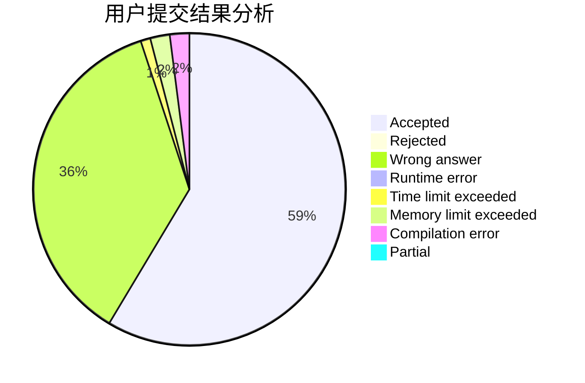
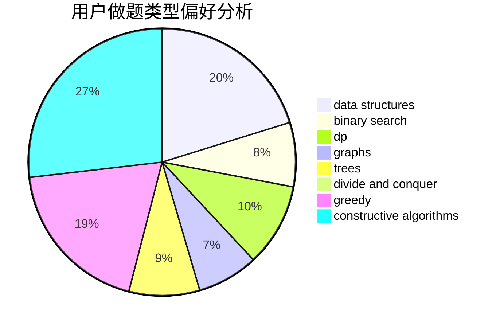

# AC_Crush

<!-- tabs:start -->

#### **用户提交结果分析**

#### **用户做题类型偏好分析**

#### **用户错题知识点分析**

<!-- tabs:end -->
# 推荐题目
[1475F](https://codeforces.com/contest/1475/problem/F)		2-sat,
                        brute force,
                        constructive algorithms		  
[1476G](https://codeforces.com/contest/1476/problem/G)		data structures,
                        hashing,
                        sortings,
                        two pointers		  
[1299E](https://codeforces.com/contest/1299/problem/E)		interactive,
                        math		  
[1475C](https://codeforces.com/contest/1475/problem/C)		combinatorics,
                        graphs,
                        math		  
[1036D](https://codeforces.com/contest/1036/problem/D)		greedy,
                        two pointers		  
[1175C](https://codeforces.com/contest/1175/problem/C)		binary search,
                        brute force,
                        greedy		  
[1454E](https://codeforces.com/contest/1454/problem/E)		combinatorics,
                        dfs and similar,
                        graphs,
                        trees		  
[1474C](https://codeforces.com/contest/1474/problem/C)		brute force,
                        constructive algorithms,
                        data structures,
                        greedy,
                        implementation,
                        sortings		  
[1473G](https://codeforces.com/contest/1473/problem/G)		combinatorics,
                        dp,
                        fft,
                        math		  
[1108B](https://codeforces.com/contest/1108/problem/B)		brute force,
                        greedy,
                        math,
                        number theory		  
