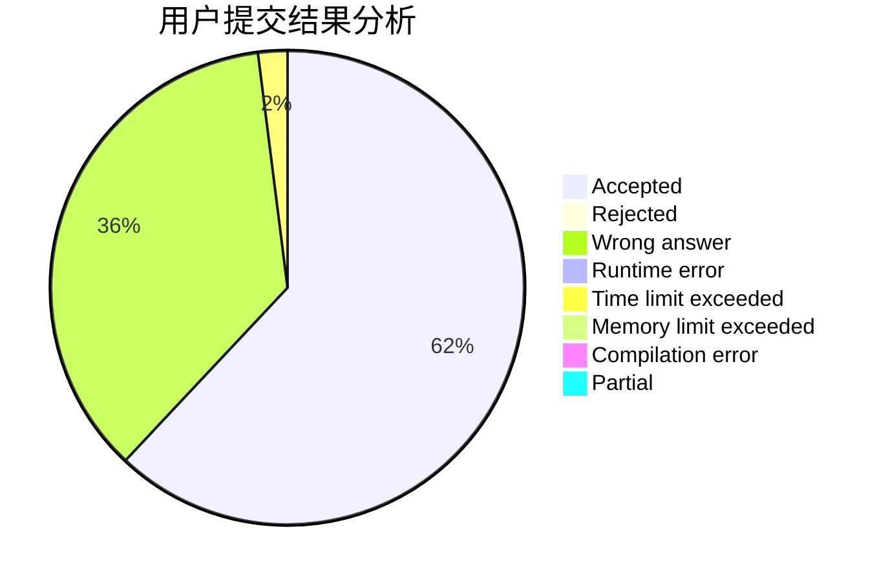
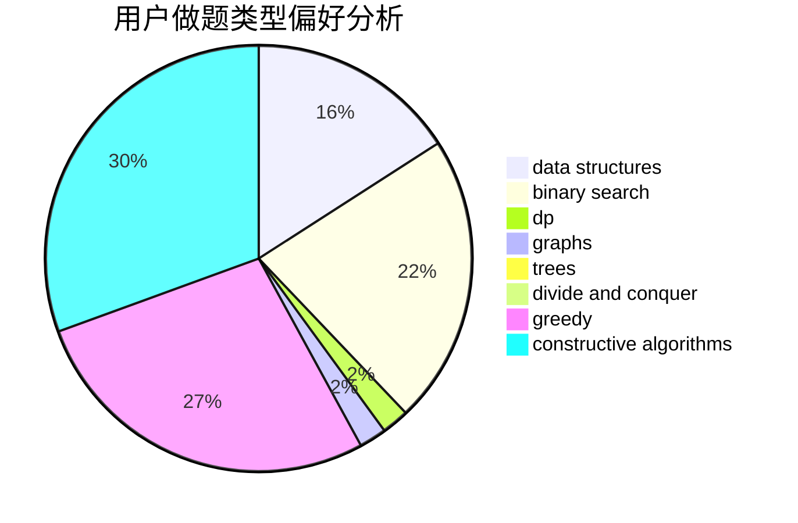
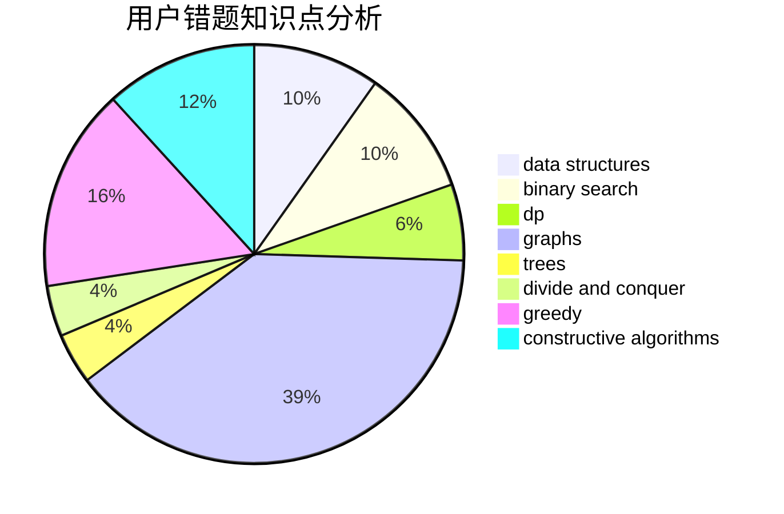

# Potassium_Fan

<!-- tabs:start -->

#### **用户提交结果分析**

#### **用户做题类型偏好分析**

#### **用户错题知识点分析**

<!-- tabs:end -->
# 推荐题目
[1415E](https://codeforces.com/contest/1415/problem/E)		constructive algorithms,
                        greedy,
                        math		  
[189A](https://codeforces.com/contest/189/problem/A)		brute force,
                        dp		  
[500A](https://codeforces.com/contest/500/problem/A)		dfs and similar,
                        graphs,
                        implementation		  
[780E](https://codeforces.com/contest/780/problem/E)		constructive algorithms,
                        dfs and similar,
                        graphs		  
[371E](https://codeforces.com/contest/371/problem/E)		greedy,
                        math,
                        two pointers		  
[860C](https://codeforces.com/contest/860/problem/C)		dsu,graphs,sortings,trees		  
[1109B](https://codeforces.com/contest/1109/problem/B)		constructive algorithms,
                        hashing,
                        strings		  
[1196D1](https://codeforces.com/contest/1196D/problem/1)		implementation		  
[1288D](https://codeforces.com/contest/1288/problem/D)		binary search,
                        bitmasks,
                        dp		  
[451D](https://codeforces.com/contest/451/problem/D)		math		  
