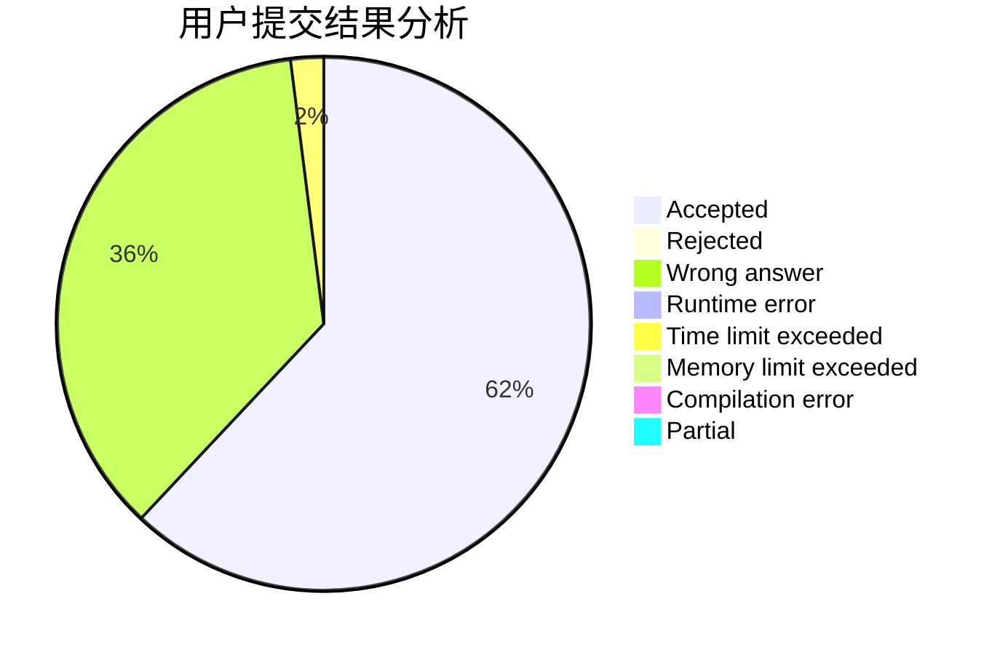
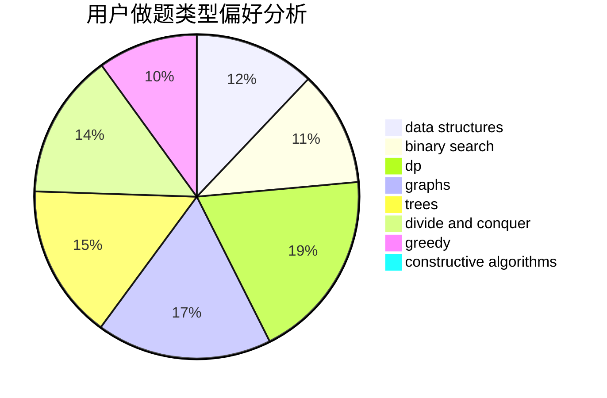
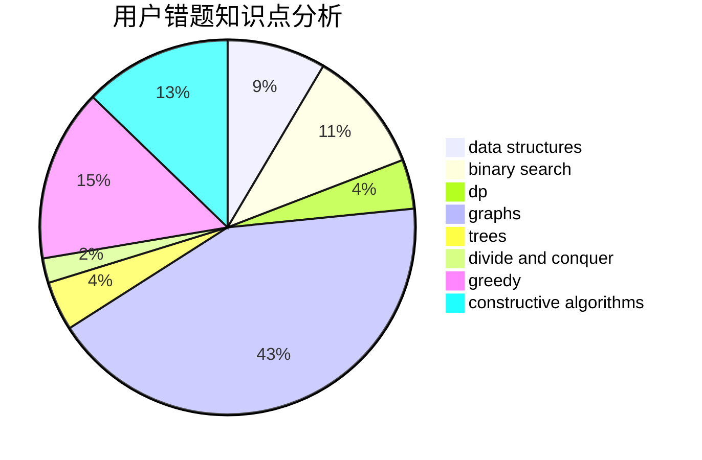

# Potassium_Fan

<!-- tabs:start -->

#### **用户提交结果分析**

#### **用户做题类型偏好分析**

#### **用户错题知识点分析**

<!-- tabs:end -->
# 推荐题目
[1423I](https://codeforces.com/contest/1423/problem/I)		bitmasks		  
[212E](https://codeforces.com/contest/212/problem/E)		dfs and similar,
                        dp,
                        trees		  
[521A](https://codeforces.com/contest/521/problem/A)		dsu,graphs,sortings,trees		  
[799D](https://codeforces.com/contest/799/problem/D)		brute force,
                        dp,
                        meet-in-the-middle		  
[401D](https://codeforces.com/contest/401/problem/D)		bitmasks,
                        brute force,
                        combinatorics,
                        dp,
                        number theory		  
[878C](https://codeforces.com/contest/878/problem/C)		data structures,
                        graphs		  
[1109F](https://codeforces.com/contest/1109/problem/F)		data structures,
                        trees		  
[11E](https://codeforces.com/contest/11/problem/E)		binary search,
                        dp,
                        greedy		  
[1295F](https://codeforces.com/contest/1295/problem/F)		combinatorics,
                        dp,
                        probabilities		  
[472F](https://codeforces.com/contest/472/problem/F)		constructive algorithms,
                        math,
                        matrices		  
