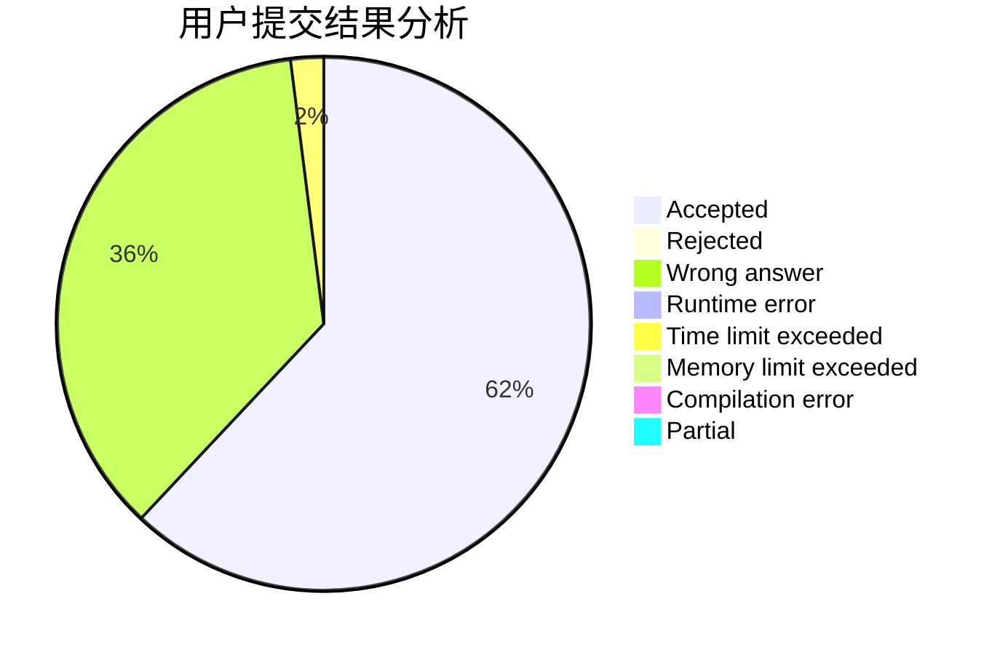
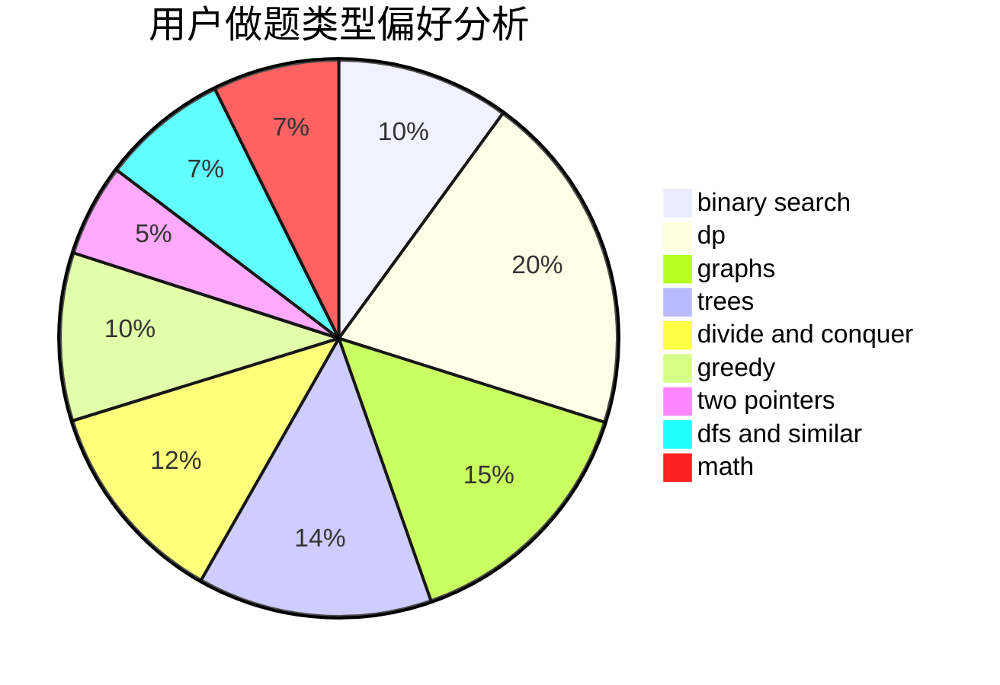

# Potassium_Fan

<!-- tabs:start -->

#### **用户提交结果分析**

#### **用户做题类型偏好分析**

<!-- tabs:end -->
# 推荐题目
[1423I](https://codeforces.com/contest/1423/problem/I)
[212E](https://codeforces.com/contest/212/problem/E)
[521A](https://codeforces.com/contest/521/problem/A)
[799D](https://codeforces.com/contest/799/problem/D)
[401D](https://codeforces.com/contest/401/problem/D)
[878C](https://codeforces.com/contest/878/problem/C)
[1109F](https://codeforces.com/contest/1109/problem/F)
[11E](https://codeforces.com/contest/11/problem/E)
[1295F](https://codeforces.com/contest/1295/problem/F)
[472F](https://codeforces.com/contest/472/problem/F)
