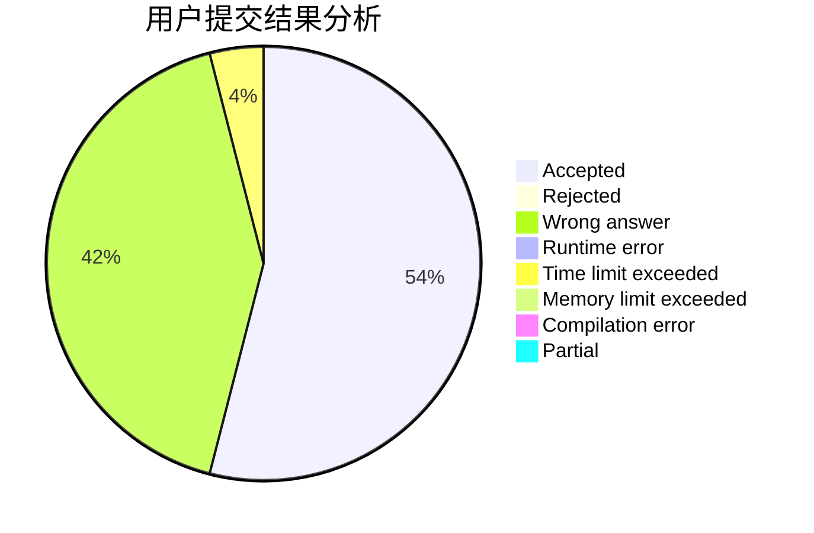
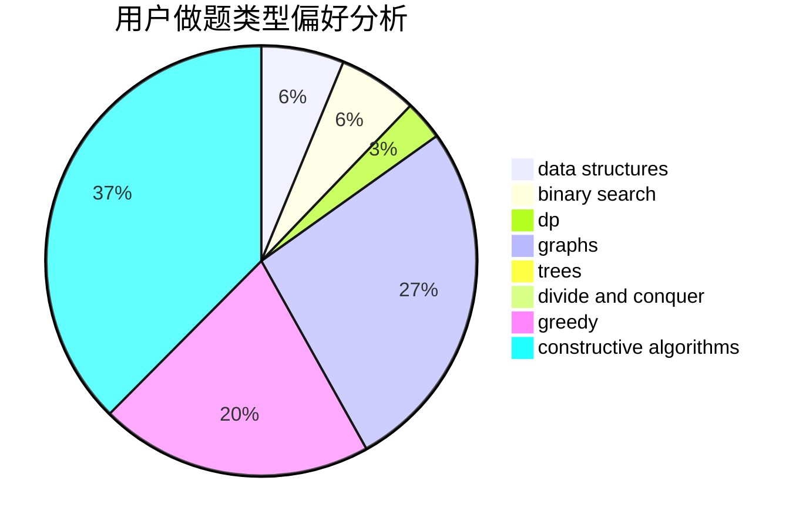
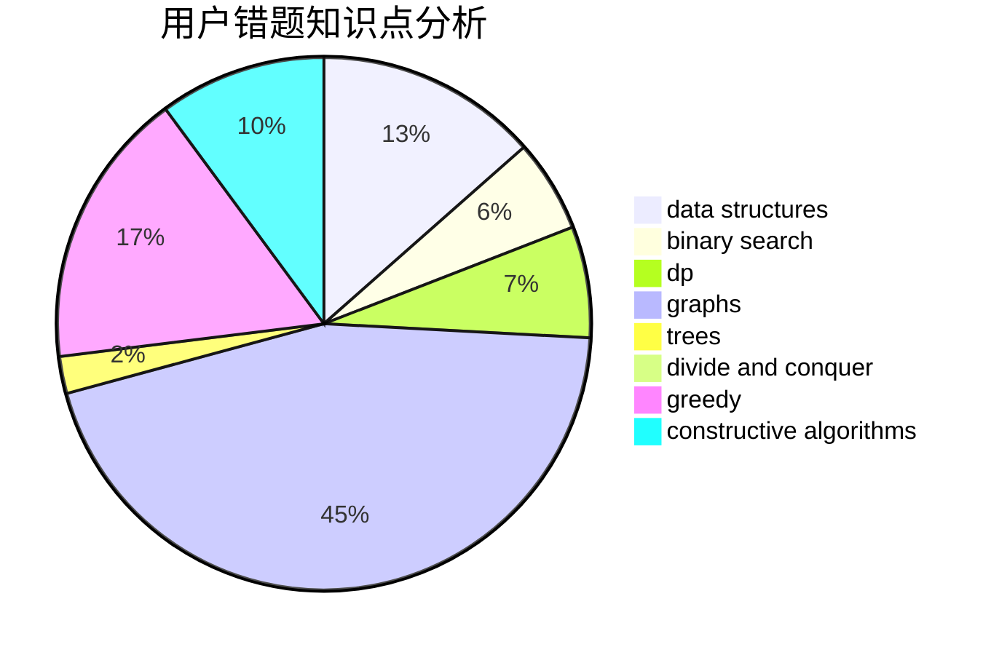

# PowerOverflow

<!-- tabs:start -->

#### **用户提交结果分析**

#### **用户做题类型偏好分析**

#### **用户错题知识点分析**

<!-- tabs:end -->
# 推荐题目
[936B](https://codeforces.com/contest/936/problem/B)		dfs and similar,
                        dp,
                        games,
                        graphs		  
[1200B](https://codeforces.com/contest/1200/problem/B)		dp,
                        greedy		  
[1033B](https://codeforces.com/contest/1033/problem/B)		math,
                        number theory		  
[710C](https://codeforces.com/contest/710/problem/C)		constructive algorithms,
                        math		  
[1093C](https://codeforces.com/contest/1093/problem/C)		greedy		  
[352A](https://codeforces.com/contest/352/problem/A)		brute force,
                        implementation,
                        math		  
[1076A](https://codeforces.com/contest/1076/problem/A)		greedy,
                        strings		  
[721E](https://codeforces.com/contest/721/problem/E)		binary search,
                        dp		  
[1346B](https://codeforces.com/contest/1346/problem/B)		*special problem,
                        greedy		  
[335F](https://codeforces.com/contest/335/problem/F)		dp,
                        greedy		  
