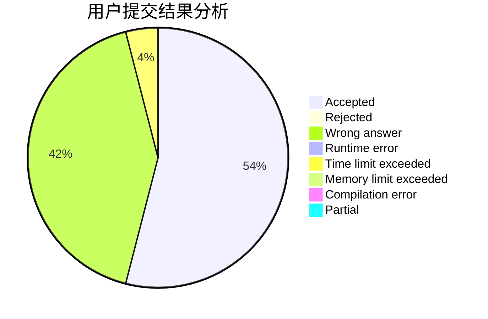
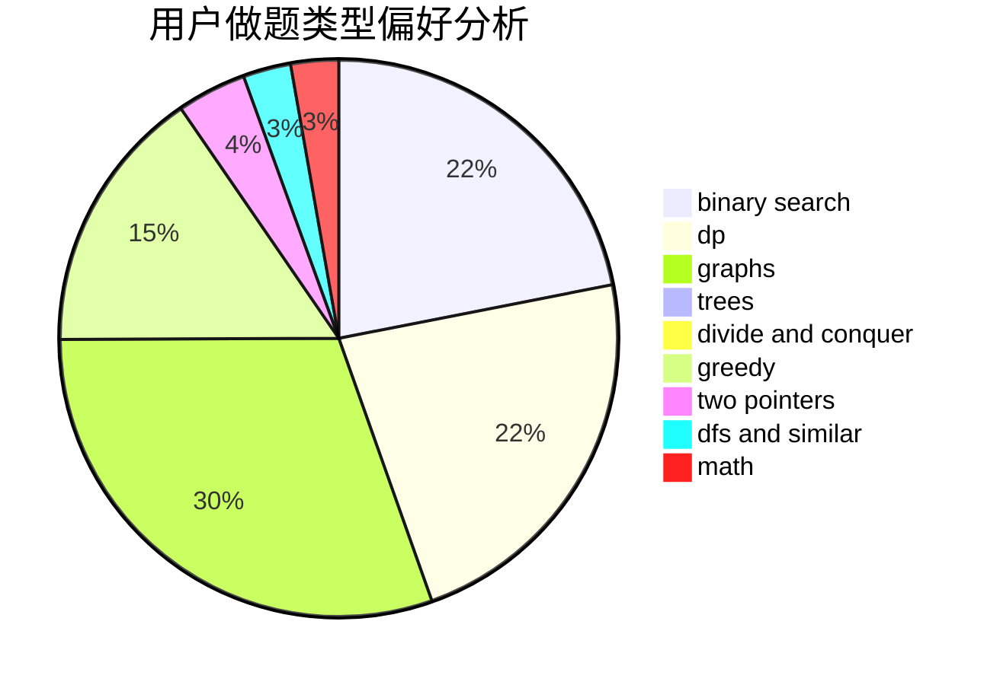

# PowerOverflow

<!-- tabs:start -->

#### **用户提交结果分析**

#### **用户做题类型偏好分析**

<!-- tabs:end -->
# 推荐题目
[936B](https://codeforces.com/contest/936/problem/B)
[1200B](https://codeforces.com/contest/1200/problem/B)
[1033B](https://codeforces.com/contest/1033/problem/B)
[710C](https://codeforces.com/contest/710/problem/C)
[1093C](https://codeforces.com/contest/1093/problem/C)
[352A](https://codeforces.com/contest/352/problem/A)
[1076A](https://codeforces.com/contest/1076/problem/A)
[721E](https://codeforces.com/contest/721/problem/E)
[1346B](https://codeforces.com/contest/1346/problem/B)
[335F](https://codeforces.com/contest/335/problem/F)
