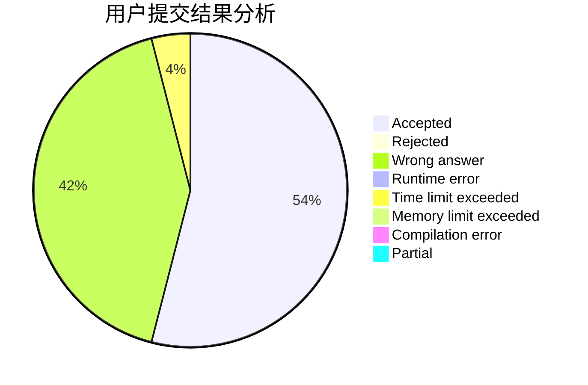
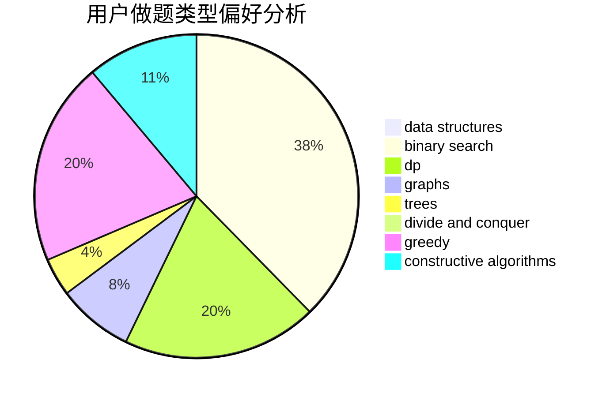
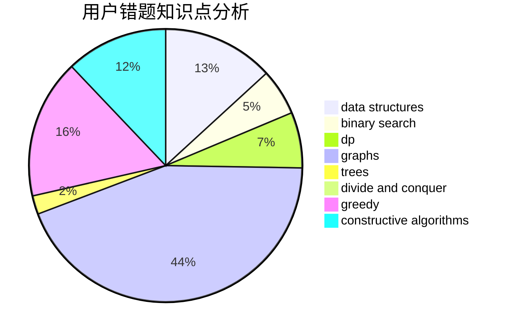

# PowerOverflow

<!-- tabs:start -->

#### **用户提交结果分析**

#### **用户做题类型偏好分析**

#### **用户错题知识点分析**

<!-- tabs:end -->
# 推荐题目
[916B](https://codeforces.com/contest/916/problem/B)		bitmasks,
                        greedy,
                        math		  
[1196F](https://codeforces.com/contest/1196/problem/F)		brute force,
                        constructive algorithms,
                        shortest paths,
                        sortings		  
[1032E](https://codeforces.com/contest/1032/problem/E)		dp,
                        math		  
[690A2](https://codeforces.com/contest/690A/problem/2)		nan		  
[1092F](https://codeforces.com/contest/1092/problem/F)		dfs and similar,
                        dp,
                        trees		  
[321B](https://codeforces.com/contest/321/problem/B)		dp,
                        flows,
                        greedy		  
[1074B](https://codeforces.com/contest/1074/problem/B)		dsu,graphs,sortings,trees		  
[703A](https://codeforces.com/contest/703/problem/A)		implementation		  
[1339B](https://codeforces.com/contest/1339/problem/B)		constructive algorithms,
                        sortings		  
[312A](https://codeforces.com/contest/312/problem/A)		implementation,
                        strings		  
