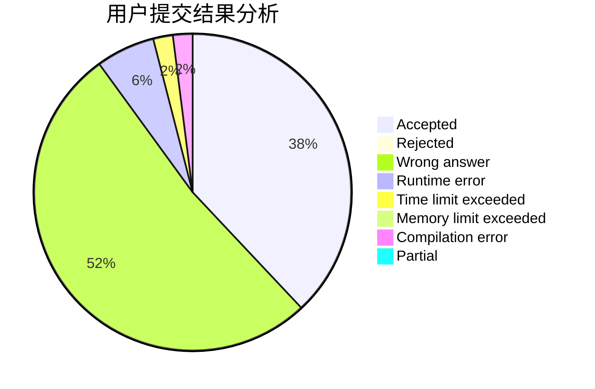
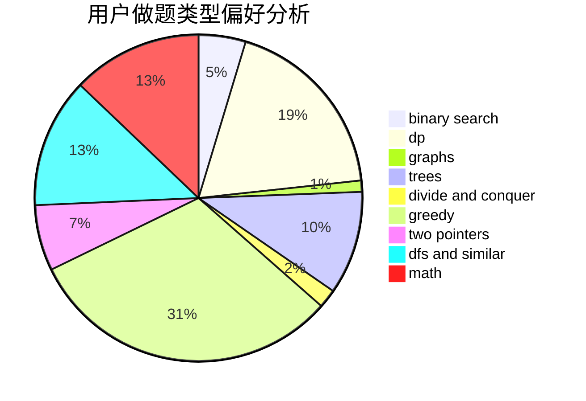

# Prean

<!-- tabs:start -->

#### **用户提交结果分析**

#### **用户做题类型偏好分析**

<!-- tabs:end -->
# 推荐题目
[1144B](https://codeforces.com/contest/1144/problem/B)
[1295D](https://codeforces.com/contest/1295/problem/D)
[243D](https://codeforces.com/contest/243/problem/D)
[1011D](https://codeforces.com/contest/1011/problem/D)
[947D](https://codeforces.com/contest/947/problem/D)
[1182A](https://codeforces.com/contest/1182/problem/A)
[584E](https://codeforces.com/contest/584/problem/E)
[670F](https://codeforces.com/contest/670/problem/F)
[1187B](https://codeforces.com/contest/1187/problem/B)
[1109D](https://codeforces.com/contest/1109/problem/D)
