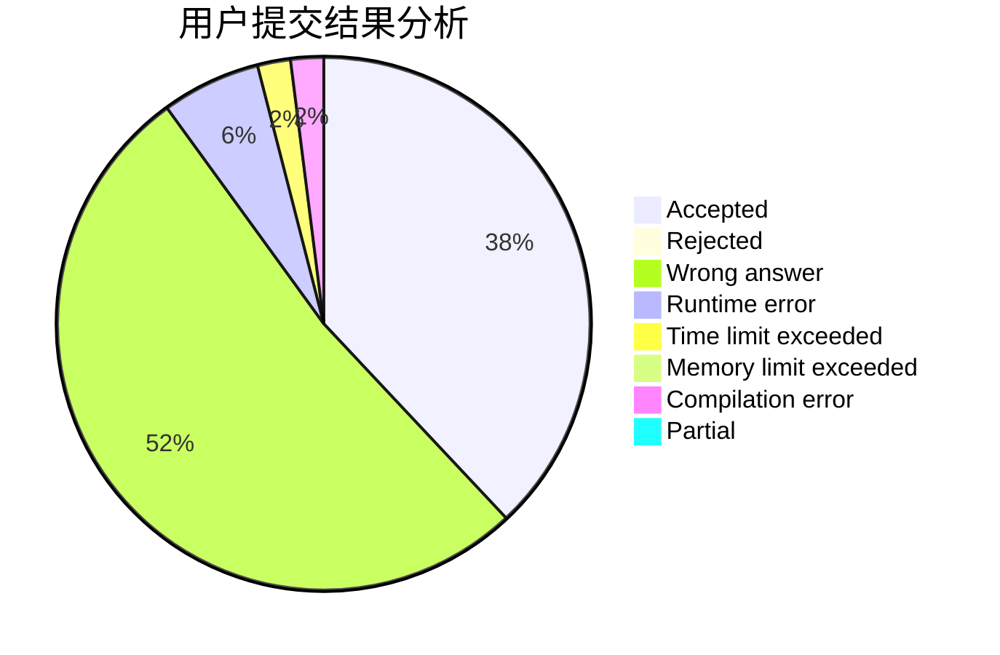
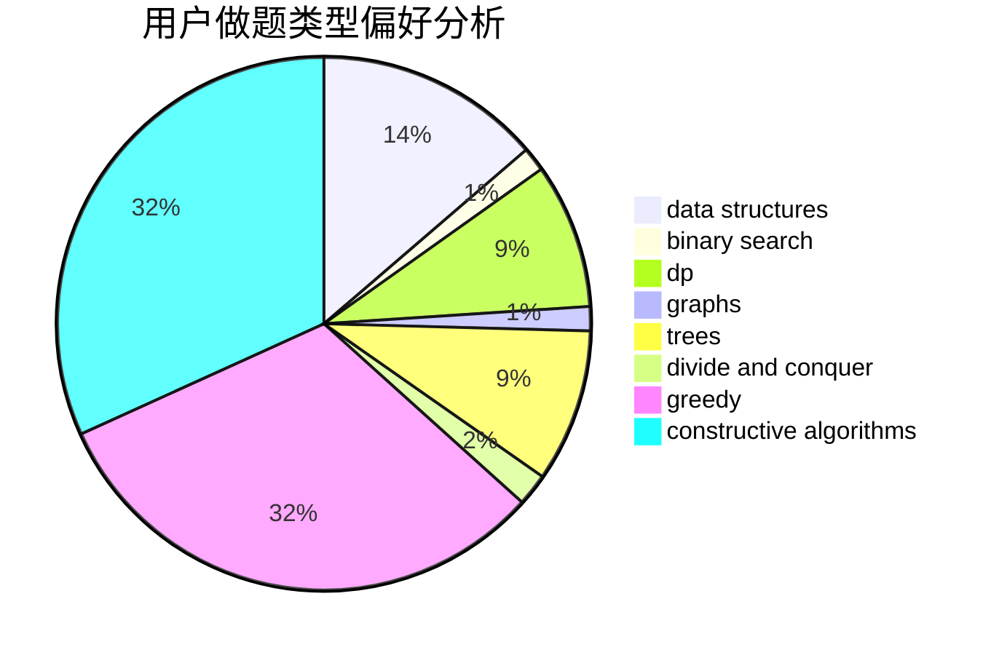
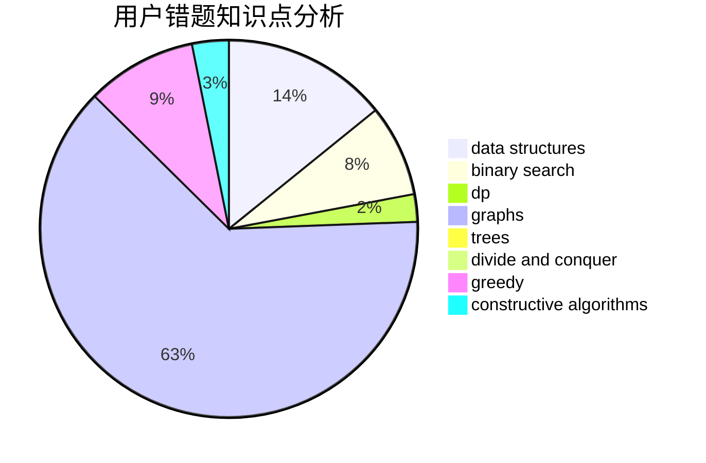

# Prean

<!-- tabs:start -->

#### **用户提交结果分析**

#### **用户做题类型偏好分析**

#### **用户错题知识点分析**

<!-- tabs:end -->
# 推荐题目
[1144B](https://codeforces.com/contest/1144/problem/B)		greedy,
                        implementation,
                        sortings		  
[1295D](https://codeforces.com/contest/1295/problem/D)		math,
                        number theory		  
[243D](https://codeforces.com/contest/243/problem/D)		data structures,
                        dp,
                        geometry,
                        two pointers		  
[1011D](https://codeforces.com/contest/1011/problem/D)		dsu,graphs,sortings,trees		  
[947D](https://codeforces.com/contest/947/problem/D)		dsu,graphs,sortings,trees		  
[1182A](https://codeforces.com/contest/1182/problem/A)		dp,
                        math		  
[584E](https://codeforces.com/contest/584/problem/E)		constructive algorithms,
                        greedy,
                        math		  
[670F](https://codeforces.com/contest/670/problem/F)		brute force,
                        constructive algorithms,
                        strings		  
[1187B](https://codeforces.com/contest/1187/problem/B)		binary search,
                        implementation,
                        strings		  
[1109D](https://codeforces.com/contest/1109/problem/D)		brute force,
                        combinatorics,
                        dp,
                        math,
                        trees		  
