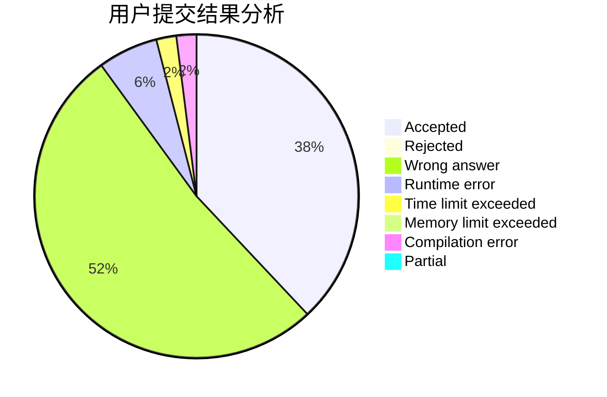
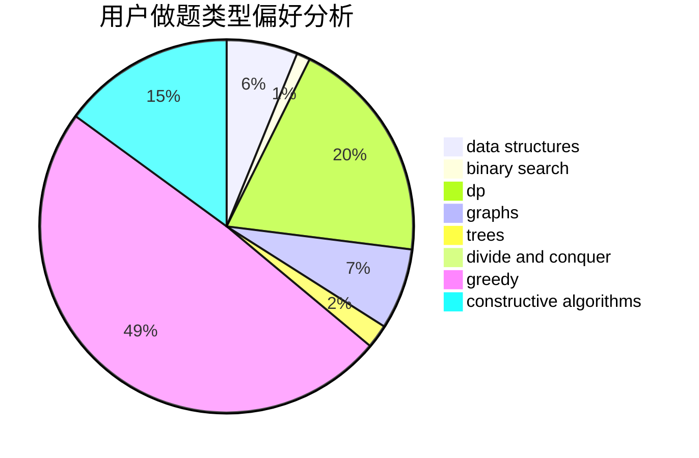
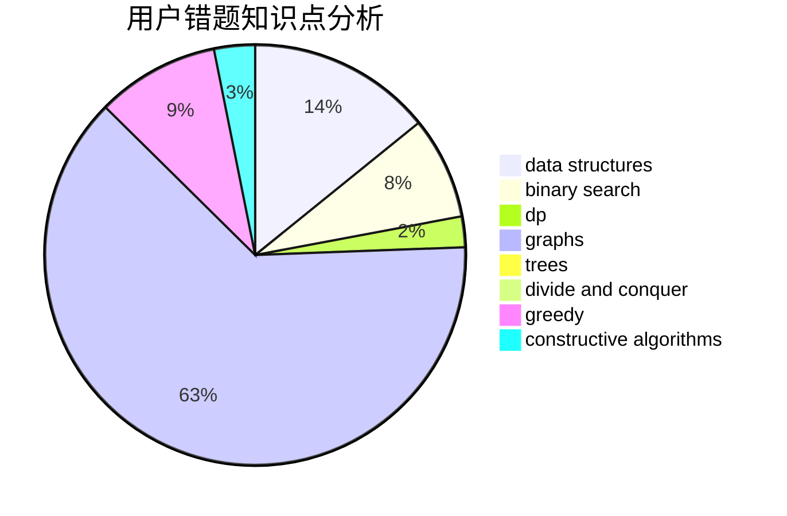

# Prean

<!-- tabs:start -->

#### **用户提交结果分析**

#### **用户做题类型偏好分析**

#### **用户错题知识点分析**

<!-- tabs:end -->
# 推荐题目
[1141G](https://codeforces.com/contest/1141/problem/G)		binary search,
                        constructive algorithms,
                        dfs and similar,
                        graphs,
                        greedy,
                        trees		  
[1288B](https://codeforces.com/contest/1288/problem/B)		math		  
[225D](https://codeforces.com/contest/225/problem/D)		bitmasks,
                        dfs and similar,
                        graphs,
                        implementation		  
[1011A](https://codeforces.com/contest/1011/problem/A)		greedy,
                        implementation,
                        sortings		  
[924A](https://codeforces.com/contest/924/problem/A)		greedy,
                        implementation		  
[1179B](https://codeforces.com/contest/1179/problem/B)		constructive algorithms		  
[566A](https://codeforces.com/contest/566/problem/A)		dfs and similar,
                        strings,
                        trees		  
[643F](https://codeforces.com/contest/643/problem/F)		dp,
                        math,
                        meet-in-the-middle		  
[1184A1](https://codeforces.com/contest/1184A/problem/1)		brute force,
                        math,
                        number theory		  
[1108F](https://codeforces.com/contest/1108/problem/F)		binary search,
                        dsu,
                        graphs,
                        greedy		  
