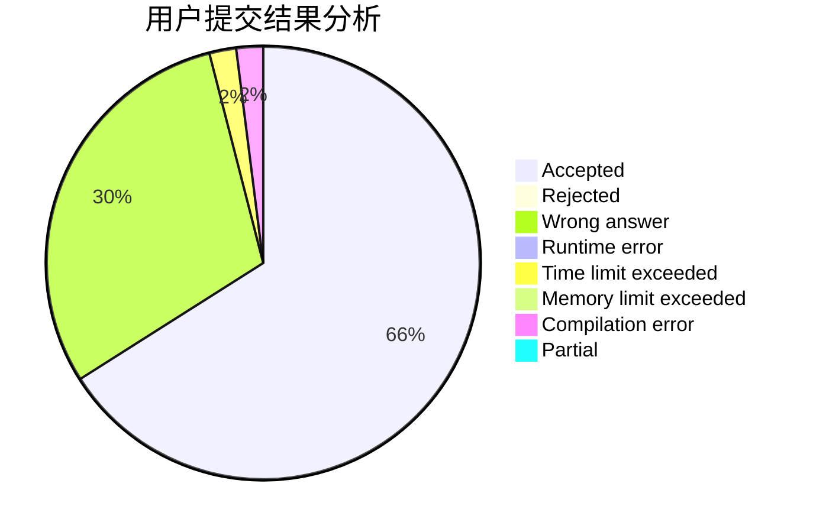
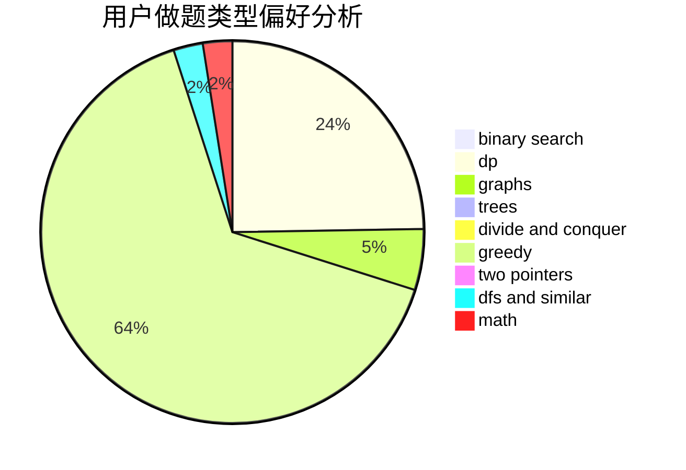

# PrimeK

<!-- tabs:start -->

#### **用户提交结果分析**

#### **用户做题类型偏好分析**

<!-- tabs:end -->
# 推荐题目
[1272E](https://codeforces.com/contest/1272/problem/E)
[220C](https://codeforces.com/contest/220/problem/C)
[540C](https://codeforces.com/contest/540/problem/C)
[103E](https://codeforces.com/contest/103/problem/E)
[807A](https://codeforces.com/contest/807/problem/A)
[845A](https://codeforces.com/contest/845/problem/A)
[1283E](https://codeforces.com/contest/1283/problem/E)
[114E](https://codeforces.com/contest/114/problem/E)
[681B](https://codeforces.com/contest/681/problem/B)
[152B](https://codeforces.com/contest/152/problem/B)
