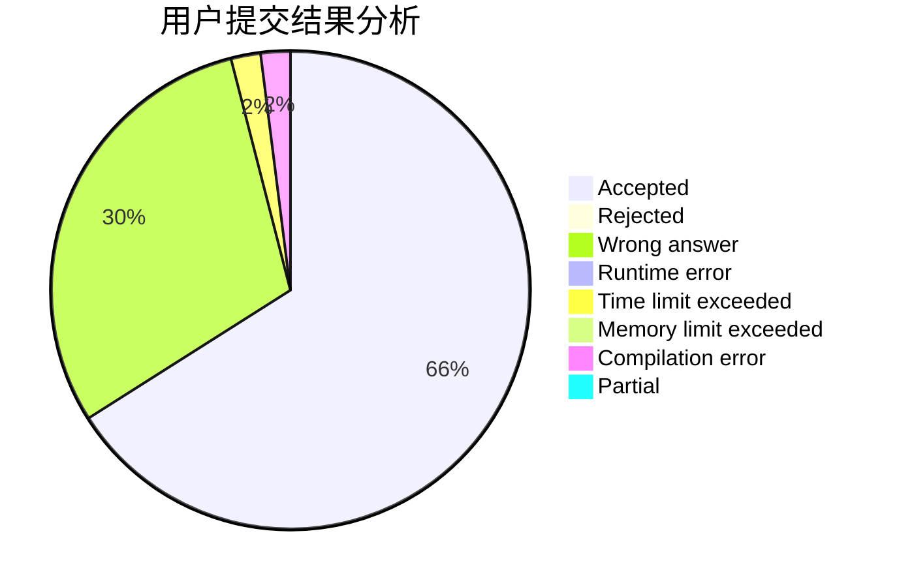
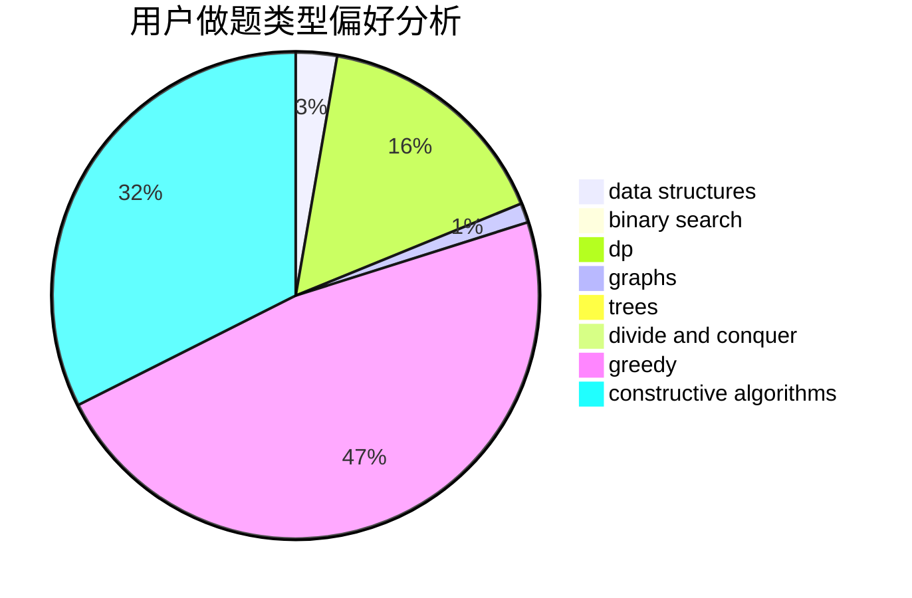

# PrimeK

<!-- tabs:start -->

#### **用户提交结果分析**

#### **用户做题类型偏好分析**

#### **用户错题知识点分析**

<!-- tabs:end -->
# 推荐题目
[1272E](https://codeforces.com/contest/1272/problem/E)		dfs and similar,
                        graphs,
                        shortest paths		  
[220C](https://codeforces.com/contest/220/problem/C)		data structures		  
[540C](https://codeforces.com/contest/540/problem/C)		dfs and similar		  
[103E](https://codeforces.com/contest/103/problem/E)		flows,
                        graph matchings		  
[807A](https://codeforces.com/contest/807/problem/A)		implementation,
                        sortings		  
[845A](https://codeforces.com/contest/845/problem/A)		implementation,
                        sortings		  
[1283E](https://codeforces.com/contest/1283/problem/E)		dp,
                        greedy		  
[114E](https://codeforces.com/contest/114/problem/E)		dsu,graphs,sortings,trees		  
[681B](https://codeforces.com/contest/681/problem/B)		brute force		  
[152B](https://codeforces.com/contest/152/problem/B)		binary search,
                        implementation		  
