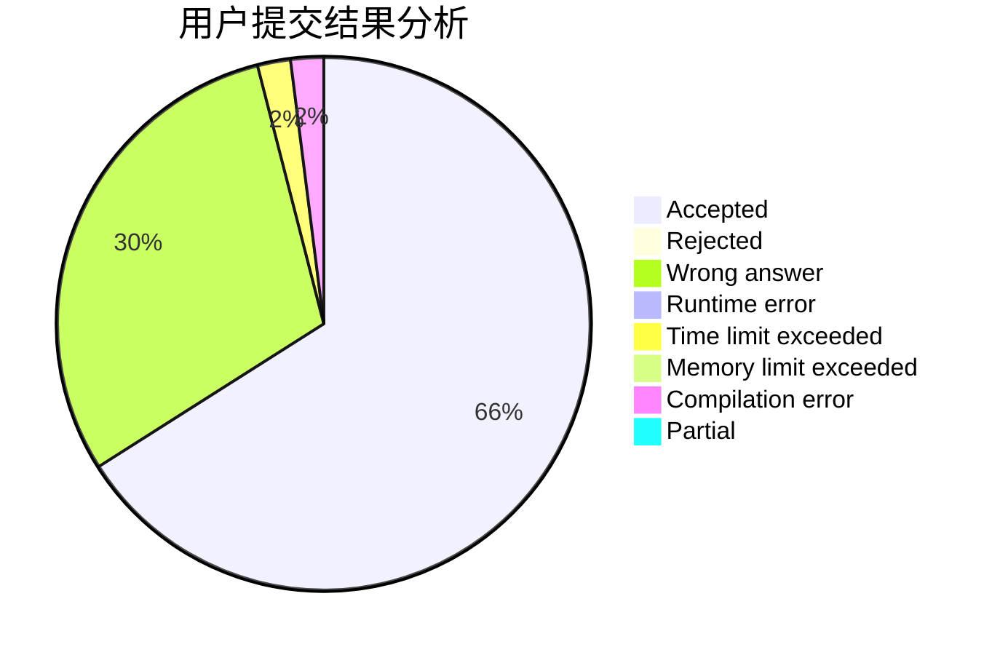
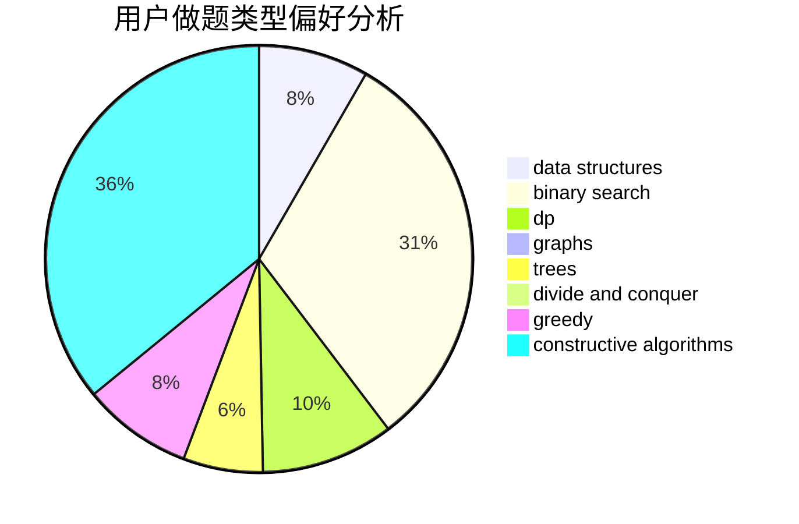

# PrimeK

<!-- tabs:start -->

#### **用户提交结果分析**

#### **用户做题类型偏好分析**

#### **用户错题知识点分析**

<!-- tabs:end -->
# 推荐题目
[1267B](https://codeforces.com/contest/1267/problem/B)		nan		  
[199D](https://codeforces.com/contest/199/problem/D)		dsu,graphs,sortings,trees		  
[514E](https://codeforces.com/contest/514/problem/E)		dp,
                        matrices		  
[103B](https://codeforces.com/contest/103/problem/B)		dfs and similar,
                        dsu,
                        graphs		  
[791C](https://codeforces.com/contest/791/problem/C)		dsu,graphs,sortings,trees		  
[825E](https://codeforces.com/contest/825/problem/E)		data structures,
                        dfs and similar,
                        graphs,
                        greedy		  
[1277C](https://codeforces.com/contest/1277/problem/C)		dsu,graphs,sortings,trees		  
[1148E](https://codeforces.com/contest/1148/problem/E)		constructive algorithms,
                        greedy,
                        math,
                        sortings,
                        two pointers		  
[660D](https://codeforces.com/contest/660/problem/D)		geometry		  
[1505B](https://codeforces.com/contest/1505/problem/B)		implementation,
                        number theory		  
