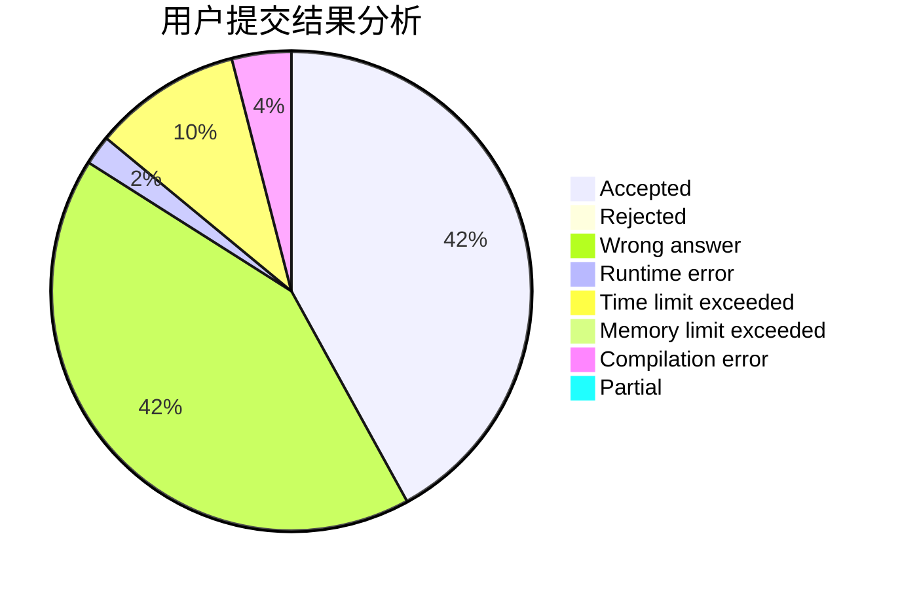
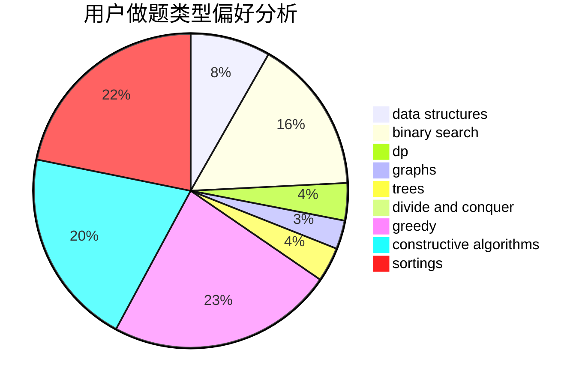

# Priori_Incantatem
<!-- tabs:start -->
#### **用户提交结果分析**

#### **用户做题类型偏好分析**

#### **用户错题知识点分析**

<!-- tabs:end -->
# 推荐题目
[1336E2](http://codeforces.com/problemset/problem/1336/E2)		bitmasks,
                        brute force,
                        combinatorics,
                        math		  
[878E](http://codeforces.com/problemset/problem/878/E)		combinatorics,
                        dp		  
[1003B](http://codeforces.com/problemset/problem/1003/B)		constructive algorithms		  
[777A](http://codeforces.com/problemset/problem/777/A)		constructive algorithms,
                        implementation,
                        math		  
[505D](http://codeforces.com/problemset/problem/505/D)		dfs and similar		  
[761F](http://codeforces.com/problemset/problem/761/F)		brute force,
                        data structures,
                        dp,
                        implementation		  
[1411G](http://codeforces.com/problemset/problem/1411/G)		bitmasks,
                        games,
                        math,
                        matrices		  
[814D](http://codeforces.com/problemset/problem/814/D)		dfs and similar,
                        dp,
                        geometry,
                        greedy,
                        trees		  
[1294C](http://codeforces.com/problemset/problem/1294/C)		greedy,
                        math,
                        number theory		  
[1234F](http://codeforces.com/problemset/problem/1234/F)		bitmasks,
                        dp		  
<!-- tabs:start -->
#### **data structures**
[761F](http://codeforces.com/problemset/problem/761/F)		brute force,
                        data structures,
                        dp,
                        implementation		  
[704E](http://codeforces.com/problemset/problem/704/E)		data structures,
                        geometry,
                        trees		  
[18C](http://codeforces.com/problemset/problem/18/C)		data structures,
                        implementation		  
[47E](http://codeforces.com/problemset/problem/47/E)		data structures,
                        geometry,
                        sortings		  
[901C](http://codeforces.com/problemset/problem/901/C)		binary search,
                        data structures,
                        dfs and similar,
                        dsu,
                        graphs,
                        two pointers		  
[956C](https://codeforces.com/contest/956/problem/C)		data structures,
                        dp,
                        greedy		  
[634D](https://codeforces.com/contest/634/problem/D)		data structures,
                        divide and conquer,
                        greedy		  
[1329C](http://codeforces.com/problemset/problem/1329/C)		constructive algorithms,
                        data structures,
                        greedy,
                        implementation		  
[558E](http://codeforces.com/problemset/problem/558/E)		data structures,
                        sortings,
                        strings		  
[1492C](http://codeforces.com/problemset/problem/1492/C)		binary search,
                        data structures,
                        dp,
                        greedy,
                        two pointers		  
#### **binary search**
[1288D](http://codeforces.com/problemset/problem/1288/D)		binary search,
                        bitmasks,
                        dp		  
[21C](http://codeforces.com/problemset/problem/21/C)		binary search,
                        dp,
                        sortings		  
[901C](http://codeforces.com/problemset/problem/901/C)		binary search,
                        data structures,
                        dfs and similar,
                        dsu,
                        graphs,
                        two pointers		  
[1486C1](http://codeforces.com/problemset/problem/1486/C1)		binary search,
                        interactive		  
[1260D](http://codeforces.com/problemset/problem/1260/D)		binary search,
                        dp,
                        greedy,
                        sortings		  
[504E](http://codeforces.com/problemset/problem/504/E)		binary search,
                        dfs and similar,
                        hashing,
                        string suffix structures,
                        trees		  
[1492C](http://codeforces.com/problemset/problem/1492/C)		binary search,
                        data structures,
                        dp,
                        greedy,
                        two pointers		  
[1463D](http://codeforces.com/problemset/problem/1463/D)		binary search,
                        constructive algorithms,
                        greedy,
                        two pointers		  
[1490G](http://codeforces.com/problemset/problem/1490/G)		binary search,
                        data structures,
                        math		  
[1479D](http://codeforces.com/problemset/problem/1479/D)		binary search,
                        bitmasks,
                        brute force,
                        data structures,
                        probabilities,
                        trees		  
#### **dp**
[878E](http://codeforces.com/problemset/problem/878/E)		combinatorics,
                        dp		  
[761F](http://codeforces.com/problemset/problem/761/F)		brute force,
                        data structures,
                        dp,
                        implementation		  
[814D](http://codeforces.com/problemset/problem/814/D)		dfs and similar,
                        dp,
                        geometry,
                        greedy,
                        trees		  
[1234F](http://codeforces.com/problemset/problem/1234/F)		bitmasks,
                        dp		  
[1288D](http://codeforces.com/problemset/problem/1288/D)		binary search,
                        bitmasks,
                        dp		  
[295B](http://codeforces.com/problemset/problem/295/B)		dp,
                        graphs,
                        shortest paths		  
[21C](http://codeforces.com/problemset/problem/21/C)		binary search,
                        dp,
                        sortings		  
[201C](http://codeforces.com/problemset/problem/201/C)		dp		  
[1510D](http://codeforces.com/problemset/problem/1510/D)		dp,
                        math,
                        number theory		  
[956C](https://codeforces.com/contest/956/problem/C)		data structures,
                        dp,
                        greedy		  
#### **graph**
[295B](http://codeforces.com/problemset/problem/295/B)		dp,
                        graphs,
                        shortest paths		  
[901C](http://codeforces.com/problemset/problem/901/C)		binary search,
                        data structures,
                        dfs and similar,
                        dsu,
                        graphs,
                        two pointers		  
[1013D](https://codeforces.com/contest/1013/problem/D)		constructive algorithms,
                        dfs and similar,
                        dsu,
                        graphs,
                        matrices		  
[911F](http://codeforces.com/problemset/problem/911/F)		constructive algorithms,
                        dfs and similar,
                        graphs,
                        greedy,
                        trees		  
[380B](http://codeforces.com/problemset/problem/380/B)		graphs,
                        implementation		  
[698B](http://codeforces.com/problemset/problem/698/B)		constructive algorithms,
                        dfs and similar,
                        dsu,
                        graphs,
                        trees		  
[1487C](http://codeforces.com/problemset/problem/1487/C)		brute force,
                        constructive algorithms,
                        dfs and similar,
                        graphs,
                        greedy,
                        implementation,
                        math		  
[1437C](http://codeforces.com/problemset/problem/1437/C)		dp,
                        flows,
                        graph matchings,
                        greedy,
                        math,
                        sortings		  
[1470D](http://codeforces.com/problemset/problem/1470/D)		constructive algorithms,
                        dfs and similar,
                        graph matchings,
                        graphs,
                        greedy		  
[1476C](http://codeforces.com/problemset/problem/1476/C)		dp,
                        graphs,
                        greedy		  
#### **trees**
[814D](http://codeforces.com/problemset/problem/814/D)		dfs and similar,
                        dp,
                        geometry,
                        greedy,
                        trees		  
[704E](http://codeforces.com/problemset/problem/704/E)		data structures,
                        geometry,
                        trees		  
[911F](http://codeforces.com/problemset/problem/911/F)		constructive algorithms,
                        dfs and similar,
                        graphs,
                        greedy,
                        trees		  
[698B](http://codeforces.com/problemset/problem/698/B)		constructive algorithms,
                        dfs and similar,
                        dsu,
                        graphs,
                        trees		  
[1173D](https://codeforces.com/contest/1173/problem/D)		combinatorics,
                        dfs and similar,
                        dp,
                        trees		  
[504E](http://codeforces.com/problemset/problem/504/E)		binary search,
                        dfs and similar,
                        hashing,
                        string suffix structures,
                        trees		  
[1479D](http://codeforces.com/problemset/problem/1479/D)		binary search,
                        bitmasks,
                        brute force,
                        data structures,
                        probabilities,
                        trees		  
[1511C](http://codeforces.com/problemset/problem/1511/C)		brute force,
                        data structures,
                        implementation,
                        trees		  
[1499F](http://codeforces.com/problemset/problem/1499/F)		combinatorics,
                        dfs and similar,
                        dp,
                        trees		  
[1491E](http://codeforces.com/problemset/problem/1491/E)		brute force,
                        dfs and similar,
                        divide and conquer,
                        number theory,
                        trees		  
#### **divide and conquer**
[634D](https://codeforces.com/contest/634/problem/D)		data structures,
                        divide and conquer,
                        greedy		  
[1461D](http://codeforces.com/problemset/problem/1461/D)		binary search,
                        brute force,
                        data structures,
                        divide and conquer,
                        implementation,
                        sortings		  
[1466G](http://codeforces.com/problemset/problem/1466/G)		combinatorics,
                        divide and conquer,
                        hashing,
                        math,
                        string suffix structures,
                        strings		  
[1490D](http://codeforces.com/problemset/problem/1490/D)		dfs and similar,
                        divide and conquer,
                        implementation		  
[1483C](https://codeforces.com/contest/1483/problem/C)		data structures,
                        divide and conquer,
                        dp		  
[1491E](http://codeforces.com/problemset/problem/1491/E)		brute force,
                        dfs and similar,
                        divide and conquer,
                        number theory,
                        trees		  
[1303G](http://codeforces.com/problemset/problem/1303/G)		data structures,
                        divide and conquer,
                        geometry,
                        trees		  
[1494D](http://codeforces.com/problemset/problem/1494/D)		constructive algorithms,
                        data structures,
                        dfs and similar,
                        divide and conquer,
                        dsu,
                        greedy,
                        sortings,
                        trees		  
[1482E](http://codeforces.com/problemset/problem/1482/E)		data structures,
                        divide and conquer,
                        dp		  
[566C](http://codeforces.com/problemset/problem/566/C)		dfs and similar,
                        divide and conquer,
                        trees		  
#### **greedy**
[814D](http://codeforces.com/problemset/problem/814/D)		dfs and similar,
                        dp,
                        geometry,
                        greedy,
                        trees		  
[1294C](http://codeforces.com/problemset/problem/1294/C)		greedy,
                        math,
                        number theory		  
[898E](http://codeforces.com/problemset/problem/898/E)		constructive algorithms,
                        greedy		  
[389A](http://codeforces.com/problemset/problem/389/A)		greedy,
                        math		  
[1077B](http://codeforces.com/problemset/problem/1077/B)		greedy		  
[1500C](http://codeforces.com/problemset/problem/1500/C)		bitmasks,
                        brute force,
                        constructive algorithms,
                        greedy,
                        two pointers		  
[670A](http://codeforces.com/problemset/problem/670/A)		brute force,
                        constructive algorithms,
                        greedy,
                        math		  
[469A](http://codeforces.com/problemset/problem/469/A)		greedy,
                        implementation		  
[1132B](http://codeforces.com/problemset/problem/1132/B)		greedy,
                        sortings		  
[956C](https://codeforces.com/contest/956/problem/C)		data structures,
                        dp,
                        greedy		  
#### **constructive algorithms**
[1003B](http://codeforces.com/problemset/problem/1003/B)		constructive algorithms		  
[777A](http://codeforces.com/problemset/problem/777/A)		constructive algorithms,
                        implementation,
                        math		  
[898E](http://codeforces.com/problemset/problem/898/E)		constructive algorithms,
                        greedy		  
[347A](http://codeforces.com/problemset/problem/347/A)		constructive algorithms,
                        implementation,
                        sortings		  
[1500C](http://codeforces.com/problemset/problem/1500/C)		bitmasks,
                        brute force,
                        constructive algorithms,
                        greedy,
                        two pointers		  
[1159D](https://codeforces.com/contest/1159/problem/D)		constructive algorithms,
                        math,
                        strings		  
[670A](http://codeforces.com/problemset/problem/670/A)		brute force,
                        constructive algorithms,
                        greedy,
                        math		  
[1013D](https://codeforces.com/contest/1013/problem/D)		constructive algorithms,
                        dfs and similar,
                        dsu,
                        graphs,
                        matrices		  
[1366D](http://codeforces.com/problemset/problem/1366/D)		constructive algorithms,
                        math,
                        number theory		  
[911F](http://codeforces.com/problemset/problem/911/F)		constructive algorithms,
                        dfs and similar,
                        graphs,
                        greedy,
                        trees		  
#### **sortings**
[347A](http://codeforces.com/problemset/problem/347/A)		constructive algorithms,
                        implementation,
                        sortings		  
[21C](http://codeforces.com/problemset/problem/21/C)		binary search,
                        dp,
                        sortings		  
[47E](http://codeforces.com/problemset/problem/47/E)		data structures,
                        geometry,
                        sortings		  
[1132B](http://codeforces.com/problemset/problem/1132/B)		greedy,
                        sortings		  
[1475G](http://codeforces.com/problemset/problem/1475/G)		dp,
                        math,
                        number theory,
                        sortings		  
[1260D](http://codeforces.com/problemset/problem/1260/D)		binary search,
                        dp,
                        greedy,
                        sortings		  
[558E](http://codeforces.com/problemset/problem/558/E)		data structures,
                        sortings,
                        strings		  
[1496C](https://codeforces.com/contest/1496/problem/C)		geometry,
                        greedy,
                        math,
                        sortings		  
[1495A](http://codeforces.com/problemset/problem/1495/A)		geometry,
                        greedy,
                        math,
                        sortings		  
[1497A](http://codeforces.com/problemset/problem/1497/A)		brute force,
                        data structures,
                        greedy,
                        sortings		  
<!-- tabs:end -->
