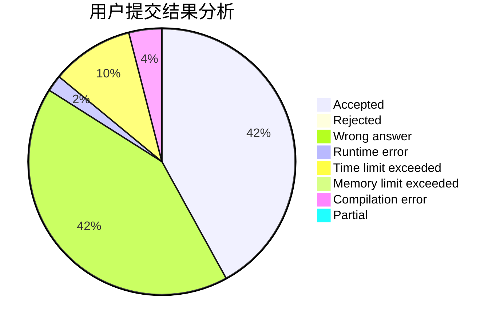
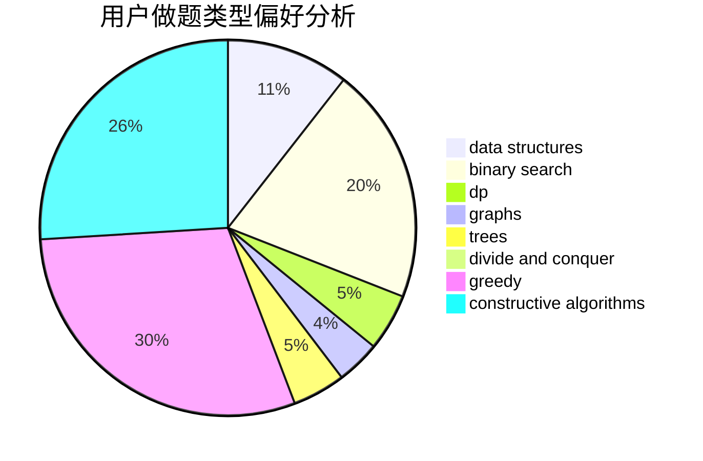

# Priori_Incantatem

<!-- tabs:start -->

#### **用户提交结果分析**

#### **用户做题类型偏好分析**

#### **用户错题知识点分析**

<!-- tabs:end -->
# 推荐题目
[505D](https://codeforces.com/contest/505/problem/D)		dfs and similar		  
[1336E2](https://codeforces.com/contest/1336E/problem/2)		bitmasks,
                        brute force,
                        combinatorics,
                        math		  
[878E](https://codeforces.com/contest/878/problem/E)		combinatorics,
                        dp		  
[777A](https://codeforces.com/contest/777/problem/A)		constructive algorithms,
                        implementation,
                        math		  
[1294C](https://codeforces.com/contest/1294/problem/C)		greedy,
                        math,
                        number theory		  
[364D](https://codeforces.com/contest/364/problem/D)		brute force,
                        math,
                        probabilities		  
[704E](https://codeforces.com/contest/704/problem/E)		data structures,
                        geometry,
                        trees		  
[1003B](https://codeforces.com/contest/1003/problem/B)		constructive algorithms		  
[901C](https://codeforces.com/contest/901/problem/C)		binary search,
                        data structures,
                        dfs and similar,
                        dsu,
                        graphs,
                        two pointers		  
[201C](https://codeforces.com/contest/201/problem/C)		dp		  
