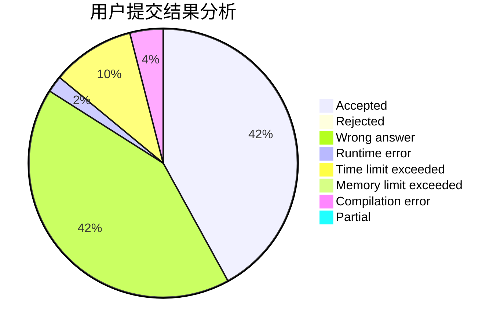
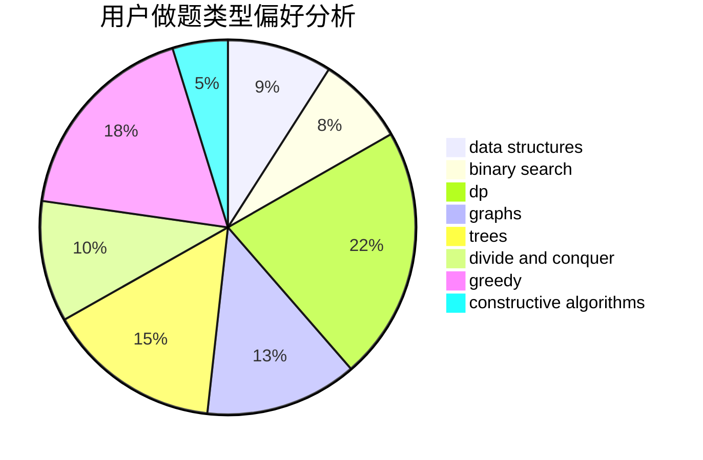

# Priori_Incantatem

<!-- tabs:start -->

#### **用户提交结果分析**

#### **用户做题类型偏好分析**

#### **用户错题知识点分析**

<!-- tabs:end -->
# 推荐题目
[526A](https://codeforces.com/contest/526/problem/A)		brute force,
                        implementation		  
[1344A](https://codeforces.com/contest/1344/problem/A)		math,
                        number theory,
                        sortings		  
[899D](https://codeforces.com/contest/899/problem/D)		constructive algorithms,
                        math		  
[794G](https://codeforces.com/contest/794/problem/G)		combinatorics,
                        dp,
                        math		  
[1300E](https://codeforces.com/contest/1300/problem/E)		dsu,graphs,sortings,trees		  
[392A](https://codeforces.com/contest/392/problem/A)		math		  
[723E](https://codeforces.com/contest/723/problem/E)		constructive algorithms,
                        dfs and similar,
                        flows,
                        graphs,
                        greedy		  
[1003E](https://codeforces.com/contest/1003/problem/E)		constructive algorithms,
                        graphs		  
[918A](https://codeforces.com/contest/918/problem/A)		brute force,
                        implementation		  
[226B](https://codeforces.com/contest/226/problem/B)		greedy		  
