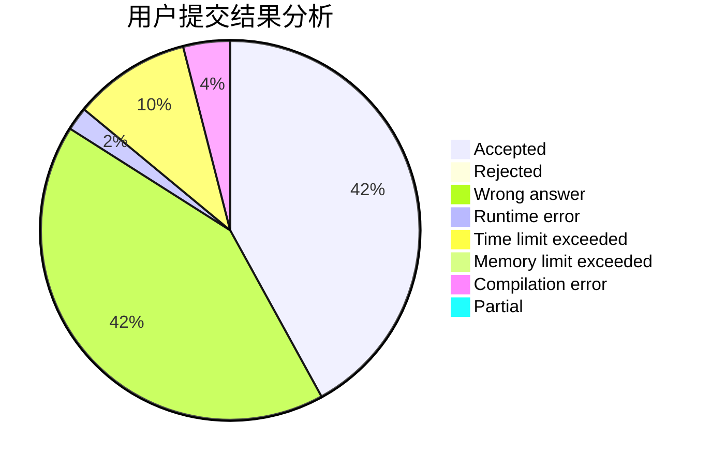
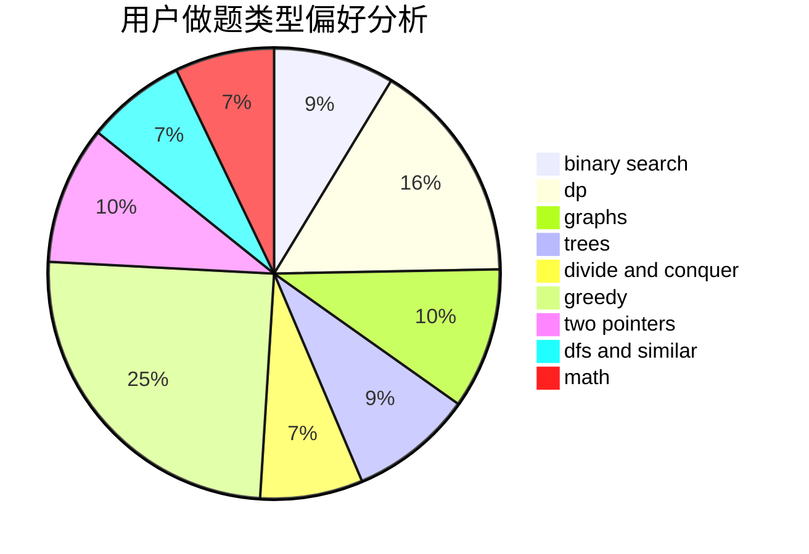

# Priori_Incantatem

<!-- tabs:start -->

#### **用户提交结果分析**

#### **用户做题类型偏好分析**

<!-- tabs:end -->
# 推荐题目
[526A](https://codeforces.com/contest/526/problem/A)
[1344A](https://codeforces.com/contest/1344/problem/A)
[899D](https://codeforces.com/contest/899/problem/D)
[794G](https://codeforces.com/contest/794/problem/G)
[1300E](https://codeforces.com/contest/1300/problem/E)
[392A](https://codeforces.com/contest/392/problem/A)
[723E](https://codeforces.com/contest/723/problem/E)
[1003E](https://codeforces.com/contest/1003/problem/E)
[918A](https://codeforces.com/contest/918/problem/A)
[226B](https://codeforces.com/contest/226/problem/B)
