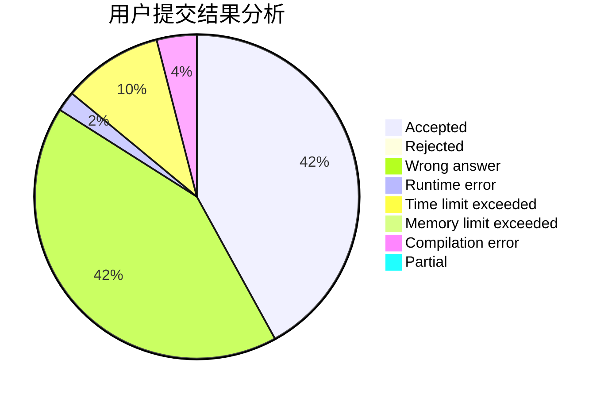
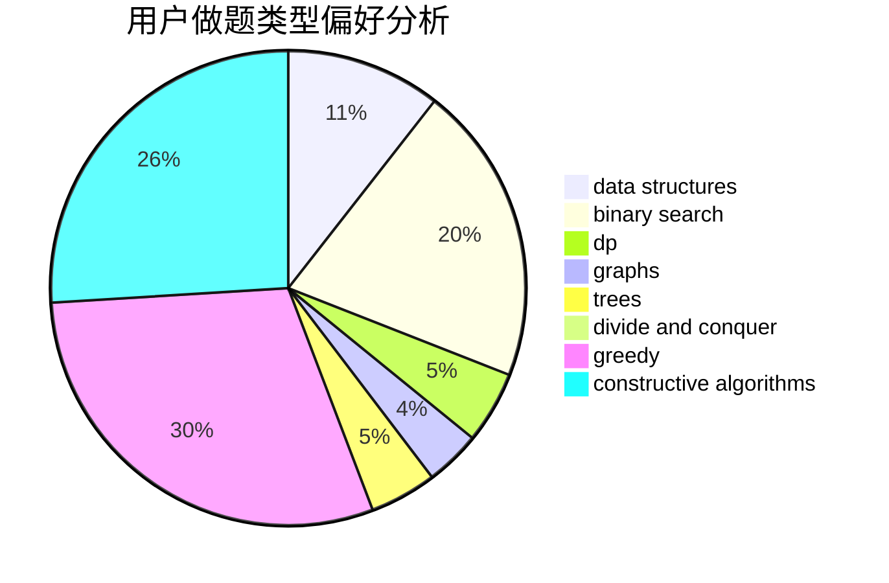

# Priori_Incantatem
<!-- tabs:start -->
#### **用户提交结果分析**

#### **用户做题类型偏好分析**

#### **用户错题知识点分析**

<!-- tabs:end -->
# 推荐题目
[Chiori and Doll Picking (hard version)](http://codeforces.com/problemset/problem/1336/E2)		bitmasks,
                        brute force,
                        combinatorics,
                        math		  
[Numbers on the blackboard](http://codeforces.com/problemset/problem/878/E)		combinatorics,
                        dp		  
[Binary String Constructing](http://codeforces.com/problemset/problem/1003/B)		constructive algorithms		  
[Shell Game](http://codeforces.com/problemset/problem/777/A)		constructive algorithms,
                        implementation,
                        math		  
[Mr. Kitayuta's Technology](http://codeforces.com/problemset/problem/505/D)		dfs and similar		  
[Dasha and Photos](http://codeforces.com/problemset/problem/761/F)		brute force,
                        data structures,
                        dp,
                        implementation		  
[No Game No Life](http://codeforces.com/problemset/problem/1411/G)		bitmasks,
                        games,
                        math,
                        matrices		  
[An overnight dance in discotheque](http://codeforces.com/problemset/problem/814/D)		dfs and similar,
                        dp,
                        geometry,
                        greedy,
                        trees		  
[Product of Three Numbers](http://codeforces.com/problemset/problem/1294/C)		greedy,
                        math,
                        number theory		  
[Yet Another Substring Reverse](http://codeforces.com/problemset/problem/1234/F)		bitmasks,
                        dp		  
<!-- tabs:start -->
#### **data structures**
[Chiori and Doll Picking (hard version)](http://codeforces.com/problemset/problem/761/F)		brute force,
                        data structures,
                        dp,
                        implementation		  
[Numbers on the blackboard](http://codeforces.com/problemset/problem/704/E)		data structures,
                        geometry,
                        trees		  
[Binary String Constructing](http://codeforces.com/problemset/problem/18/C)		data structures,
                        implementation		  
[Shell Game](http://codeforces.com/problemset/problem/47/E)		data structures,
                        geometry,
                        sortings		  
[Mr. Kitayuta's Technology](http://codeforces.com/problemset/problem/901/C)		binary search,
                        data structures,
                        dfs and similar,
                        dsu,
                        graphs,
                        two pointers		  
[Dasha and Photos](https://codeforces.com/contest/956/problem/C)		data structures,
                        dp,
                        greedy		  
[No Game No Life](https://codeforces.com/contest/634/problem/D)		data structures,
                        divide and conquer,
                        greedy		  
[An overnight dance in discotheque](http://codeforces.com/problemset/problem/1329/C)		constructive algorithms,
                        data structures,
                        greedy,
                        implementation		  
[Product of Three Numbers](http://codeforces.com/problemset/problem/558/E)		data structures,
                        sortings,
                        strings		  
[Yet Another Substring Reverse](http://codeforces.com/problemset/problem/1492/C)		binary search,
                        data structures,
                        dp,
                        greedy,
                        two pointers		  
#### **binary search**
[Chiori and Doll Picking (hard version)](http://codeforces.com/problemset/problem/1288/D)		binary search,
                        bitmasks,
                        dp		  
[Numbers on the blackboard](http://codeforces.com/problemset/problem/21/C)		binary search,
                        dp,
                        sortings		  
[Binary String Constructing](http://codeforces.com/problemset/problem/901/C)		binary search,
                        data structures,
                        dfs and similar,
                        dsu,
                        graphs,
                        two pointers		  
[Shell Game](http://codeforces.com/problemset/problem/1486/C1)		binary search,
                        interactive		  
[Mr. Kitayuta's Technology](http://codeforces.com/problemset/problem/1260/D)		binary search,
                        dp,
                        greedy,
                        sortings		  
[Dasha and Photos](http://codeforces.com/problemset/problem/504/E)		binary search,
                        dfs and similar,
                        hashing,
                        string suffix structures,
                        trees		  
[No Game No Life](http://codeforces.com/problemset/problem/1492/C)		binary search,
                        data structures,
                        dp,
                        greedy,
                        two pointers		  
[An overnight dance in discotheque](http://codeforces.com/problemset/problem/1463/D)		binary search,
                        constructive algorithms,
                        greedy,
                        two pointers		  
[Product of Three Numbers](http://codeforces.com/problemset/problem/1490/G)		binary search,
                        data structures,
                        math		  
[Yet Another Substring Reverse](http://codeforces.com/problemset/problem/1479/D)		binary search,
                        bitmasks,
                        brute force,
                        data structures,
                        probabilities,
                        trees		  
#### **dp**
[Chiori and Doll Picking (hard version)](http://codeforces.com/problemset/problem/878/E)		combinatorics,
                        dp		  
[Numbers on the blackboard](http://codeforces.com/problemset/problem/761/F)		brute force,
                        data structures,
                        dp,
                        implementation		  
[Binary String Constructing](http://codeforces.com/problemset/problem/814/D)		dfs and similar,
                        dp,
                        geometry,
                        greedy,
                        trees		  
[Shell Game](http://codeforces.com/problemset/problem/1234/F)		bitmasks,
                        dp		  
[Mr. Kitayuta's Technology](http://codeforces.com/problemset/problem/1288/D)		binary search,
                        bitmasks,
                        dp		  
[Dasha and Photos](http://codeforces.com/problemset/problem/295/B)		dp,
                        graphs,
                        shortest paths		  
[No Game No Life](http://codeforces.com/problemset/problem/21/C)		binary search,
                        dp,
                        sortings		  
[An overnight dance in discotheque](http://codeforces.com/problemset/problem/201/C)		dp		  
[Product of Three Numbers](http://codeforces.com/problemset/problem/1510/D)		dp,
                        math,
                        number theory		  
[Yet Another Substring Reverse](https://codeforces.com/contest/956/problem/C)		data structures,
                        dp,
                        greedy		  
#### **graph**
[Chiori and Doll Picking (hard version)](http://codeforces.com/problemset/problem/295/B)		dp,
                        graphs,
                        shortest paths		  
[Numbers on the blackboard](http://codeforces.com/problemset/problem/901/C)		binary search,
                        data structures,
                        dfs and similar,
                        dsu,
                        graphs,
                        two pointers		  
[Binary String Constructing](https://codeforces.com/contest/1013/problem/D)		constructive algorithms,
                        dfs and similar,
                        dsu,
                        graphs,
                        matrices		  
[Shell Game](http://codeforces.com/problemset/problem/911/F)		constructive algorithms,
                        dfs and similar,
                        graphs,
                        greedy,
                        trees		  
[Mr. Kitayuta's Technology](http://codeforces.com/problemset/problem/380/B)		graphs,
                        implementation		  
[Dasha and Photos](http://codeforces.com/problemset/problem/698/B)		constructive algorithms,
                        dfs and similar,
                        dsu,
                        graphs,
                        trees		  
[No Game No Life](http://codeforces.com/problemset/problem/1487/C)		brute force,
                        constructive algorithms,
                        dfs and similar,
                        graphs,
                        greedy,
                        implementation,
                        math		  
[An overnight dance in discotheque](http://codeforces.com/problemset/problem/1437/C)		dp,
                        flows,
                        graph matchings,
                        greedy,
                        math,
                        sortings		  
[Product of Three Numbers](http://codeforces.com/problemset/problem/1470/D)		constructive algorithms,
                        dfs and similar,
                        graph matchings,
                        graphs,
                        greedy		  
[Yet Another Substring Reverse](http://codeforces.com/problemset/problem/1476/C)		dp,
                        graphs,
                        greedy		  
#### **trees**
[Chiori and Doll Picking (hard version)](http://codeforces.com/problemset/problem/814/D)		dfs and similar,
                        dp,
                        geometry,
                        greedy,
                        trees		  
[Numbers on the blackboard](http://codeforces.com/problemset/problem/704/E)		data structures,
                        geometry,
                        trees		  
[Binary String Constructing](http://codeforces.com/problemset/problem/911/F)		constructive algorithms,
                        dfs and similar,
                        graphs,
                        greedy,
                        trees		  
[Shell Game](http://codeforces.com/problemset/problem/698/B)		constructive algorithms,
                        dfs and similar,
                        dsu,
                        graphs,
                        trees		  
[Mr. Kitayuta's Technology](https://codeforces.com/contest/1173/problem/D)		combinatorics,
                        dfs and similar,
                        dp,
                        trees		  
[Dasha and Photos](http://codeforces.com/problemset/problem/504/E)		binary search,
                        dfs and similar,
                        hashing,
                        string suffix structures,
                        trees		  
[No Game No Life](http://codeforces.com/problemset/problem/1479/D)		binary search,
                        bitmasks,
                        brute force,
                        data structures,
                        probabilities,
                        trees		  
[An overnight dance in discotheque](http://codeforces.com/problemset/problem/1511/C)		brute force,
                        data structures,
                        implementation,
                        trees		  
[Product of Three Numbers](http://codeforces.com/problemset/problem/1499/F)		combinatorics,
                        dfs and similar,
                        dp,
                        trees		  
[Yet Another Substring Reverse](http://codeforces.com/problemset/problem/1491/E)		brute force,
                        dfs and similar,
                        divide and conquer,
                        number theory,
                        trees		  
#### **divide and conquer**
[Chiori and Doll Picking (hard version)](https://codeforces.com/contest/634/problem/D)		data structures,
                        divide and conquer,
                        greedy		  
[Numbers on the blackboard](http://codeforces.com/problemset/problem/1461/D)		binary search,
                        brute force,
                        data structures,
                        divide and conquer,
                        implementation,
                        sortings		  
[Binary String Constructing](http://codeforces.com/problemset/problem/1466/G)		combinatorics,
                        divide and conquer,
                        hashing,
                        math,
                        string suffix structures,
                        strings		  
[Shell Game](http://codeforces.com/problemset/problem/1490/D)		dfs and similar,
                        divide and conquer,
                        implementation		  
[Mr. Kitayuta's Technology](https://codeforces.com/contest/1483/problem/C)		data structures,
                        divide and conquer,
                        dp		  
[Dasha and Photos](http://codeforces.com/problemset/problem/1491/E)		brute force,
                        dfs and similar,
                        divide and conquer,
                        number theory,
                        trees		  
[No Game No Life](http://codeforces.com/problemset/problem/1303/G)		data structures,
                        divide and conquer,
                        geometry,
                        trees		  
[An overnight dance in discotheque](http://codeforces.com/problemset/problem/1494/D)		constructive algorithms,
                        data structures,
                        dfs and similar,
                        divide and conquer,
                        dsu,
                        greedy,
                        sortings,
                        trees		  
[Product of Three Numbers](http://codeforces.com/problemset/problem/1482/E)		data structures,
                        divide and conquer,
                        dp		  
[Yet Another Substring Reverse](http://codeforces.com/problemset/problem/566/C)		dfs and similar,
                        divide and conquer,
                        trees		  
#### **greedy**
[Chiori and Doll Picking (hard version)](http://codeforces.com/problemset/problem/814/D)		dfs and similar,
                        dp,
                        geometry,
                        greedy,
                        trees		  
[Numbers on the blackboard](http://codeforces.com/problemset/problem/1294/C)		greedy,
                        math,
                        number theory		  
[Binary String Constructing](http://codeforces.com/problemset/problem/898/E)		constructive algorithms,
                        greedy		  
[Shell Game](http://codeforces.com/problemset/problem/389/A)		greedy,
                        math		  
[Mr. Kitayuta's Technology](http://codeforces.com/problemset/problem/1077/B)		greedy		  
[Dasha and Photos](http://codeforces.com/problemset/problem/1500/C)		bitmasks,
                        brute force,
                        constructive algorithms,
                        greedy,
                        two pointers		  
[No Game No Life](http://codeforces.com/problemset/problem/670/A)		brute force,
                        constructive algorithms,
                        greedy,
                        math		  
[An overnight dance in discotheque](http://codeforces.com/problemset/problem/469/A)		greedy,
                        implementation		  
[Product of Three Numbers](http://codeforces.com/problemset/problem/1132/B)		greedy,
                        sortings		  
[Yet Another Substring Reverse](https://codeforces.com/contest/956/problem/C)		data structures,
                        dp,
                        greedy		  
#### **constructive algorithms**
[Chiori and Doll Picking (hard version)](http://codeforces.com/problemset/problem/1003/B)		constructive algorithms		  
[Numbers on the blackboard](http://codeforces.com/problemset/problem/777/A)		constructive algorithms,
                        implementation,
                        math		  
[Binary String Constructing](http://codeforces.com/problemset/problem/898/E)		constructive algorithms,
                        greedy		  
[Shell Game](http://codeforces.com/problemset/problem/347/A)		constructive algorithms,
                        implementation,
                        sortings		  
[Mr. Kitayuta's Technology](http://codeforces.com/problemset/problem/1500/C)		bitmasks,
                        brute force,
                        constructive algorithms,
                        greedy,
                        two pointers		  
[Dasha and Photos](https://codeforces.com/contest/1159/problem/D)		constructive algorithms,
                        math,
                        strings		  
[No Game No Life](http://codeforces.com/problemset/problem/670/A)		brute force,
                        constructive algorithms,
                        greedy,
                        math		  
[An overnight dance in discotheque](https://codeforces.com/contest/1013/problem/D)		constructive algorithms,
                        dfs and similar,
                        dsu,
                        graphs,
                        matrices		  
[Product of Three Numbers](http://codeforces.com/problemset/problem/1366/D)		constructive algorithms,
                        math,
                        number theory		  
[Yet Another Substring Reverse](http://codeforces.com/problemset/problem/911/F)		constructive algorithms,
                        dfs and similar,
                        graphs,
                        greedy,
                        trees		  
#### **sortings**
[Chiori and Doll Picking (hard version)](http://codeforces.com/problemset/problem/347/A)		constructive algorithms,
                        implementation,
                        sortings		  
[Numbers on the blackboard](http://codeforces.com/problemset/problem/21/C)		binary search,
                        dp,
                        sortings		  
[Binary String Constructing](http://codeforces.com/problemset/problem/47/E)		data structures,
                        geometry,
                        sortings		  
[Shell Game](http://codeforces.com/problemset/problem/1132/B)		greedy,
                        sortings		  
[Mr. Kitayuta's Technology](http://codeforces.com/problemset/problem/1475/G)		dp,
                        math,
                        number theory,
                        sortings		  
[Dasha and Photos](http://codeforces.com/problemset/problem/1260/D)		binary search,
                        dp,
                        greedy,
                        sortings		  
[No Game No Life](http://codeforces.com/problemset/problem/558/E)		data structures,
                        sortings,
                        strings		  
[An overnight dance in discotheque](https://codeforces.com/contest/1496/problem/C)		geometry,
                        greedy,
                        math,
                        sortings		  
[Product of Three Numbers](http://codeforces.com/problemset/problem/1495/A)		geometry,
                        greedy,
                        math,
                        sortings		  
[Yet Another Substring Reverse](http://codeforces.com/problemset/problem/1497/A)		brute force,
                        data structures,
                        greedy,
                        sortings		  
<!-- tabs:end -->
