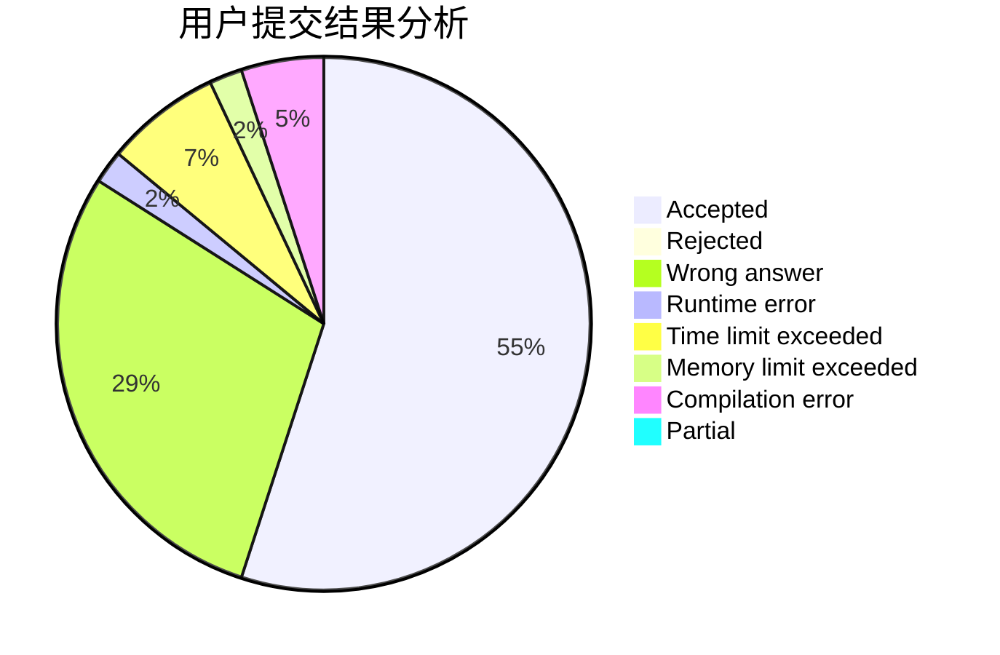
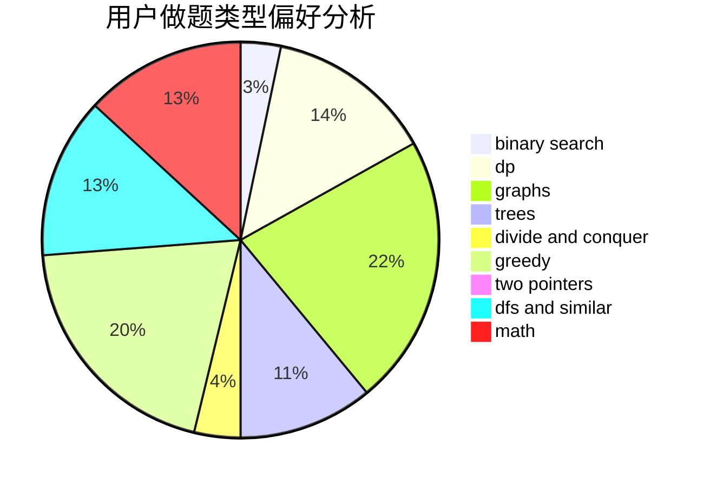

# Prism_ZG

<!-- tabs:start -->

#### **用户提交结果分析**

#### **用户做题类型偏好分析**

<!-- tabs:end -->
# 推荐题目
[1293D](https://codeforces.com/contest/1293/problem/D)
[437B](https://codeforces.com/contest/437/problem/B)
[1297A](https://codeforces.com/contest/1297/problem/A)
[827C](https://codeforces.com/contest/827/problem/C)
[280B](https://codeforces.com/contest/280/problem/B)
[11E](https://codeforces.com/contest/11/problem/E)
[103A](https://codeforces.com/contest/103/problem/A)
[984A](https://codeforces.com/contest/984/problem/A)
[492D](https://codeforces.com/contest/492/problem/D)
[1425A](https://codeforces.com/contest/1425/problem/A)
