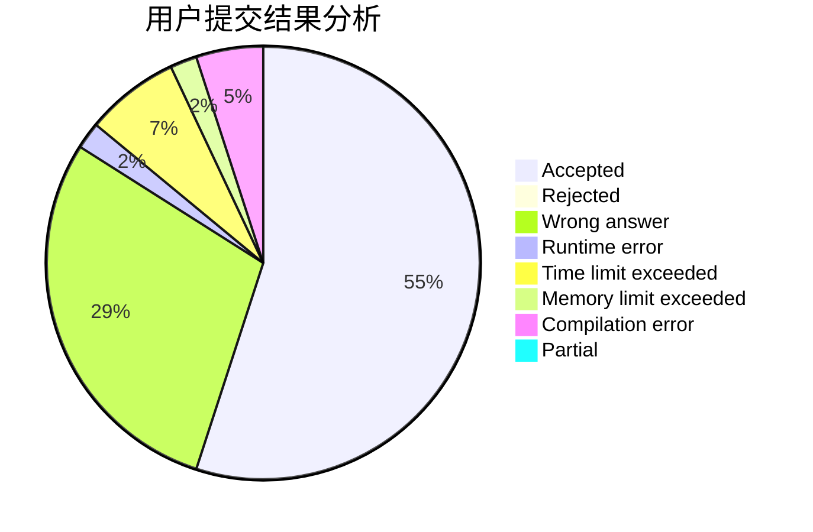
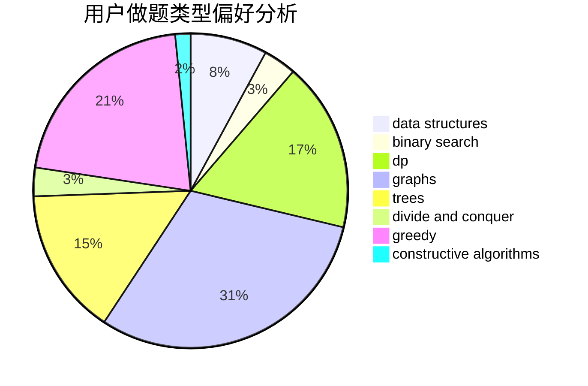

# Prism_ZG

<!-- tabs:start -->

#### **用户提交结果分析**

#### **用户做题类型偏好分析**

#### **用户错题知识点分析**

<!-- tabs:end -->
# 推荐题目
[1293D](https://codeforces.com/contest/1293/problem/D)		dsu,graphs,sortings,trees		  
[437B](https://codeforces.com/contest/437/problem/B)		bitmasks,
                        greedy,
                        implementation,
                        sortings		  
[1297A](https://codeforces.com/contest/1297/problem/A)		*special problem,
                        implementation		  
[827C](https://codeforces.com/contest/827/problem/C)		data structures,
                        strings		  
[280B](https://codeforces.com/contest/280/problem/B)		data structures,
                        implementation,
                        two pointers		  
[11E](https://codeforces.com/contest/11/problem/E)		binary search,
                        dp,
                        greedy		  
[103A](https://codeforces.com/contest/103/problem/A)		greedy,
                        implementation,
                        math		  
[984A](https://codeforces.com/contest/984/problem/A)		sortings		  
[492D](https://codeforces.com/contest/492/problem/D)		binary search,
                        implementation,
                        math,
                        sortings		  
[1425A](https://codeforces.com/contest/1425/problem/A)		games,
                        greedy		  
