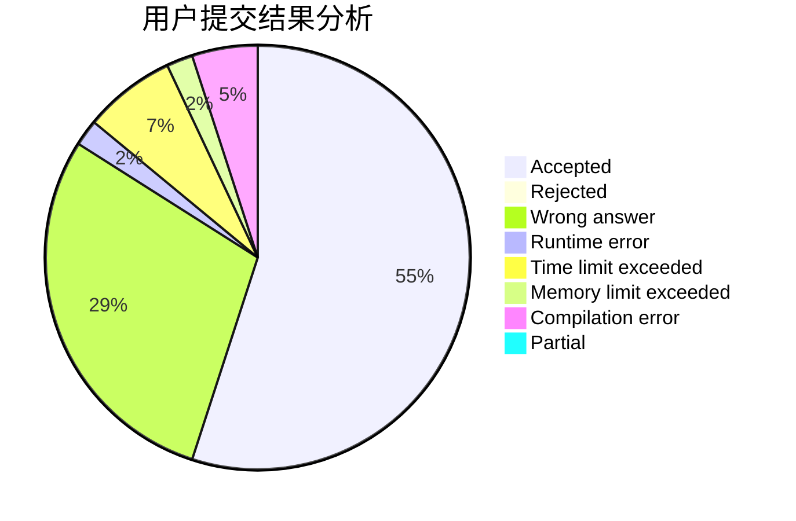
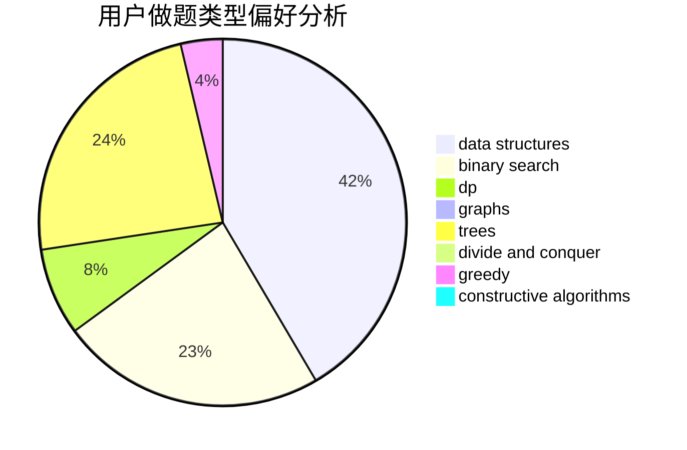

# Prism_ZG

<!-- tabs:start -->

#### **用户提交结果分析**

#### **用户做题类型偏好分析**

#### **用户错题知识点分析**

<!-- tabs:end -->
# 推荐题目
[1286C1](https://codeforces.com/contest/1286C/problem/1)		brute force,
                        constructive algorithms,
                        interactive,
                        math		  
[409H](https://codeforces.com/contest/409/problem/H)		*special problem,
                        brute force,
                        constructive algorithms,
                        dsu,
                        implementation		  
[1290D](https://codeforces.com/contest/1290/problem/D)		constructive algorithms,
                        graphs,
                        interactive		  
[809D](https://codeforces.com/contest/809/problem/D)		data structures,
                        dp		  
[264B](https://codeforces.com/contest/264/problem/B)		dp,
                        number theory		  
[1196D1](https://codeforces.com/contest/1196D/problem/1)		implementation		  
[1039C](https://codeforces.com/contest/1039/problem/C)		dfs and similar,
                        dsu,
                        graphs,
                        math,
                        sortings		  
[961E](https://codeforces.com/contest/961/problem/E)		data structures		  
[474C](https://codeforces.com/contest/474/problem/C)		brute force,
                        geometry		  
[1417D](https://codeforces.com/contest/1417/problem/D)		dsu,graphs,sortings,trees		  
