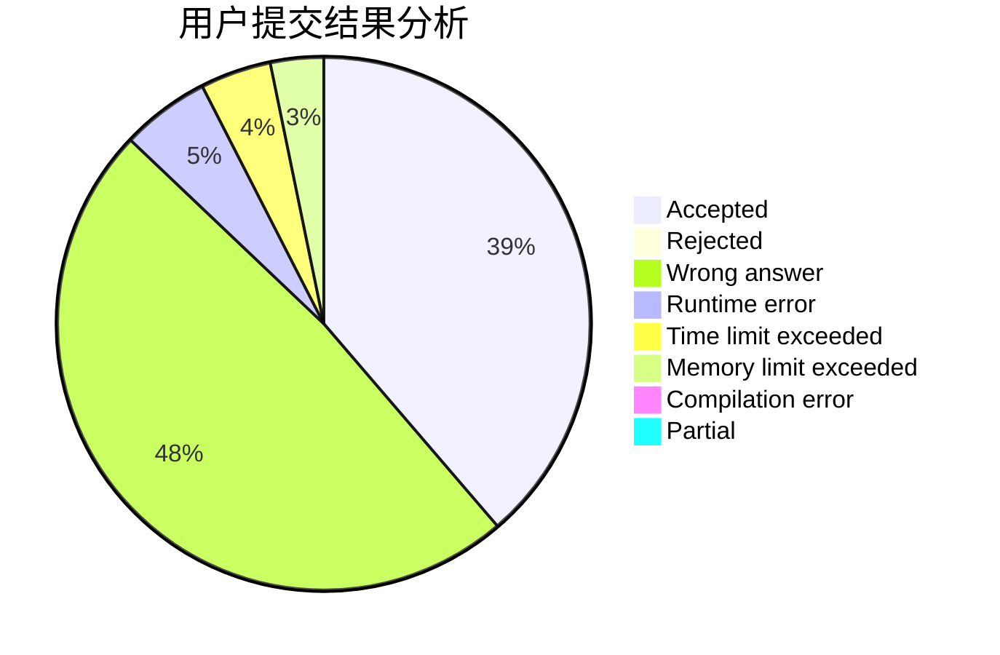
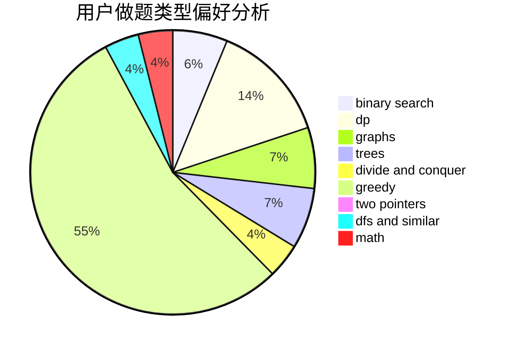

# Pro_king

<!-- tabs:start -->

#### **用户提交结果分析**

#### **用户做题类型偏好分析**

<!-- tabs:end -->
# 推荐题目
[20C](https://codeforces.com/contest/20/problem/C)
[190C](https://codeforces.com/contest/190/problem/C)
[1005D](https://codeforces.com/contest/1005/problem/D)
[189E](https://codeforces.com/contest/189/problem/E)
[160D](https://codeforces.com/contest/160/problem/D)
[672B](https://codeforces.com/contest/672/problem/B)
[252A](https://codeforces.com/contest/252/problem/A)
[233A](https://codeforces.com/contest/233/problem/A)
[306C](https://codeforces.com/contest/306/problem/C)
[486B](https://codeforces.com/contest/486/problem/B)
