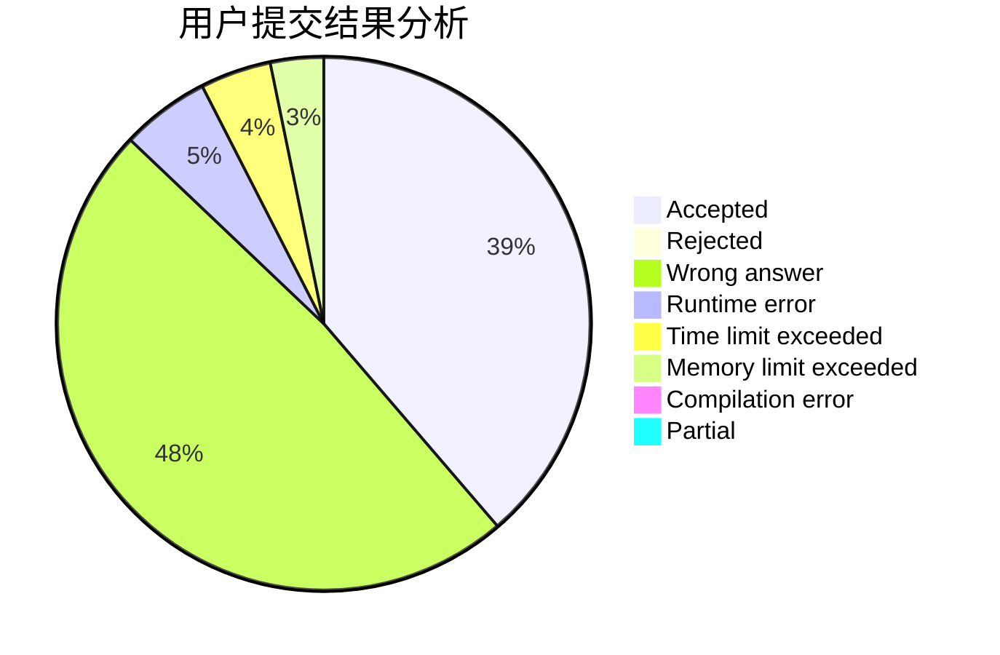
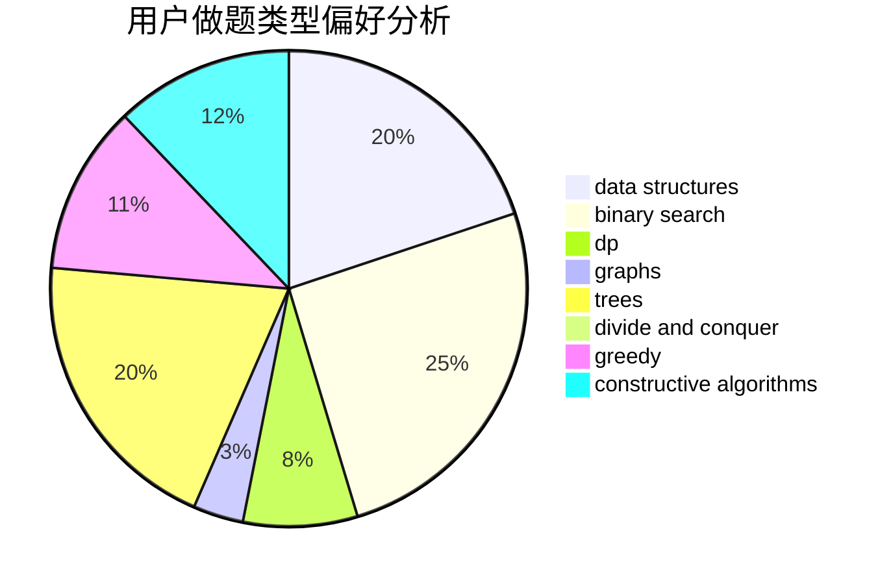
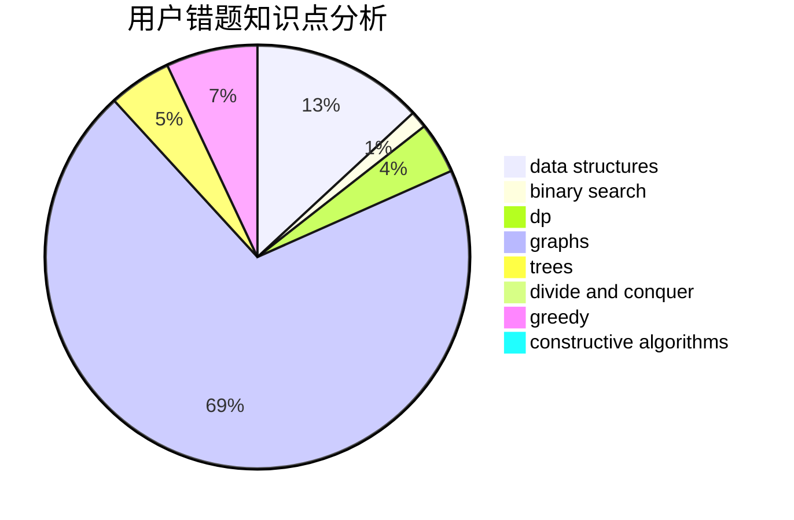

# Pro_king

<!-- tabs:start -->

#### **用户提交结果分析**

#### **用户做题类型偏好分析**

#### **用户错题知识点分析**

<!-- tabs:end -->
# 推荐题目
[185E](https://codeforces.com/contest/185/problem/E)		binary search,
                        data structures		  
[165D](https://codeforces.com/contest/165/problem/D)		data structures,
                        dsu,
                        trees		  
[1005C](https://codeforces.com/contest/1005/problem/C)		brute force,
                        greedy,
                        implementation		  
[163E](https://codeforces.com/contest/163/problem/E)		data structures,
                        dfs and similar,
                        dp,
                        strings,
                        trees		  
[1509F](https://codeforces.com/contest/1509/problem/F)		dsu,graphs,sortings,trees		  
[645F](https://codeforces.com/contest/645/problem/F)		combinatorics,
                        math,
                        number theory		  
[231B](https://codeforces.com/contest/231/problem/B)		constructive algorithms,
                        greedy		  
[213E](https://codeforces.com/contest/213/problem/E)		data structures,
                        hashing,
                        strings		  
[291E](https://codeforces.com/contest/291/problem/E)		*special problem,
                        dfs and similar,
                        hashing,
                        strings		  
[466D](https://codeforces.com/contest/466/problem/D)		combinatorics,
                        dp		  
