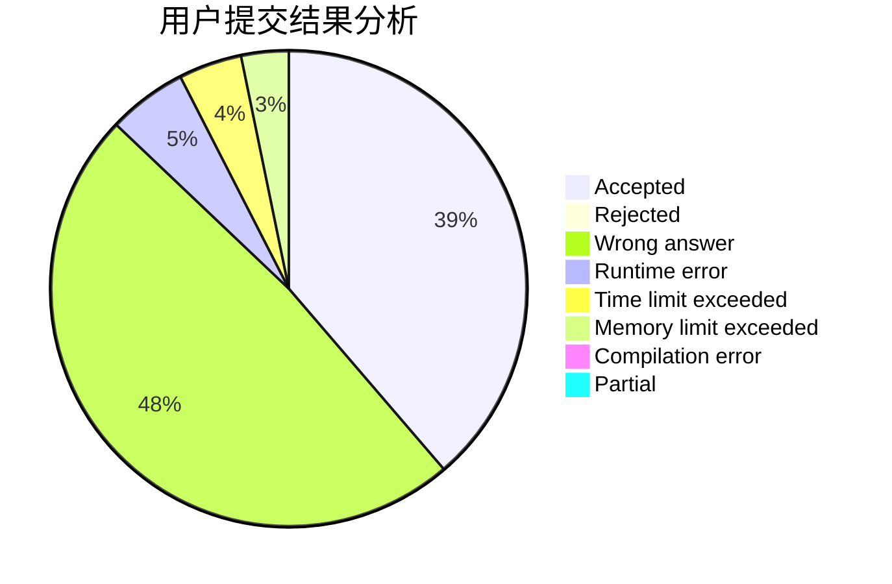
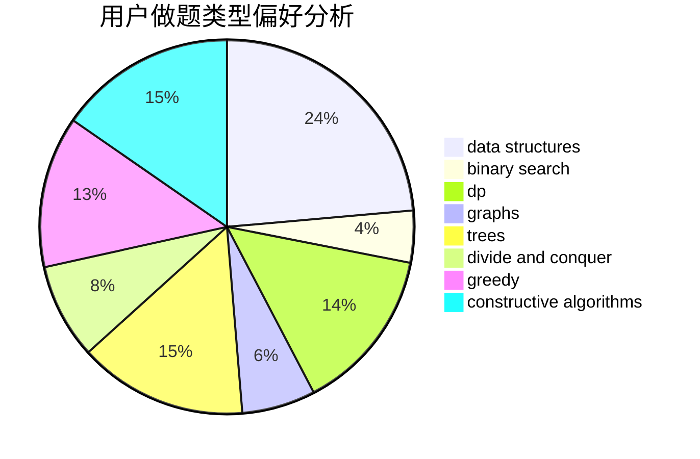
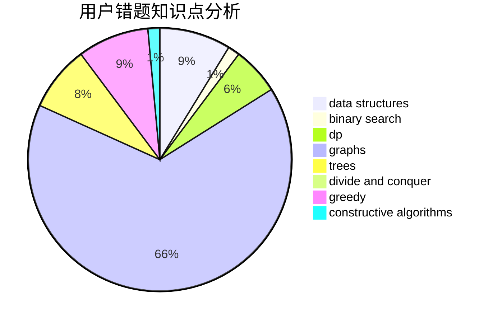

# Pro_king

<!-- tabs:start -->

#### **用户提交结果分析**

#### **用户做题类型偏好分析**

#### **用户错题知识点分析**

<!-- tabs:end -->
# 推荐题目
[20C](https://codeforces.com/contest/20/problem/C)		graphs,
                        shortest paths		  
[190C](https://codeforces.com/contest/190/problem/C)		dfs and similar		  
[1005D](https://codeforces.com/contest/1005/problem/D)		dp,
                        greedy,
                        number theory		  
[189E](https://codeforces.com/contest/189/problem/E)		dsu,graphs,sortings,trees		  
[160D](https://codeforces.com/contest/160/problem/D)		dfs and similar,
                        dsu,
                        graphs,
                        sortings		  
[672B](https://codeforces.com/contest/672/problem/B)		constructive algorithms,
                        implementation,
                        strings		  
[252A](https://codeforces.com/contest/252/problem/A)		brute force,
                        implementation		  
[233A](https://codeforces.com/contest/233/problem/A)		implementation,
                        math		  
[306C](https://codeforces.com/contest/306/problem/C)		combinatorics,
                        number theory		  
[486B](https://codeforces.com/contest/486/problem/B)		greedy,
                        hashing,
                        implementation		  
