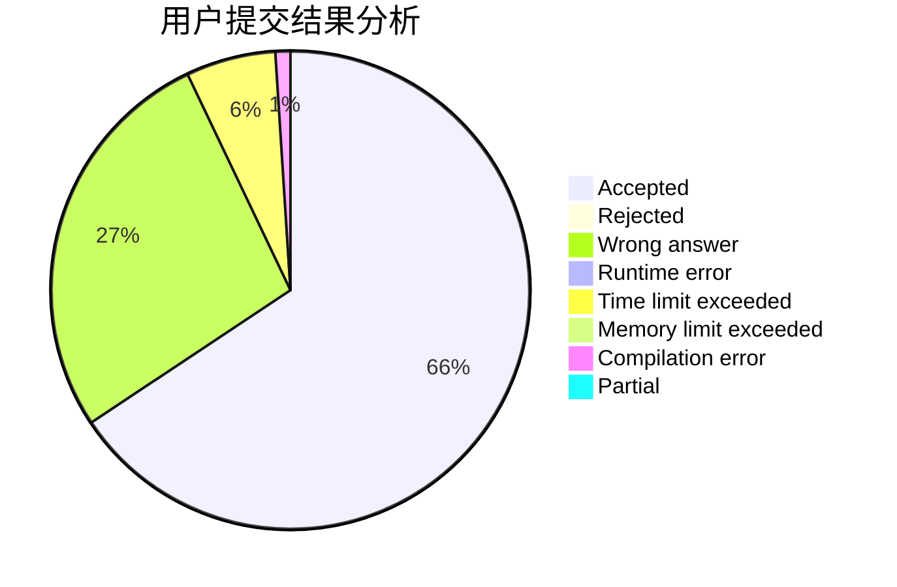
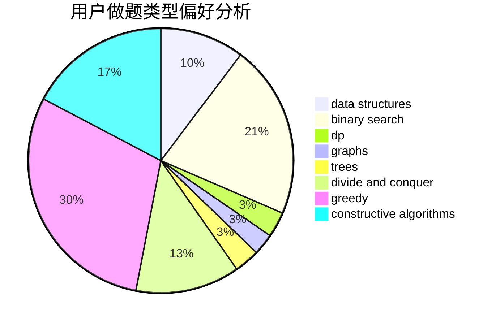
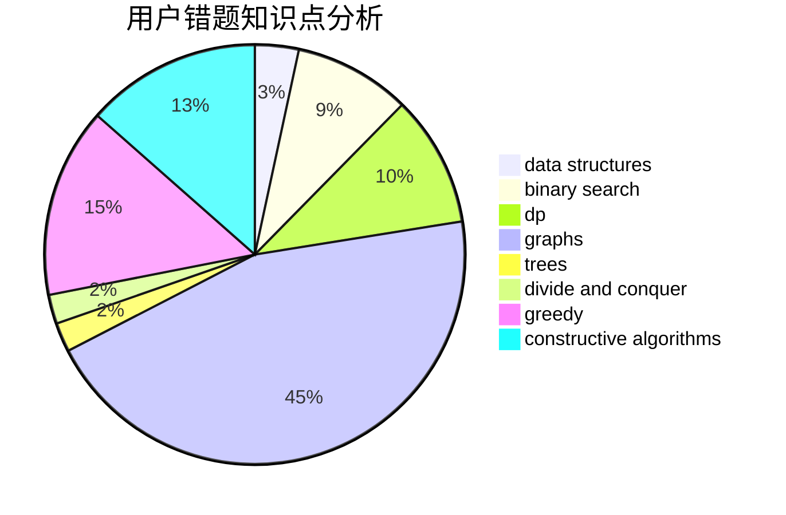

# Prof_BL

<!-- tabs:start -->

#### **用户提交结果分析**

#### **用户做题类型偏好分析**

#### **用户错题知识点分析**

<!-- tabs:end -->
# 推荐题目
[1384A](https://codeforces.com/contest/1384/problem/A)		constructive algorithms,
                        greedy,
                        strings		  
[295C](https://codeforces.com/contest/295/problem/C)		combinatorics,
                        dp,
                        graphs,
                        shortest paths		  
[251B](https://codeforces.com/contest/251/problem/B)		implementation,
                        math		  
[799F](https://codeforces.com/contest/799/problem/F)		data structures		  
[1245D](https://codeforces.com/contest/1245/problem/D)		dsu,
                        graphs,
                        greedy,
                        shortest paths,
                        trees		  
[587D](https://codeforces.com/contest/587/problem/D)		2-sat,
                        binary search		  
[609A](https://codeforces.com/contest/609/problem/A)		greedy,
                        implementation,
                        sortings		  
[112A](https://codeforces.com/contest/112/problem/A)		implementation,
                        strings		  
[441C](https://codeforces.com/contest/441/problem/C)		constructive algorithms,
                        dfs and similar,
                        implementation		  
[538H](https://codeforces.com/contest/538/problem/H)		2-sat,
                        data structures,
                        dfs and similar,
                        greedy		  
