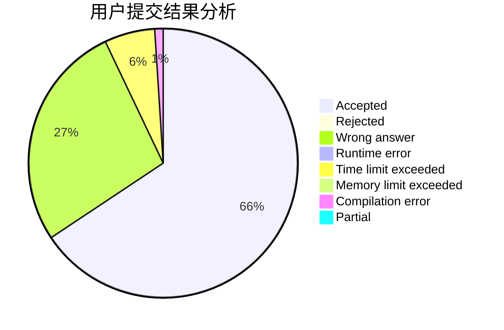
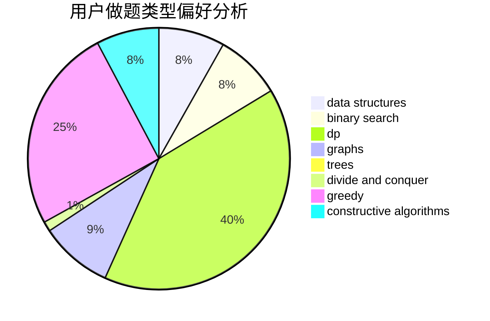
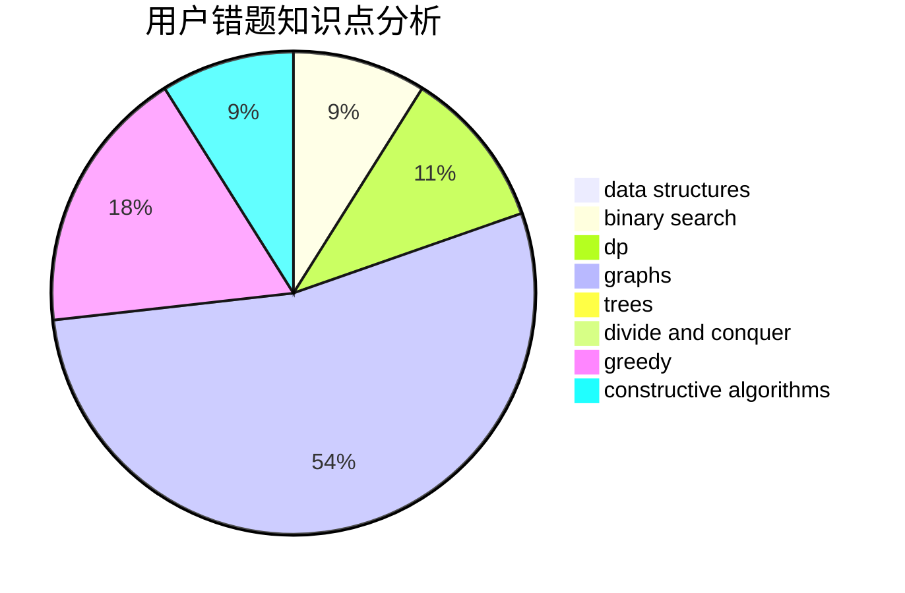

# Prof_BL

<!-- tabs:start -->

#### **用户提交结果分析**

#### **用户做题类型偏好分析**

#### **用户错题知识点分析**

<!-- tabs:end -->
# 推荐题目
[1393D](https://codeforces.com/contest/1393/problem/D)		dfs and similar,
                        dp,
                        implementation,
                        shortest paths		  
[312A](https://codeforces.com/contest/312/problem/A)		implementation,
                        strings		  
[269D](https://codeforces.com/contest/269/problem/D)		data structures,
                        dp,
                        graphs,
                        sortings		  
[813F](https://codeforces.com/contest/813/problem/F)		data structures,
                        dsu,
                        graphs		  
[1250F](https://codeforces.com/contest/1250/problem/F)		brute force,
                        implementation		  
[607E](https://codeforces.com/contest/607/problem/E)		binary search,
                        geometry		  
[627F](https://codeforces.com/contest/627/problem/F)		dfs and similar,
                        dsu,
                        graphs,
                        trees		  
[1131F](https://codeforces.com/contest/1131/problem/F)		constructive algorithms,
                        dsu		  
[462A](https://codeforces.com/contest/462/problem/A)		brute force,
                        implementation		  
[55C](https://codeforces.com/contest/55/problem/C)		games		  
