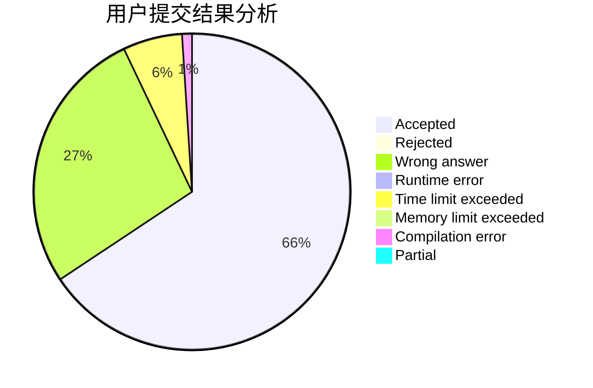
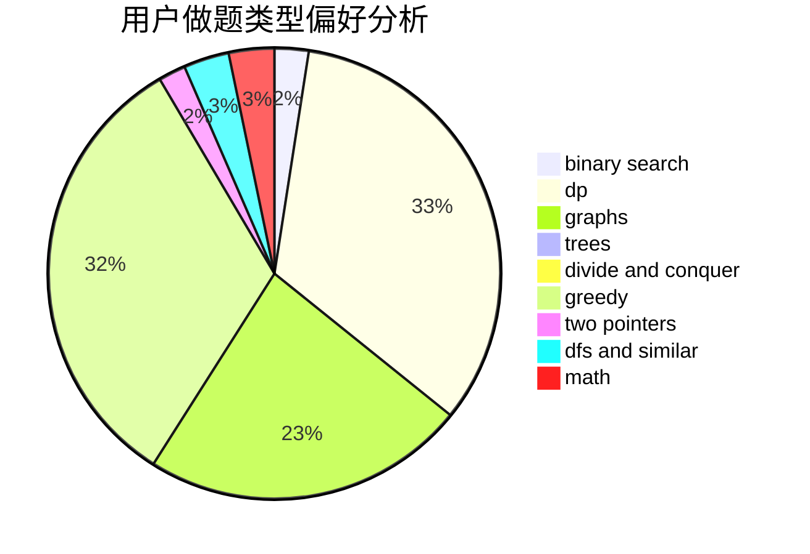

# Prof_BL

<!-- tabs:start -->

#### **用户提交结果分析**

#### **用户做题类型偏好分析**

<!-- tabs:end -->
# 推荐题目
[1393D](https://codeforces.com/contest/1393/problem/D)
[312A](https://codeforces.com/contest/312/problem/A)
[269D](https://codeforces.com/contest/269/problem/D)
[813F](https://codeforces.com/contest/813/problem/F)
[1250F](https://codeforces.com/contest/1250/problem/F)
[607E](https://codeforces.com/contest/607/problem/E)
[627F](https://codeforces.com/contest/627/problem/F)
[1131F](https://codeforces.com/contest/1131/problem/F)
[462A](https://codeforces.com/contest/462/problem/A)
[55C](https://codeforces.com/contest/55/problem/C)
