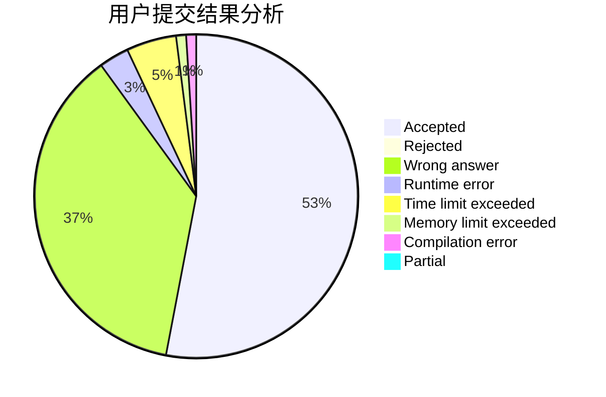
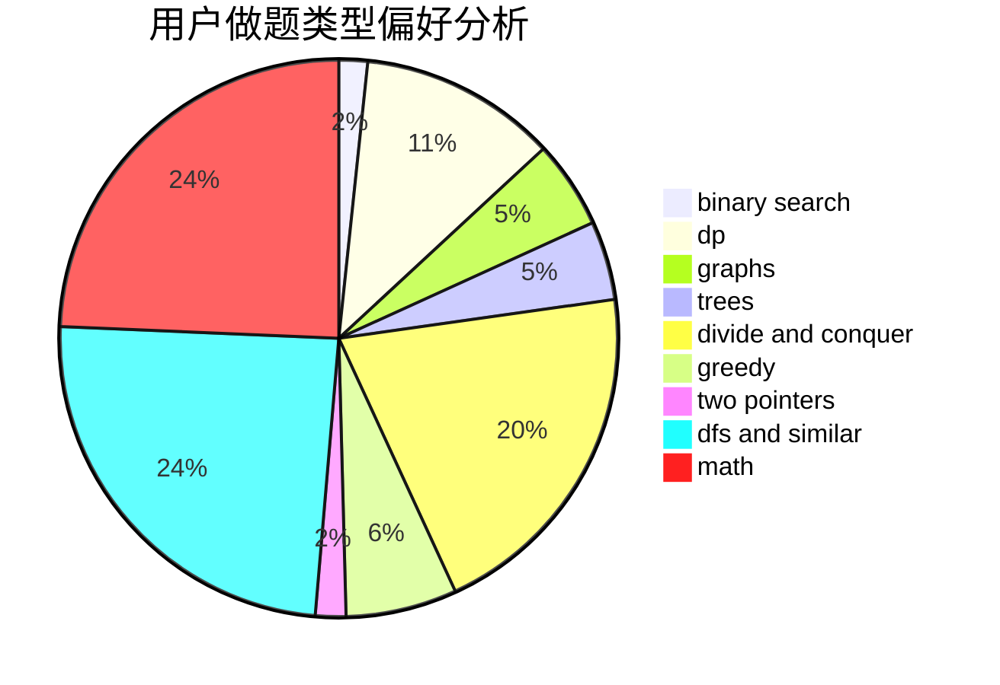

# Profat_

<!-- tabs:start -->

#### **用户提交结果分析**

#### **用户做题类型偏好分析**

<!-- tabs:end -->
# 推荐题目
[1483F](https://codeforces.com/contest/1483/problem/F)
[991E](https://codeforces.com/contest/991/problem/E)
[629E](https://codeforces.com/contest/629/problem/E)
[1203A](https://codeforces.com/contest/1203/problem/A)
[1373E](https://codeforces.com/contest/1373/problem/E)
[1280E](https://codeforces.com/contest/1280/problem/E)
[967E](https://codeforces.com/contest/967/problem/E)
[737C](https://codeforces.com/contest/737/problem/C)
[630G](https://codeforces.com/contest/630/problem/G)
[224A](https://codeforces.com/contest/224/problem/A)
