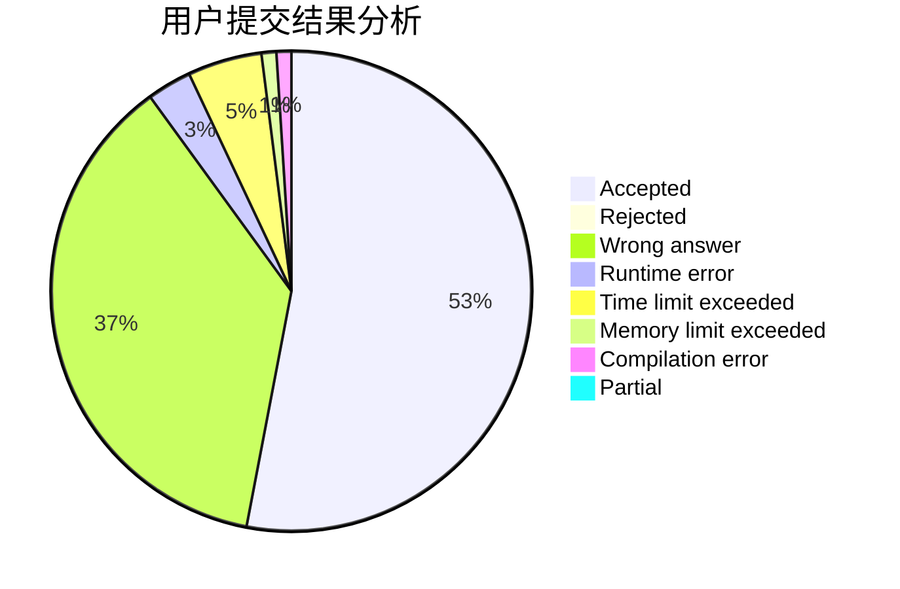
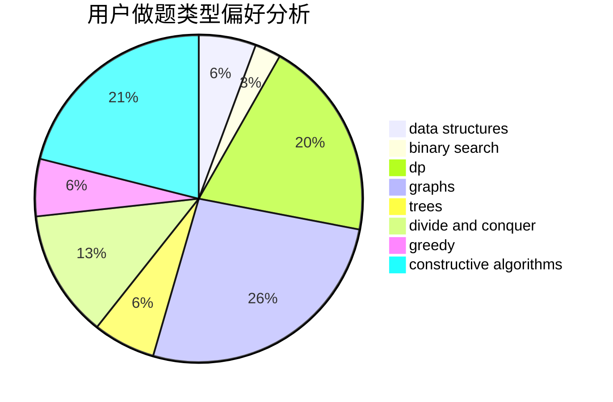
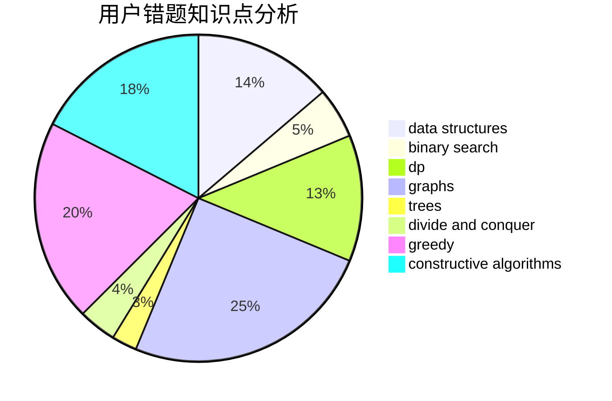

# Profat_

<!-- tabs:start -->

#### **用户提交结果分析**

#### **用户做题类型偏好分析**

#### **用户错题知识点分析**

<!-- tabs:end -->
# 推荐题目
[1475C](https://codeforces.com/contest/1475/problem/C)		combinatorics,
                        graphs,
                        math		  
[978A](https://codeforces.com/contest/978/problem/A)		implementation		  
[610C](https://codeforces.com/contest/610/problem/C)		constructive algorithms		  
[1199E](https://codeforces.com/contest/1199/problem/E)		dsu,graphs,sortings,trees		  
[1366F](https://codeforces.com/contest/1366/problem/F)		binary search,
                        dp,
                        geometry,
                        graphs		  
[1271C](https://codeforces.com/contest/1271/problem/C)		brute force,
                        geometry,
                        greedy,
                        implementation		  
[950C](https://codeforces.com/contest/950/problem/C)		dsu,graphs,sortings,trees		  
[720C](https://codeforces.com/contest/720/problem/C)		constructive algorithms		  
[611D](https://codeforces.com/contest/611/problem/D)		dp,
                        hashing,
                        strings		  
[1B](https://codeforces.com/contest/1/problem/B)		implementation,
                        math		  
