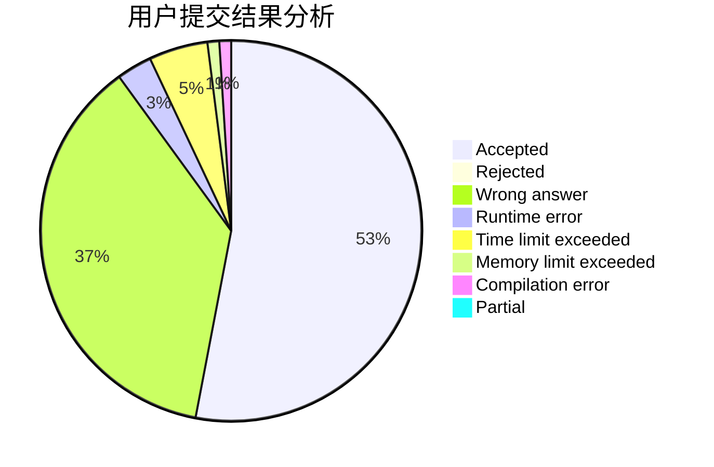
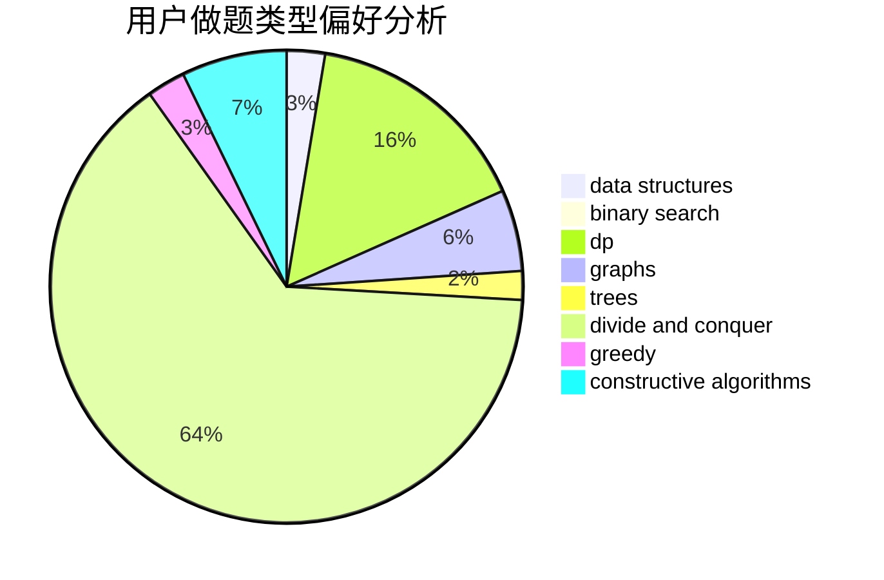
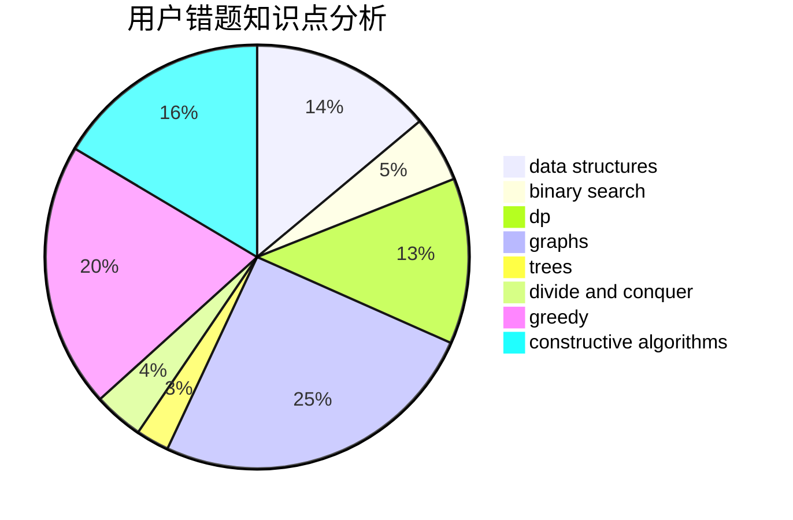

# Profat_

<!-- tabs:start -->

#### **用户提交结果分析**

#### **用户做题类型偏好分析**

#### **用户错题知识点分析**

<!-- tabs:end -->
# 推荐题目
[1483F](https://codeforces.com/contest/1483/problem/F)		dsu,graphs,sortings,trees		  
[991E](https://codeforces.com/contest/991/problem/E)		brute force,
                        combinatorics,
                        math		  
[629E](https://codeforces.com/contest/629/problem/E)		combinatorics,
                        data structures,
                        dfs and similar,
                        dp,
                        probabilities,
                        trees		  
[1203A](https://codeforces.com/contest/1203/problem/A)		implementation		  
[1373E](https://codeforces.com/contest/1373/problem/E)		brute force,
                        constructive algorithms,
                        dp,
                        greedy		  
[1280E](https://codeforces.com/contest/1280/problem/E)		math		  
[967E](https://codeforces.com/contest/967/problem/E)		dsu,graphs,sortings,trees		  
[737C](https://codeforces.com/contest/737/problem/C)		dsu,graphs,sortings,trees		  
[630G](https://codeforces.com/contest/630/problem/G)		combinatorics,
                        math		  
[224A](https://codeforces.com/contest/224/problem/A)		brute force,
                        geometry,
                        math		  
