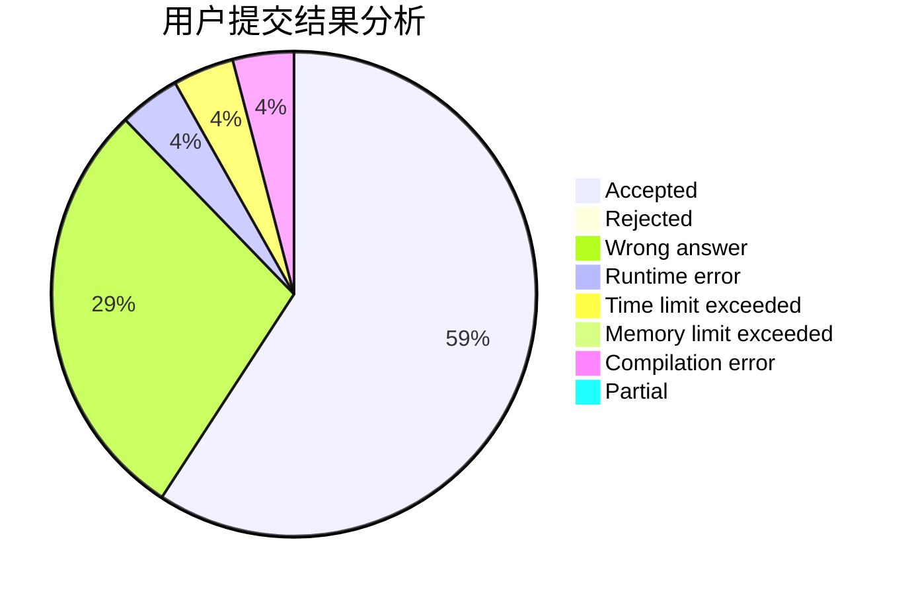
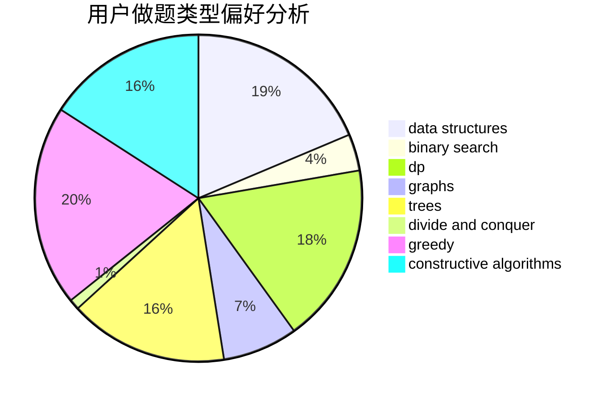

# PsephurusGladius
<!-- tabs:start -->
#### **用户提交结果分析**

#### **用户做题类型偏好分析**

#### **用户错题知识点分析**

<!-- tabs:end -->
# 推荐题目
[Binary Table (Hard Version)](https://codeforces.com/contest/1440/problem/C2)		constructive algorithms,
                        graphs,
                        greedy,
                        implementation		  
[Towers](http://codeforces.com/problemset/problem/229/D)		dp,
                        greedy,
                        two pointers		  
[Wrong Answer](https://codeforces.com/contest/1130/problem/E)		constructive algorithms		  
[Blackboard Fibonacci](https://codeforces.com/contest/218/problem/D)		brute force,
                        math		  
[Lucky Permutation Triple](https://codeforces.com/contest/304/problem/C)		constructive algorithms,
                        implementation,
                        math		  
[LIS of Sequence](http://codeforces.com/problemset/problem/486/E)		data structures,
                        dp,
                        greedy,
                        hashing,
                        math		  
[Wrong Answer](http://codeforces.com/problemset/problem/1129/B)		constructive algorithms		  
[Beautiful Year](http://codeforces.com/problemset/problem/271/A)		brute force		  
[Five Dimensional Points](https://codeforces.com/contest/851/problem/C)		brute force,
                        geometry,
                        math		  
[Little Elephant and Numbers](http://codeforces.com/problemset/problem/221/B)		implementation		  
<!-- tabs:start -->
#### **data structures**
[Binary Table (Hard Version)](http://codeforces.com/problemset/problem/486/E)		data structures,
                        dp,
                        greedy,
                        hashing,
                        math		  
[Towers](http://codeforces.com/problemset/problem/1109/F)		data structures,
                        trees		  
[Wrong Answer](http://codeforces.com/problemset/problem/733/E)		constructive algorithms,
                        data structures,
                        math,
                        two pointers		  
[Blackboard Fibonacci](http://codeforces.com/problemset/problem/1379/F2)		data structures,
                        divide and conquer		  
[Lucky Permutation Triple](http://codeforces.com/problemset/problem/776/C)		binary search,
                        brute force,
                        data structures,
                        implementation,
                        math		  
[LIS of Sequence](http://codeforces.com/problemset/problem/1492/C)		binary search,
                        data structures,
                        dp,
                        greedy,
                        two pointers		  
[Wrong Answer](http://codeforces.com/problemset/problem/1490/G)		binary search,
                        data structures,
                        math		  
[Beautiful Year](http://codeforces.com/problemset/problem/1479/D)		binary search,
                        bitmasks,
                        brute force,
                        data structures,
                        probabilities,
                        trees		  
[Five Dimensional Points](http://codeforces.com/problemset/problem/1497/A)		brute force,
                        data structures,
                        greedy,
                        sortings		  
[Little Elephant and Numbers](http://codeforces.com/problemset/problem/1491/C)		brute force,
                        data structures,
                        dp,
                        greedy,
                        implementation		  
#### **binary search**
[Binary Table (Hard Version)](http://codeforces.com/problemset/problem/1260/B)		binary search,
                        math		  
[Towers](http://codeforces.com/problemset/problem/776/C)		binary search,
                        brute force,
                        data structures,
                        implementation,
                        math		  
[Wrong Answer](http://codeforces.com/problemset/problem/1492/C)		binary search,
                        data structures,
                        dp,
                        greedy,
                        two pointers		  
[Blackboard Fibonacci](http://codeforces.com/problemset/problem/1463/D)		binary search,
                        constructive algorithms,
                        greedy,
                        two pointers		  
[Lucky Permutation Triple](http://codeforces.com/problemset/problem/1490/G)		binary search,
                        data structures,
                        math		  
[LIS of Sequence](http://codeforces.com/problemset/problem/1479/D)		binary search,
                        bitmasks,
                        brute force,
                        data structures,
                        probabilities,
                        trees		  
[Wrong Answer](http://codeforces.com/problemset/problem/1436/E)		binary search,
                        data structures,
                        two pointers		  
[Beautiful Year](http://codeforces.com/problemset/problem/1461/D)		binary search,
                        brute force,
                        data structures,
                        divide and conquer,
                        implementation,
                        sortings		  
[Five Dimensional Points](http://codeforces.com/problemset/problem/1493/C)		binary search,
                        brute force,
                        constructive algorithms,
                        greedy,
                        strings		  
[Little Elephant and Numbers](http://codeforces.com/problemset/problem/1487/D)		binary search,
                        brute force,
                        math,
                        number theory		  
#### **dp**
[Binary Table (Hard Version)](http://codeforces.com/problemset/problem/229/D)		dp,
                        greedy,
                        two pointers		  
[Towers](http://codeforces.com/problemset/problem/486/E)		data structures,
                        dp,
                        greedy,
                        hashing,
                        math		  
[Wrong Answer](https://codeforces.com/contest/544/problem/C)		dp		  
[Blackboard Fibonacci](http://codeforces.com/problemset/problem/1359/B)		brute force,
                        dp,
                        greedy,
                        implementation,
                        two pointers		  
[Lucky Permutation Triple](http://codeforces.com/problemset/problem/932/E)		combinatorics,
                        dp,
                        math		  
[LIS of Sequence](http://codeforces.com/problemset/problem/1492/C)		binary search,
                        data structures,
                        dp,
                        greedy,
                        two pointers		  
[Wrong Answer](https://codeforces.com/contest/1457/problem/C)		brute force,
                        dp,
                        implementation		  
[Beautiful Year](http://codeforces.com/problemset/problem/1491/C)		brute force,
                        data structures,
                        dp,
                        greedy,
                        implementation		  
[Five Dimensional Points](http://codeforces.com/problemset/problem/1437/C)		dp,
                        flows,
                        graph matchings,
                        greedy,
                        math,
                        sortings		  
[Little Elephant and Numbers](http://codeforces.com/problemset/problem/1499/B)		brute force,
                        dp,
                        greedy,
                        implementation		  
#### **graph**
[Binary Table (Hard Version)](https://codeforces.com/contest/1440/problem/C2)		constructive algorithms,
                        graphs,
                        greedy,
                        implementation		  
[Towers](http://codeforces.com/problemset/problem/1340/E)		graphs,
                        interactive,
                        probabilities		  
[Wrong Answer](http://codeforces.com/problemset/problem/1487/C)		brute force,
                        constructive algorithms,
                        dfs and similar,
                        graphs,
                        greedy,
                        implementation,
                        math		  
[Blackboard Fibonacci](http://codeforces.com/problemset/problem/1437/C)		dp,
                        flows,
                        graph matchings,
                        greedy,
                        math,
                        sortings		  
[Lucky Permutation Triple](http://codeforces.com/problemset/problem/1470/D)		constructive algorithms,
                        dfs and similar,
                        graph matchings,
                        graphs,
                        greedy		  
[LIS of Sequence](http://codeforces.com/problemset/problem/1476/C)		dp,
                        graphs,
                        greedy		  
[Wrong Answer](http://codeforces.com/problemset/problem/1304/D)		constructive algorithms,
                        graphs,
                        greedy,
                        two pointers		  
[Beautiful Year](http://codeforces.com/problemset/problem/1475/C)		combinatorics,
                        graphs,
                        math		  
[Five Dimensional Points](http://codeforces.com/problemset/problem/553/E)		dp,
                        fft,
                        graphs,
                        math,
                        probabilities		  
[Little Elephant and Numbers](http://codeforces.com/problemset/problem/1495/C)		constructive algorithms,
                        graphs		  
#### **trees**
[Binary Table (Hard Version)](http://codeforces.com/problemset/problem/1109/F)		data structures,
                        trees		  
[Towers](http://codeforces.com/problemset/problem/288/D)		combinatorics,
                        dfs and similar,
                        trees		  
[Wrong Answer](http://codeforces.com/problemset/problem/1479/D)		binary search,
                        bitmasks,
                        brute force,
                        data structures,
                        probabilities,
                        trees		  
[Blackboard Fibonacci](http://codeforces.com/problemset/problem/1511/C)		brute force,
                        data structures,
                        implementation,
                        trees		  
[Lucky Permutation Triple](http://codeforces.com/problemset/problem/1499/F)		combinatorics,
                        dfs and similar,
                        dp,
                        trees		  
[LIS of Sequence](http://codeforces.com/problemset/problem/1491/E)		brute force,
                        dfs and similar,
                        divide and conquer,
                        number theory,
                        trees		  
[Wrong Answer](http://codeforces.com/problemset/problem/1466/D)		data structures,
                        greedy,
                        sortings,
                        trees		  
[Beautiful Year](http://codeforces.com/problemset/problem/1495/D)		combinatorics,
                        dfs and similar,
                        graphs,
                        math,
                        shortest paths,
                        trees		  
[Five Dimensional Points](http://codeforces.com/problemset/problem/1303/G)		data structures,
                        divide and conquer,
                        geometry,
                        trees		  
[Little Elephant and Numbers](http://codeforces.com/problemset/problem/1454/E)		combinatorics,
                        dfs and similar,
                        graphs,
                        trees		  
#### **divide and conquer**
[Binary Table (Hard Version)](http://codeforces.com/problemset/problem/1379/F2)		data structures,
                        divide and conquer		  
[Towers](http://codeforces.com/problemset/problem/1461/D)		binary search,
                        brute force,
                        data structures,
                        divide and conquer,
                        implementation,
                        sortings		  
[Wrong Answer](http://codeforces.com/problemset/problem/1466/G)		combinatorics,
                        divide and conquer,
                        hashing,
                        math,
                        string suffix structures,
                        strings		  
[Blackboard Fibonacci](http://codeforces.com/problemset/problem/1490/D)		dfs and similar,
                        divide and conquer,
                        implementation		  
[Lucky Permutation Triple](https://codeforces.com/contest/1483/problem/C)		data structures,
                        divide and conquer,
                        dp		  
[LIS of Sequence](http://codeforces.com/problemset/problem/1491/E)		brute force,
                        dfs and similar,
                        divide and conquer,
                        number theory,
                        trees		  
[Wrong Answer](http://codeforces.com/problemset/problem/1303/G)		data structures,
                        divide and conquer,
                        geometry,
                        trees		  
[Beautiful Year](http://codeforces.com/problemset/problem/1494/D)		constructive algorithms,
                        data structures,
                        dfs and similar,
                        divide and conquer,
                        dsu,
                        greedy,
                        sortings,
                        trees		  
[Five Dimensional Points](http://codeforces.com/problemset/problem/1482/E)		data structures,
                        divide and conquer,
                        dp		  
[Little Elephant and Numbers](http://codeforces.com/problemset/problem/566/C)		dfs and similar,
                        divide and conquer,
                        trees		  
#### **greedy**
[Binary Table (Hard Version)](https://codeforces.com/contest/1440/problem/C2)		constructive algorithms,
                        graphs,
                        greedy,
                        implementation		  
[Towers](http://codeforces.com/problemset/problem/229/D)		dp,
                        greedy,
                        two pointers		  
[Wrong Answer](http://codeforces.com/problemset/problem/486/E)		data structures,
                        dp,
                        greedy,
                        hashing,
                        math		  
[Blackboard Fibonacci](http://codeforces.com/problemset/problem/1118/D1)		brute force,
                        greedy		  
[Lucky Permutation Triple](http://codeforces.com/problemset/problem/734/B)		brute force,
                        greedy,
                        implementation,
                        math		  
[LIS of Sequence](http://codeforces.com/problemset/problem/381/B)		greedy,
                        implementation,
                        sortings		  
[Wrong Answer](http://codeforces.com/problemset/problem/1359/B)		brute force,
                        dp,
                        greedy,
                        implementation,
                        two pointers		  
[Beautiful Year](http://codeforces.com/problemset/problem/1493/E)		bitmasks,
                        constructive algorithms,
                        greedy,
                        math,
                        strings,
                        two pointers		  
[Five Dimensional Points](http://codeforces.com/problemset/problem/1313/B)		constructive algorithms,
                        greedy,
                        implementation,
                        math		  
[Little Elephant and Numbers](http://codeforces.com/problemset/problem/1215/C)		constructive algorithms,
                        greedy		  
#### **constructive algorithms**
[Binary Table (Hard Version)](https://codeforces.com/contest/1440/problem/C2)		constructive algorithms,
                        graphs,
                        greedy,
                        implementation		  
[Towers](https://codeforces.com/contest/1130/problem/E)		constructive algorithms		  
[Wrong Answer](https://codeforces.com/contest/304/problem/C)		constructive algorithms,
                        implementation,
                        math		  
[Blackboard Fibonacci](http://codeforces.com/problemset/problem/1129/B)		constructive algorithms		  
[Lucky Permutation Triple](http://codeforces.com/problemset/problem/1493/E)		bitmasks,
                        constructive algorithms,
                        greedy,
                        math,
                        strings,
                        two pointers		  
[LIS of Sequence](http://codeforces.com/problemset/problem/1313/B)		constructive algorithms,
                        greedy,
                        implementation,
                        math		  
[Wrong Answer](http://codeforces.com/problemset/problem/733/E)		constructive algorithms,
                        data structures,
                        math,
                        two pointers		  
[Beautiful Year](http://codeforces.com/problemset/problem/1215/C)		constructive algorithms,
                        greedy		  
[Five Dimensional Points](http://codeforces.com/problemset/problem/1493/A)		constructive algorithms,
                        greedy		  
[Little Elephant and Numbers](http://codeforces.com/problemset/problem/1463/D)		binary search,
                        constructive algorithms,
                        greedy,
                        two pointers		  
#### **sortings**
[Binary Table (Hard Version)](http://codeforces.com/problemset/problem/381/B)		greedy,
                        implementation,
                        sortings		  
[Towers](https://codeforces.com/contest/1496/problem/C)		geometry,
                        greedy,
                        math,
                        sortings		  
[Wrong Answer](http://codeforces.com/problemset/problem/1495/A)		geometry,
                        greedy,
                        math,
                        sortings		  
[Blackboard Fibonacci](http://codeforces.com/problemset/problem/1497/A)		brute force,
                        data structures,
                        greedy,
                        sortings		  
[Lucky Permutation Triple](http://codeforces.com/problemset/problem/1427/A)		math,
                        sortings		  
[LIS of Sequence](http://codeforces.com/problemset/problem/1461/D)		binary search,
                        brute force,
                        data structures,
                        divide and conquer,
                        implementation,
                        sortings		  
[Wrong Answer](http://codeforces.com/problemset/problem/1437/C)		dp,
                        flows,
                        graph matchings,
                        greedy,
                        math,
                        sortings		  
[Beautiful Year](http://codeforces.com/problemset/problem/1473/A)		greedy,
                        implementation,
                        math,
                        sortings		  
[Five Dimensional Points](http://codeforces.com/problemset/problem/1486/B)		binary search,
                        geometry,
                        shortest paths,
                        sortings		  
[Little Elephant and Numbers](http://codeforces.com/problemset/problem/1480/B)		greedy,
                        implementation,
                        sortings		  
<!-- tabs:end -->
