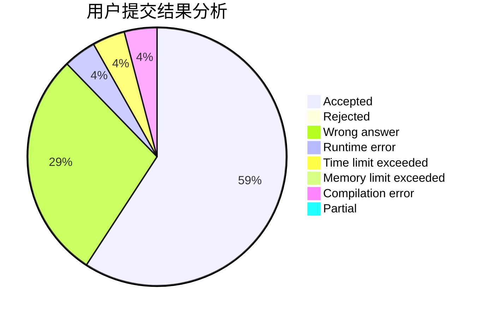
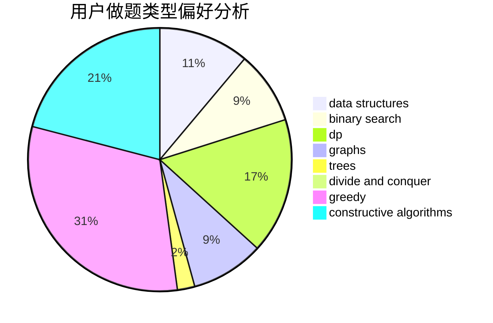

# PsephurusGladius

<!-- tabs:start -->

#### **用户提交结果分析**

#### **用户做题类型偏好分析**

#### **用户错题知识点分析**

<!-- tabs:end -->
# 推荐题目
[249E](https://codeforces.com/contest/249/problem/E)		math		  
[1131B](https://codeforces.com/contest/1131/problem/B)		greedy,
                        implementation		  
[1322E](https://codeforces.com/contest/1322/problem/E)		data structures		  
[1113A](https://codeforces.com/contest/1113/problem/A)		dp,
                        greedy,
                        math		  
[1279F](https://codeforces.com/contest/1279/problem/F)		binary search,
                        dp		  
[287C](https://codeforces.com/contest/287/problem/C)		dsu,graphs,sortings,trees		  
[238A](https://codeforces.com/contest/238/problem/A)		constructive algorithms,
                        math		  
[1488E](https://codeforces.com/contest/1488/problem/E)		*special problem,
                        data structures,
                        dp		  
[1092A](https://codeforces.com/contest/1092/problem/A)		implementation		  
[293C](https://codeforces.com/contest/293/problem/C)		brute force,
                        math,
                        number theory		  
