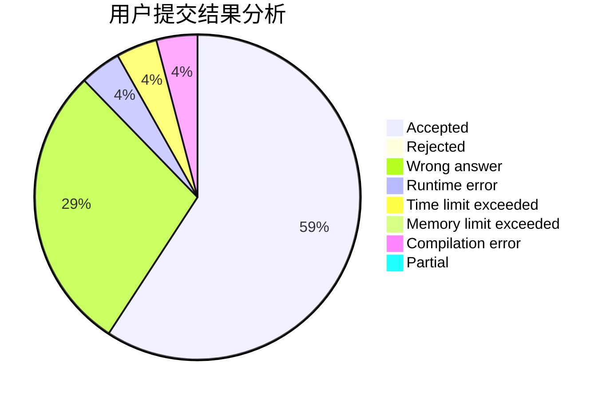
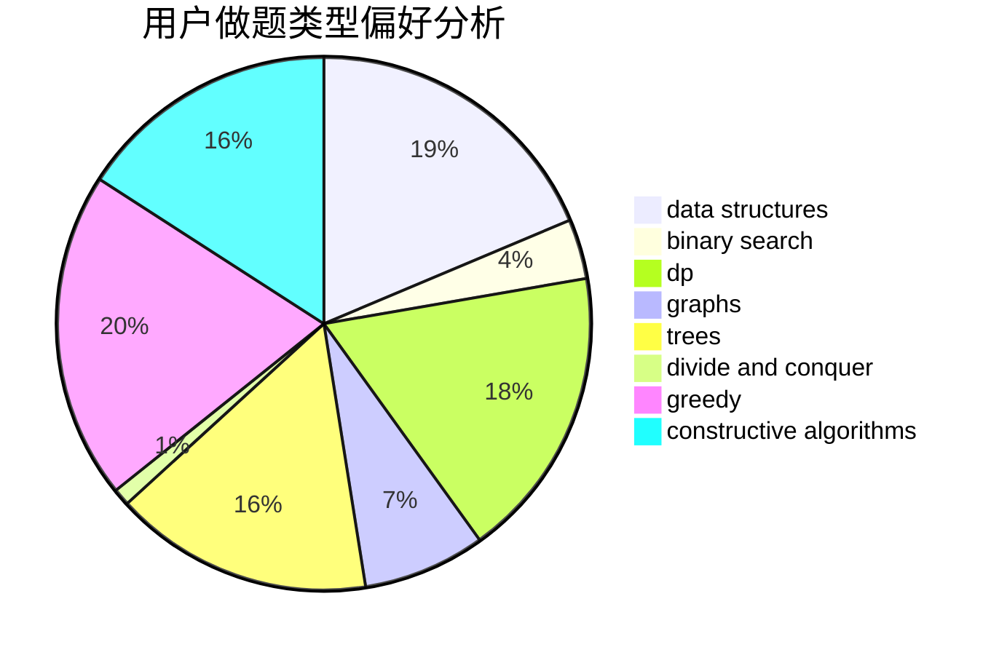

# PsephurusGladius

<!-- tabs:start -->

#### **用户提交结果分析**

#### **用户做题类型偏好分析**

#### **用户错题知识点分析**

<!-- tabs:end -->
# 推荐题目
[229D](https://codeforces.com/contest/229/problem/D)		dp,
                        greedy,
                        two pointers		  
[1129B](https://codeforces.com/contest/1129/problem/B)		constructive algorithms		  
[1313B](https://codeforces.com/contest/1313/problem/B)		constructive algorithms,
                        greedy,
                        implementation,
                        math		  
[1111B](https://codeforces.com/contest/1111/problem/B)		brute force,
                        implementation,
                        math		  
[1270F](https://codeforces.com/contest/1270/problem/F)		math,
                        strings		  
[271A](https://codeforces.com/contest/271/problem/A)		brute force		  
[218D](https://codeforces.com/contest/218/problem/D)		dsu,graphs,sortings,trees		  
[1480A](https://codeforces.com/contest/1480/problem/A)		games,
                        greedy,
                        strings		  
[1091H](https://codeforces.com/contest/1091/problem/H)		games		  
[278C](https://codeforces.com/contest/278/problem/C)		dsu,graphs,sortings,trees		  
