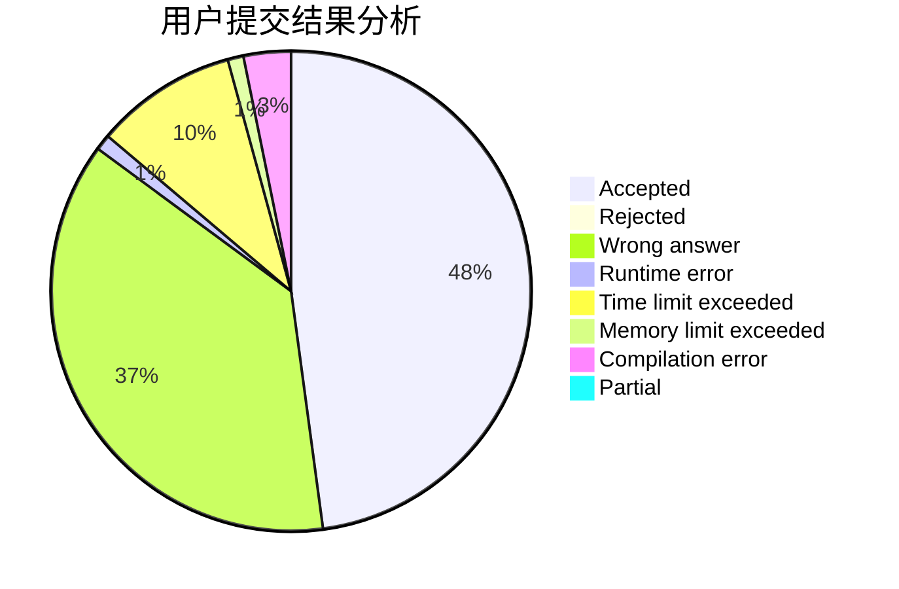
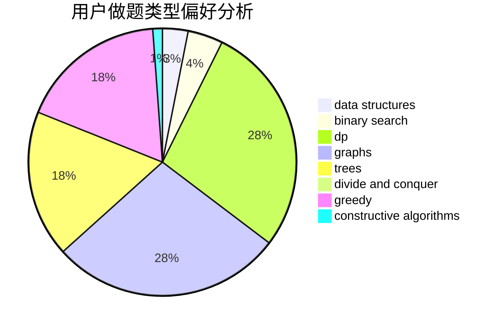

# ACfunhsl

<!-- tabs:start -->

#### **用户提交结果分析**

#### **用户做题类型偏好分析**

#### **用户错题知识点分析**

<!-- tabs:end -->
# 推荐题目
[1487G](https://codeforces.com/contest/1487/problem/G)		combinatorics,
                        dp,
                        fft,
                        math		  
[1278B](https://codeforces.com/contest/1278/problem/B)		greedy,
                        math		  
[1434E](https://codeforces.com/contest/1434/problem/E)		dsu,
                        games		  
[120J](https://codeforces.com/contest/120/problem/J)		divide and conquer,
                        geometry,
                        sortings		  
[1262A](https://codeforces.com/contest/1262/problem/A)		dsu,graphs,sortings,trees		  
[1064B](https://codeforces.com/contest/1064/problem/B)		math		  
[1153E](https://codeforces.com/contest/1153/problem/E)		binary search,
                        brute force,
                        interactive		  
[1379A](https://codeforces.com/contest/1379/problem/A)		brute force,
                        implementation,
                        strings		  
[1431A](https://codeforces.com/contest/1431/problem/A)		*special problem		  
[1487F](https://codeforces.com/contest/1487/problem/F)		dp,
                        greedy,
                        shortest paths		  
