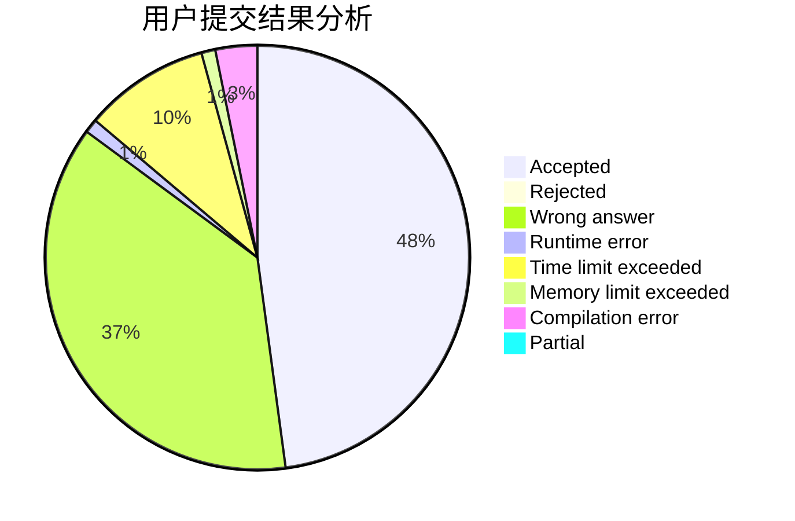
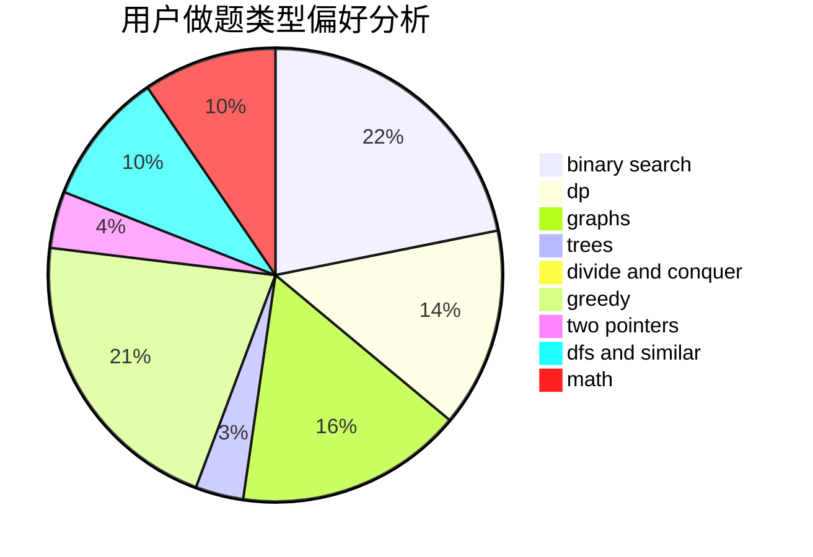

# ACfunhsl

<!-- tabs:start -->

#### **用户提交结果分析**

#### **用户做题类型偏好分析**

<!-- tabs:end -->
# 推荐题目
[1487G](https://codeforces.com/contest/1487/problem/G)
[1278B](https://codeforces.com/contest/1278/problem/B)
[1434E](https://codeforces.com/contest/1434/problem/E)
[120J](https://codeforces.com/contest/120/problem/J)
[1262A](https://codeforces.com/contest/1262/problem/A)
[1064B](https://codeforces.com/contest/1064/problem/B)
[1153E](https://codeforces.com/contest/1153/problem/E)
[1379A](https://codeforces.com/contest/1379/problem/A)
[1431A](https://codeforces.com/contest/1431/problem/A)
[1487F](https://codeforces.com/contest/1487/problem/F)
