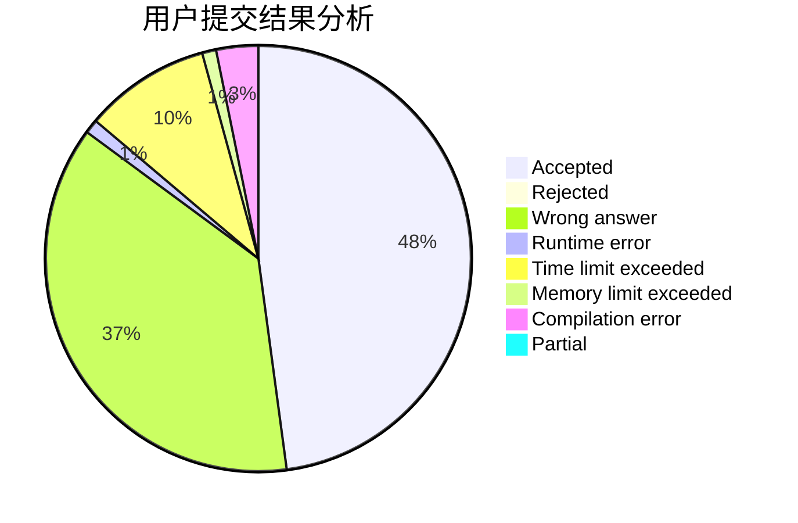
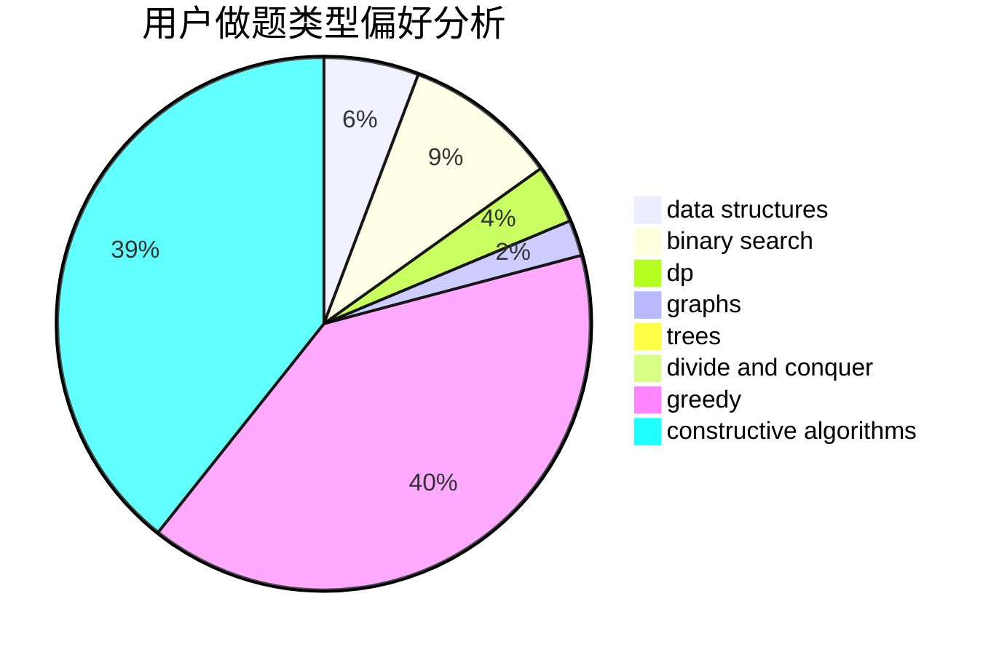

# ACfunhsl

<!-- tabs:start -->

#### **用户提交结果分析**

#### **用户做题类型偏好分析**

#### **用户错题知识点分析**

<!-- tabs:end -->
# 推荐题目
[1479B2](https://codeforces.com/contest/1479B/problem/2)		constructive algorithms,
                        data structures,
                        dp,
                        greedy,
                        implementation		  
[1269B](https://codeforces.com/contest/1269/problem/B)		brute force,
                        sortings		  
[1426C](https://codeforces.com/contest/1426/problem/C)		binary search,
                        constructive algorithms,
                        math		  
[1205F](https://codeforces.com/contest/1205/problem/F)		constructive algorithms,
                        math		  
[1255A](https://codeforces.com/contest/1255/problem/A)		math		  
[1063E](https://codeforces.com/contest/1063/problem/E)		constructive algorithms,
                        math		  
[1151E](https://codeforces.com/contest/1151/problem/E)		combinatorics,
                        data structures,
                        dp,
                        math		  
[1370D](https://codeforces.com/contest/1370/problem/D)		binary search,
                        dp,
                        dsu,
                        greedy,
                        implementation		  
[1423F](https://codeforces.com/contest/1423/problem/F)		math		  
[1479B1](https://codeforces.com/contest/1479B/problem/1)		constructive algorithms,
                        data structures,
                        dp,
                        greedy,
                        implementation		  
