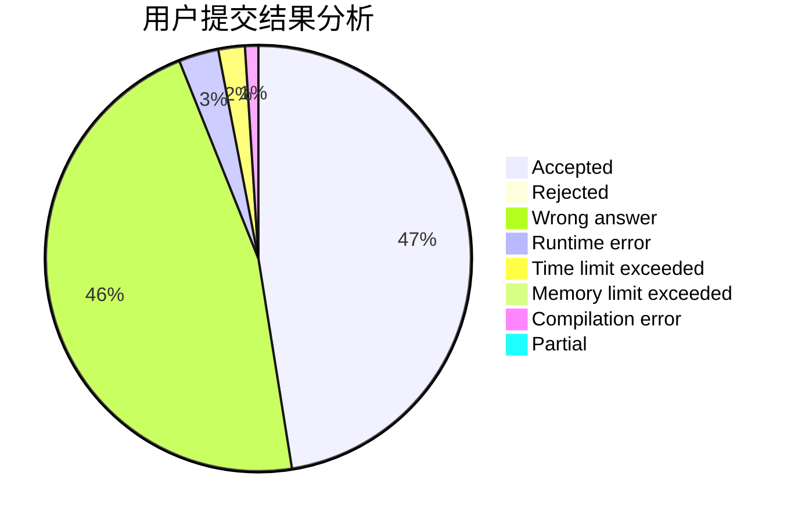
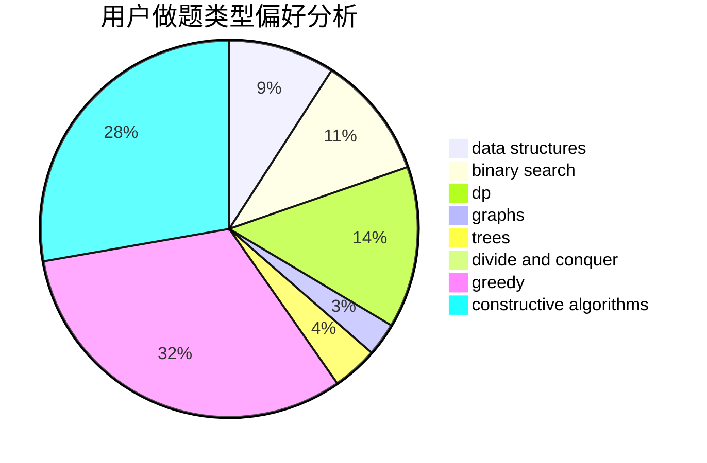
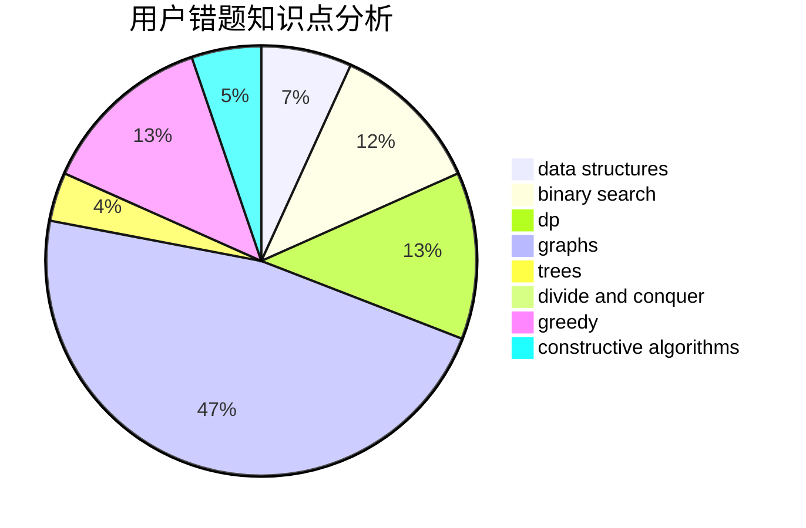

# PurpleGuy

<!-- tabs:start -->

#### **用户提交结果分析**

#### **用户做题类型偏好分析**

#### **用户错题知识点分析**

<!-- tabs:end -->
# 推荐题目
[1413A](https://codeforces.com/contest/1413/problem/A)		constructive algorithms,
                        math		  
[477E](https://codeforces.com/contest/477/problem/E)		data structures		  
[816E](https://codeforces.com/contest/816/problem/E)		dsu,graphs,sortings,trees		  
[200A](https://codeforces.com/contest/200/problem/A)		brute force,
                        data structures		  
[699B](https://codeforces.com/contest/699/problem/B)		implementation		  
[1152C](https://codeforces.com/contest/1152/problem/C)		brute force,
                        math,
                        number theory		  
[367D](https://codeforces.com/contest/367/problem/D)		bitmasks,
                        dfs and similar		  
[1152D](https://codeforces.com/contest/1152/problem/D)		dp,
                        greedy,
                        trees		  
[1391C](https://codeforces.com/contest/1391/problem/C)		combinatorics,
                        dp,
                        graphs,
                        math		  
[175B](https://codeforces.com/contest/175/problem/B)		implementation		  
