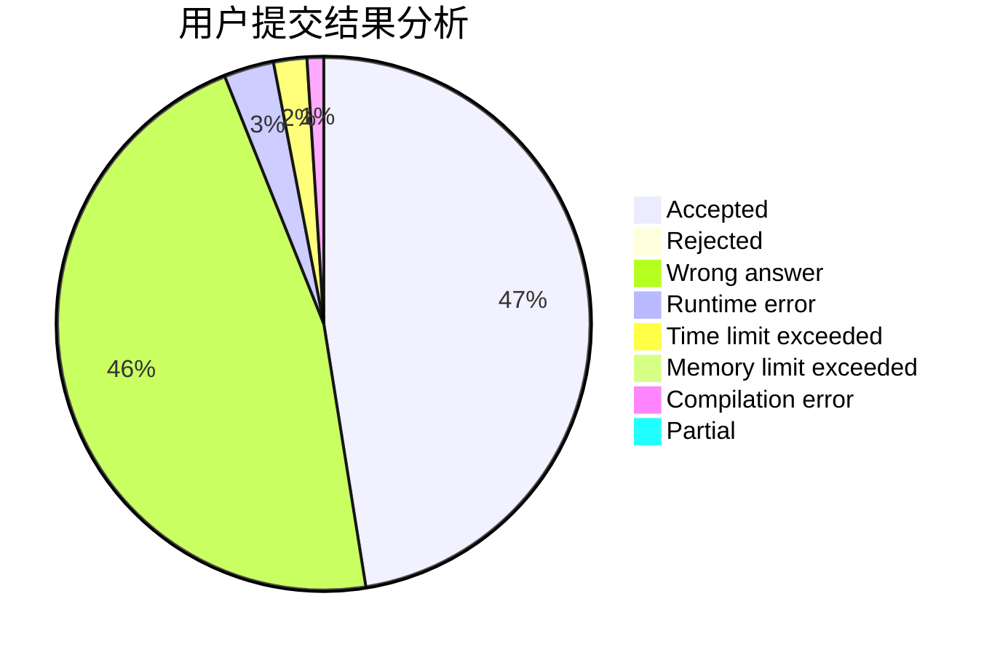
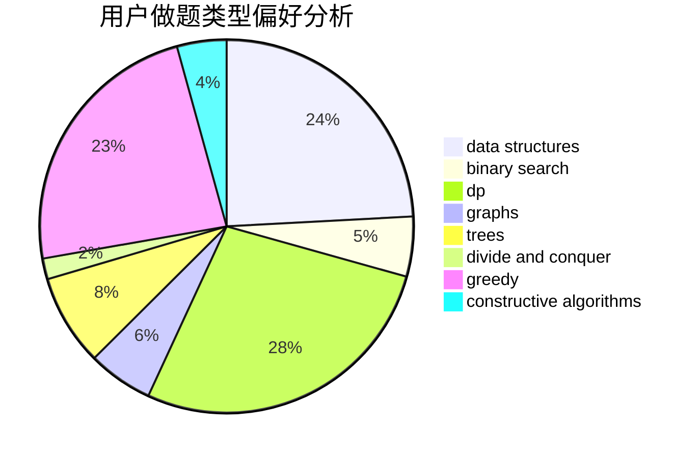
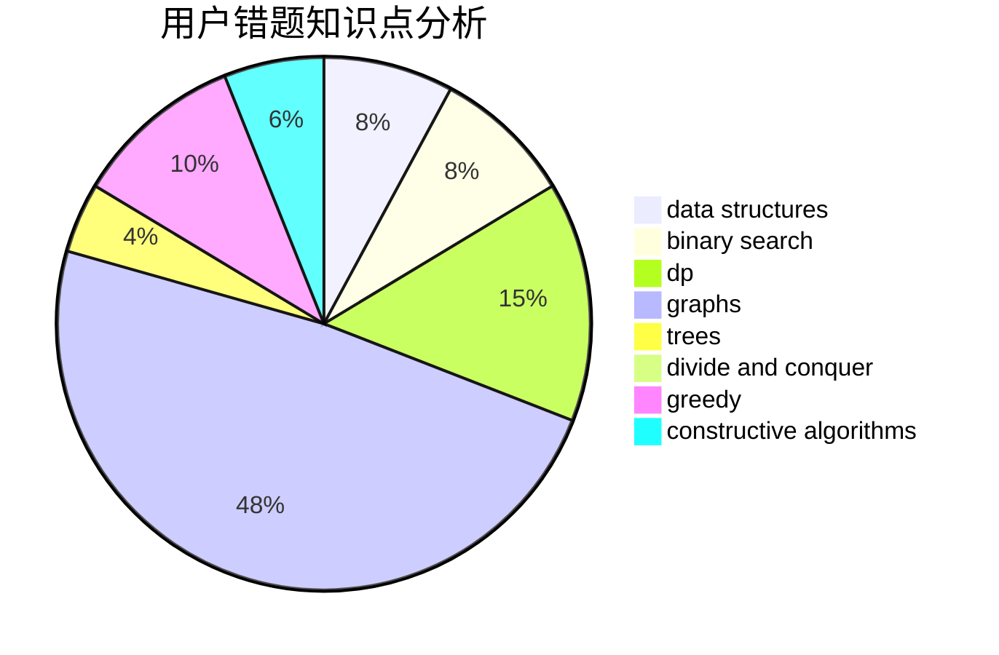

# PurpleGuy

<!-- tabs:start -->

#### **用户提交结果分析**

#### **用户做题类型偏好分析**

#### **用户错题知识点分析**

<!-- tabs:end -->
# 推荐题目
[1422C](https://codeforces.com/contest/1422/problem/C)		combinatorics,
                        dp,
                        math		  
[497E](https://codeforces.com/contest/497/problem/E)		dp,
                        matrices		  
[835F](https://codeforces.com/contest/835/problem/F)		dfs and similar,
                        dp,
                        graphs,
                        trees		  
[225C](https://codeforces.com/contest/225/problem/C)		dp,
                        matrices		  
[716A](https://codeforces.com/contest/716/problem/A)		implementation		  
[1154C](https://codeforces.com/contest/1154/problem/C)		implementation,
                        math		  
[398C](https://codeforces.com/contest/398/problem/C)		constructive algorithms		  
[1154D](https://codeforces.com/contest/1154/problem/D)		greedy		  
[139A](https://codeforces.com/contest/139/problem/A)		implementation		  
[200B](https://codeforces.com/contest/200/problem/B)		implementation,
                        math		  
