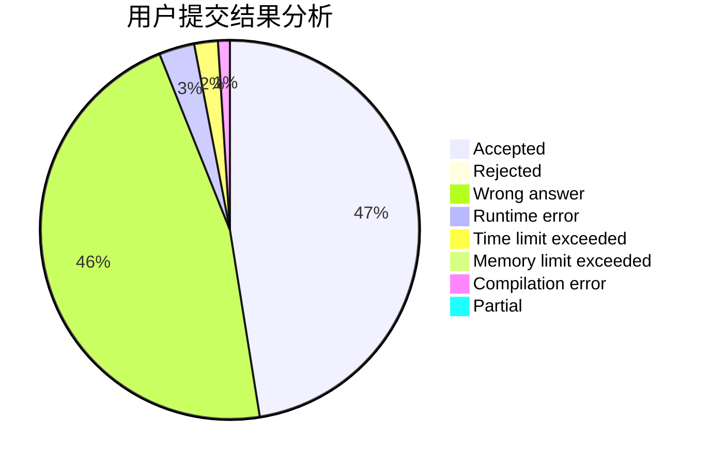
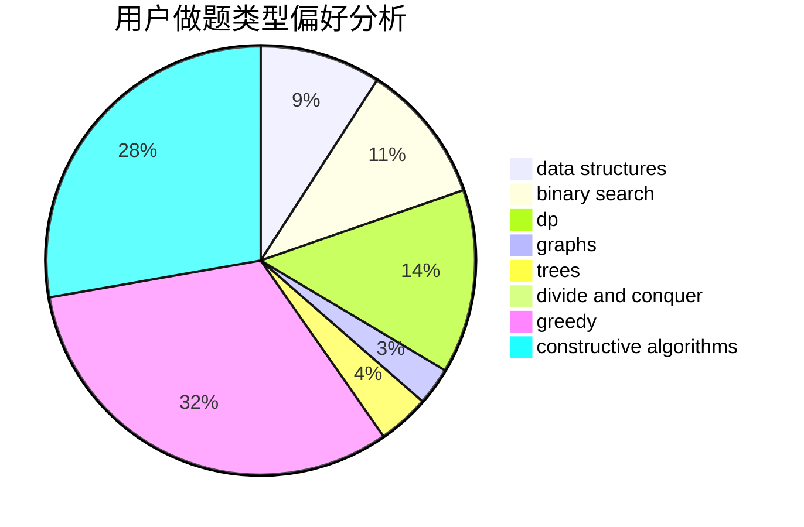
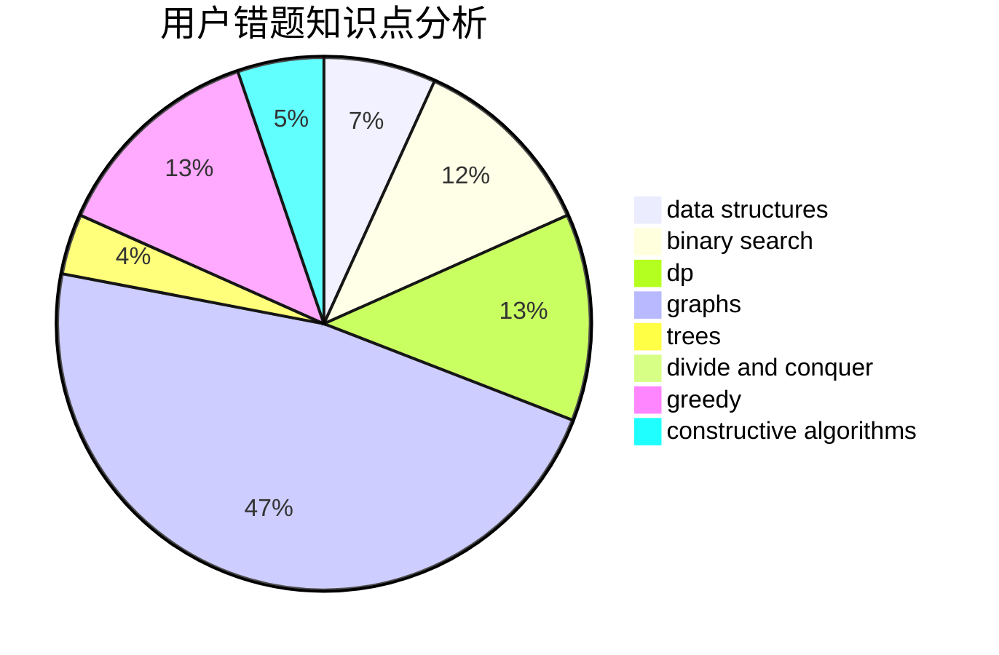

# PurpleGuy
<!-- tabs:start -->
#### **用户提交结果分析**

#### **用户做题类型偏好分析**

#### **用户错题知识点分析**

<!-- tabs:end -->
# 推荐题目
[New Year and Naming](http://codeforces.com/problemset/problem/1284/A)		implementation,
                        strings		  
[Perform Easily](https://codeforces.com/contest/1434/problem/A)		binary search,
                        brute force,
                        dp,
                        implementation,
                        sortings,
                        two pointers		  
[Cinema](http://codeforces.com/problemset/problem/200/A)		brute force,
                        data structures		  
[Suitable Replacement](http://codeforces.com/problemset/problem/825/D)		binary search,
                        greedy,
                        implementation		  
[Finding Sasuke](http://codeforces.com/problemset/problem/1413/A)		constructive algorithms,
                        math		  
[Guess The Maximums](http://codeforces.com/problemset/problem/1363/D)		binary search,
                        implementation,
                        interactive,
                        math		  
[Yet Another Ball Problem](http://codeforces.com/problemset/problem/1118/E)		constructive algorithms,
                        implementation		  
[One Bomb](http://codeforces.com/problemset/problem/699/B)		implementation		  
[New Game Plus!](http://codeforces.com/problemset/problem/1415/E)		constructive algorithms,
                        greedy,
                        math		  
[Dreamoon and Notepad](http://codeforces.com/problemset/problem/477/E)		data structures		  
<!-- tabs:start -->
#### **data structures**
[New Year and Naming](http://codeforces.com/problemset/problem/200/A)		brute force,
                        data structures		  
[Perform Easily](http://codeforces.com/problemset/problem/477/E)		data structures		  
[Cinema](http://codeforces.com/problemset/problem/930/E)		data structures,
                        dp,
                        math		  
[Suitable Replacement](http://codeforces.com/problemset/problem/633/H)		data structures,
                        implementation		  
[Finding Sasuke](http://codeforces.com/problemset/problem/513/D2)		constructive algorithms,
                        data structures		  
[Guess The Maximums](http://codeforces.com/problemset/problem/436/F)		brute force,
                        data structures,
                        dp		  
[Yet Another Ball Problem](http://codeforces.com/problemset/problem/1236/E)		binary search,
                        data structures,
                        dp,
                        dsu		  
[One Bomb](http://codeforces.com/problemset/problem/838/B)		data structures,
                        dfs and similar,
                        trees		  
[New Game Plus!](http://codeforces.com/problemset/problem/1316/F)		data structures,
                        divide and conquer,
                        probabilities		  
[Dreamoon and Notepad](http://codeforces.com/problemset/problem/1458/E)		data structures,
                        games		  
#### **binary search**
[New Year and Naming](https://codeforces.com/contest/1434/problem/A)		binary search,
                        brute force,
                        dp,
                        implementation,
                        sortings,
                        two pointers		  
[Perform Easily](http://codeforces.com/problemset/problem/825/D)		binary search,
                        greedy,
                        implementation		  
[Cinema](http://codeforces.com/problemset/problem/1363/D)		binary search,
                        implementation,
                        interactive,
                        math		  
[Suitable Replacement](http://codeforces.com/problemset/problem/518/F)		binary search,
                        brute force,
                        combinatorics,
                        dp,
                        implementation		  
[Finding Sasuke](http://codeforces.com/problemset/problem/1236/E)		binary search,
                        data structures,
                        dp,
                        dsu		  
[Guess The Maximums](http://codeforces.com/problemset/problem/730/C)		binary search,
                        dfs and similar		  
[Yet Another Ball Problem](http://codeforces.com/problemset/problem/1168/A)		binary search,
                        greedy		  
[One Bomb](http://codeforces.com/problemset/problem/1492/C)		binary search,
                        data structures,
                        dp,
                        greedy,
                        two pointers		  
[New Game Plus!](http://codeforces.com/problemset/problem/1463/D)		binary search,
                        constructive algorithms,
                        greedy,
                        two pointers		  
[Dreamoon and Notepad](http://codeforces.com/problemset/problem/1490/G)		binary search,
                        data structures,
                        math		  
#### **dp**
[New Year and Naming](https://codeforces.com/contest/1434/problem/A)		binary search,
                        brute force,
                        dp,
                        implementation,
                        sortings,
                        two pointers		  
[Perform Easily](http://codeforces.com/problemset/problem/1152/D)		dp,
                        greedy,
                        trees		  
[Cinema](http://codeforces.com/problemset/problem/930/E)		data structures,
                        dp,
                        math		  
[Suitable Replacement](http://codeforces.com/problemset/problem/518/F)		binary search,
                        brute force,
                        combinatorics,
                        dp,
                        implementation		  
[Finding Sasuke](http://codeforces.com/problemset/problem/436/F)		brute force,
                        data structures,
                        dp		  
[Guess The Maximums](http://codeforces.com/problemset/problem/1391/C)		combinatorics,
                        dp,
                        graphs,
                        math		  
[Yet Another Ball Problem](http://codeforces.com/problemset/problem/1236/E)		binary search,
                        data structures,
                        dp,
                        dsu		  
[One Bomb](http://codeforces.com/problemset/problem/439/E)		combinatorics,
                        dp,
                        math		  
[New Game Plus!](https://codeforces.com/contest/816/problem/E)		brute force,
                        dp,
                        trees		  
[Dreamoon and Notepad](http://codeforces.com/problemset/problem/1182/E)		dp,
                        math,
                        matrices,
                        number theory		  
#### **graph**
[New Year and Naming](http://codeforces.com/problemset/problem/1391/C)		combinatorics,
                        dp,
                        graphs,
                        math		  
[Perform Easily](http://codeforces.com/problemset/problem/1144/F)		dfs and similar,
                        graphs		  
[Cinema](http://codeforces.com/problemset/problem/1430/G)		bitmasks,
                        dfs and similar,
                        dp,
                        flows,
                        graphs,
                        math		  
[Suitable Replacement](http://codeforces.com/problemset/problem/1487/C)		brute force,
                        constructive algorithms,
                        dfs and similar,
                        graphs,
                        greedy,
                        implementation,
                        math		  
[Finding Sasuke](http://codeforces.com/problemset/problem/1437/C)		dp,
                        flows,
                        graph matchings,
                        greedy,
                        math,
                        sortings		  
[Guess The Maximums](http://codeforces.com/problemset/problem/1470/D)		constructive algorithms,
                        dfs and similar,
                        graph matchings,
                        graphs,
                        greedy		  
[Yet Another Ball Problem](http://codeforces.com/problemset/problem/1476/C)		dp,
                        graphs,
                        greedy		  
[One Bomb](http://codeforces.com/problemset/problem/1304/D)		constructive algorithms,
                        graphs,
                        greedy,
                        two pointers		  
[New Game Plus!](http://codeforces.com/problemset/problem/1475/C)		combinatorics,
                        graphs,
                        math		  
[Dreamoon and Notepad](http://codeforces.com/problemset/problem/553/E)		dp,
                        fft,
                        graphs,
                        math,
                        probabilities		  
#### **trees**
[New Year and Naming](http://codeforces.com/problemset/problem/1152/D)		dp,
                        greedy,
                        trees		  
[Perform Easily](https://codeforces.com/contest/816/problem/E)		brute force,
                        dp,
                        trees		  
[Cinema](http://codeforces.com/problemset/problem/838/B)		data structures,
                        dfs and similar,
                        trees		  
[Suitable Replacement](http://codeforces.com/problemset/problem/855/C)		dp,
                        trees		  
[Finding Sasuke](http://codeforces.com/problemset/problem/1479/D)		binary search,
                        bitmasks,
                        brute force,
                        data structures,
                        probabilities,
                        trees		  
[Guess The Maximums](http://codeforces.com/problemset/problem/1511/C)		brute force,
                        data structures,
                        implementation,
                        trees		  
[Yet Another Ball Problem](http://codeforces.com/problemset/problem/1499/F)		combinatorics,
                        dfs and similar,
                        dp,
                        trees		  
[One Bomb](http://codeforces.com/problemset/problem/1491/E)		brute force,
                        dfs and similar,
                        divide and conquer,
                        number theory,
                        trees		  
[New Game Plus!](http://codeforces.com/problemset/problem/1466/D)		data structures,
                        greedy,
                        sortings,
                        trees		  
[Dreamoon and Notepad](http://codeforces.com/problemset/problem/1495/D)		combinatorics,
                        dfs and similar,
                        graphs,
                        math,
                        shortest paths,
                        trees		  
#### **divide and conquer**
[New Year and Naming](http://codeforces.com/problemset/problem/1316/F)		data structures,
                        divide and conquer,
                        probabilities		  
[Perform Easily](http://codeforces.com/problemset/problem/1461/D)		binary search,
                        brute force,
                        data structures,
                        divide and conquer,
                        implementation,
                        sortings		  
[Cinema](http://codeforces.com/problemset/problem/1466/G)		combinatorics,
                        divide and conquer,
                        hashing,
                        math,
                        string suffix structures,
                        strings		  
[Suitable Replacement](http://codeforces.com/problemset/problem/1490/D)		dfs and similar,
                        divide and conquer,
                        implementation		  
[Finding Sasuke](https://codeforces.com/contest/1483/problem/C)		data structures,
                        divide and conquer,
                        dp		  
[Guess The Maximums](http://codeforces.com/problemset/problem/1491/E)		brute force,
                        dfs and similar,
                        divide and conquer,
                        number theory,
                        trees		  
[Yet Another Ball Problem](http://codeforces.com/problemset/problem/1303/G)		data structures,
                        divide and conquer,
                        geometry,
                        trees		  
[One Bomb](http://codeforces.com/problemset/problem/1494/D)		constructive algorithms,
                        data structures,
                        dfs and similar,
                        divide and conquer,
                        dsu,
                        greedy,
                        sortings,
                        trees		  
[New Game Plus!](http://codeforces.com/problemset/problem/1482/E)		data structures,
                        divide and conquer,
                        dp		  
[Dreamoon and Notepad](http://codeforces.com/problemset/problem/566/C)		dfs and similar,
                        divide and conquer,
                        trees		  
#### **greedy**
[New Year and Naming](http://codeforces.com/problemset/problem/825/D)		binary search,
                        greedy,
                        implementation		  
[Perform Easily](http://codeforces.com/problemset/problem/1415/E)		constructive algorithms,
                        greedy,
                        math		  
[Cinema](http://codeforces.com/problemset/problem/1152/D)		dp,
                        greedy,
                        trees		  
[Suitable Replacement](http://codeforces.com/problemset/problem/743/A)		constructive algorithms,
                        greedy,
                        implementation		  
[Finding Sasuke](http://codeforces.com/problemset/problem/369/A)		greedy,
                        implementation		  
[Guess The Maximums](http://codeforces.com/problemset/problem/216/C)		greedy		  
[Yet Another Ball Problem](http://codeforces.com/problemset/problem/1107/C)		greedy,
                        sortings,
                        two pointers		  
[One Bomb](http://codeforces.com/problemset/problem/1428/G1)		dp,
                        greedy		  
[New Game Plus!](http://codeforces.com/problemset/problem/1398/B)		games,
                        greedy,
                        sortings		  
[Dreamoon and Notepad](http://codeforces.com/problemset/problem/1168/A)		binary search,
                        greedy		  
#### **constructive algorithms**
[New Year and Naming](http://codeforces.com/problemset/problem/1413/A)		constructive algorithms,
                        math		  
[Perform Easily](http://codeforces.com/problemset/problem/1118/E)		constructive algorithms,
                        implementation		  
[Cinema](http://codeforces.com/problemset/problem/1415/E)		constructive algorithms,
                        greedy,
                        math		  
[Suitable Replacement](http://codeforces.com/problemset/problem/743/A)		constructive algorithms,
                        greedy,
                        implementation		  
[Finding Sasuke](http://codeforces.com/problemset/problem/513/D2)		constructive algorithms,
                        data structures		  
[Guess The Maximums](http://codeforces.com/problemset/problem/538/B)		constructive algorithms,
                        dp,
                        greedy,
                        implementation		  
[Yet Another Ball Problem](http://codeforces.com/problemset/problem/1493/A)		constructive algorithms,
                        greedy		  
[One Bomb](http://codeforces.com/problemset/problem/1463/D)		binary search,
                        constructive algorithms,
                        greedy,
                        two pointers		  
[New Game Plus!](https://codeforces.com/contest/1456/problem/B)		bitmasks,
                        brute force,
                        constructive algorithms		  
[Dreamoon and Notepad](http://codeforces.com/problemset/problem/1492/D)		bitmasks,
                        constructive algorithms,
                        greedy,
                        math		  
#### **sortings**
[New Year and Naming](https://codeforces.com/contest/1434/problem/A)		binary search,
                        brute force,
                        dp,
                        implementation,
                        sortings,
                        two pointers		  
[Perform Easily](http://codeforces.com/problemset/problem/1107/C)		greedy,
                        sortings,
                        two pointers		  
[Cinema](http://codeforces.com/problemset/problem/1398/B)		games,
                        greedy,
                        sortings		  
[Suitable Replacement](https://codeforces.com/contest/1496/problem/C)		geometry,
                        greedy,
                        math,
                        sortings		  
[Finding Sasuke](http://codeforces.com/problemset/problem/1495/A)		geometry,
                        greedy,
                        math,
                        sortings		  
[Guess The Maximums](http://codeforces.com/problemset/problem/1497/A)		brute force,
                        data structures,
                        greedy,
                        sortings		  
[Yet Another Ball Problem](http://codeforces.com/problemset/problem/1427/A)		math,
                        sortings		  
[One Bomb](http://codeforces.com/problemset/problem/1461/D)		binary search,
                        brute force,
                        data structures,
                        divide and conquer,
                        implementation,
                        sortings		  
[New Game Plus!](http://codeforces.com/problemset/problem/1437/C)		dp,
                        flows,
                        graph matchings,
                        greedy,
                        math,
                        sortings		  
[Dreamoon and Notepad](http://codeforces.com/problemset/problem/1473/A)		greedy,
                        implementation,
                        math,
                        sortings		  
<!-- tabs:end -->
