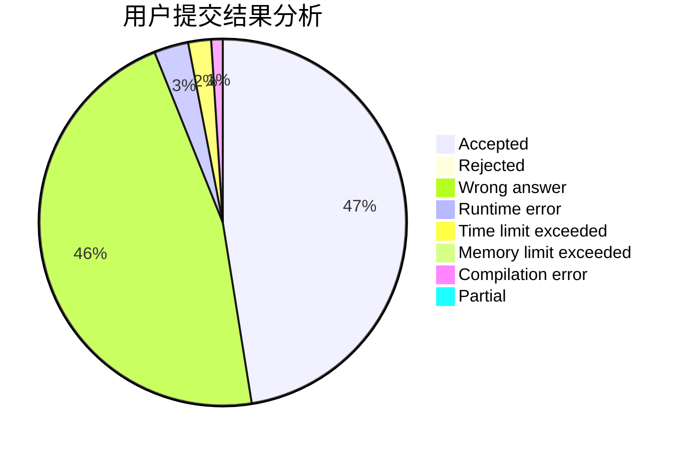
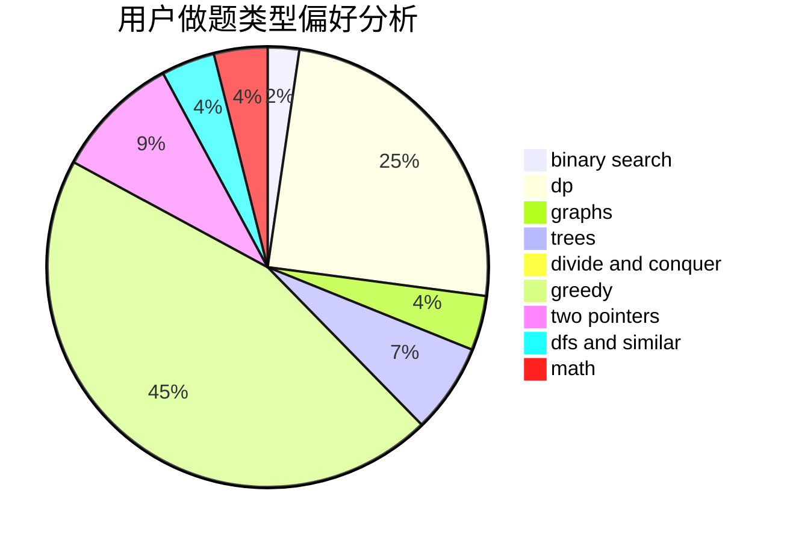

# PurpleGuy

<!-- tabs:start -->

#### **用户提交结果分析**

#### **用户做题类型偏好分析**

<!-- tabs:end -->
# 推荐题目
[1422C](https://codeforces.com/contest/1422/problem/C)
[497E](https://codeforces.com/contest/497/problem/E)
[835F](https://codeforces.com/contest/835/problem/F)
[225C](https://codeforces.com/contest/225/problem/C)
[716A](https://codeforces.com/contest/716/problem/A)
[1154C](https://codeforces.com/contest/1154/problem/C)
[398C](https://codeforces.com/contest/398/problem/C)
[1154D](https://codeforces.com/contest/1154/problem/D)
[139A](https://codeforces.com/contest/139/problem/A)
[200B](https://codeforces.com/contest/200/problem/B)
