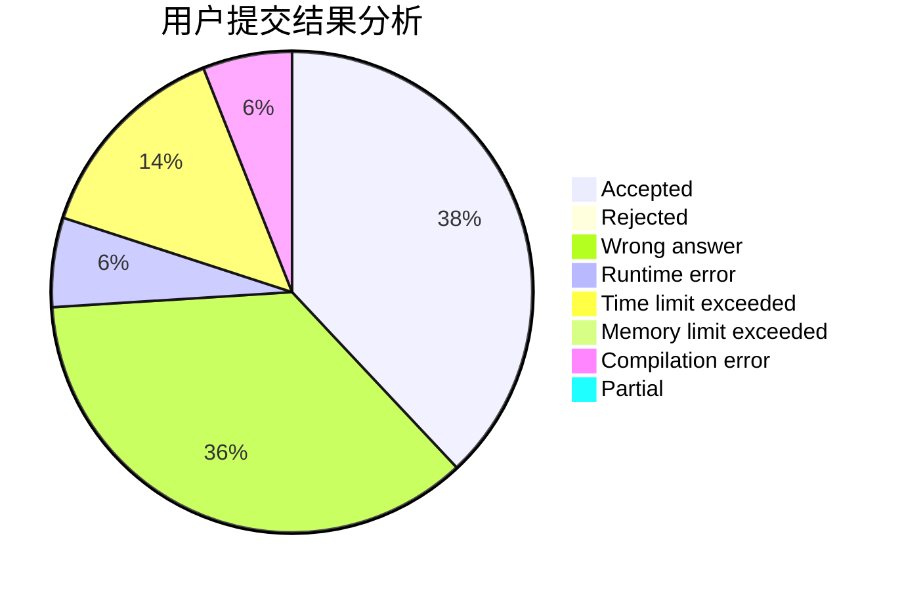
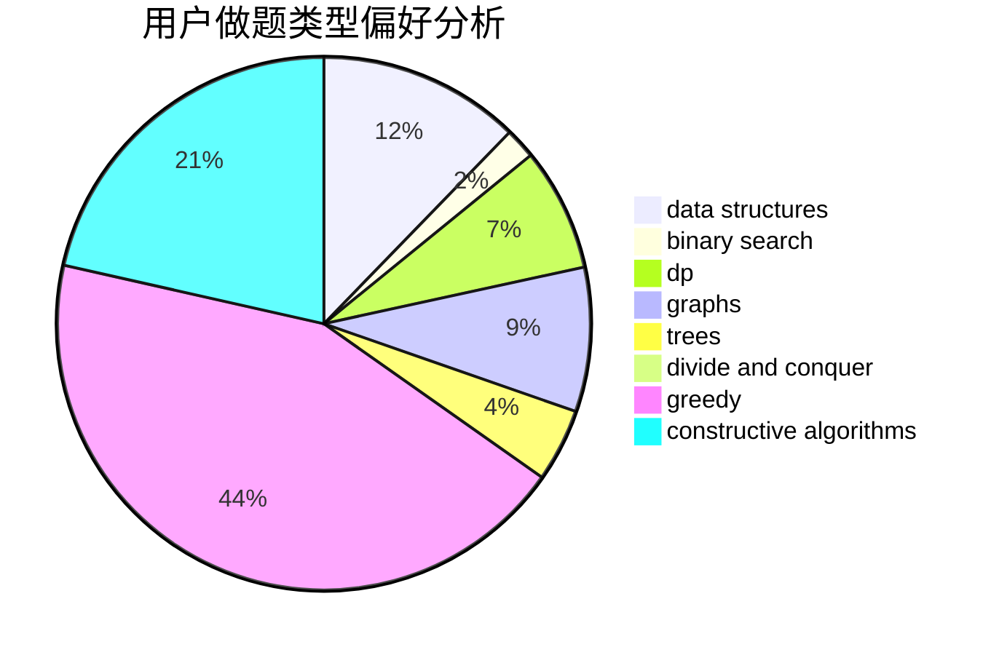

# PushyTao

<!-- tabs:start -->

#### **用户提交结果分析**

#### **用户做题类型偏好分析**

#### **用户错题知识点分析**

<!-- tabs:end -->
# 推荐题目
[677A](https://codeforces.com/contest/677/problem/A)		implementation		  
[1066E](https://codeforces.com/contest/1066/problem/E)		data structures,
                        implementation,
                        math		  
[893A](https://codeforces.com/contest/893/problem/A)		implementation		  
[1238E](https://codeforces.com/contest/1238/problem/E)		bitmasks,
                        dp		  
[864C](https://codeforces.com/contest/864/problem/C)		greedy,
                        implementation,
                        math		  
[715B](https://codeforces.com/contest/715/problem/B)		binary search,
                        constructive algorithms,
                        graphs,
                        shortest paths		  
[434C](https://codeforces.com/contest/434/problem/C)		dsu,graphs,sortings,trees		  
[296B](https://codeforces.com/contest/296/problem/B)		combinatorics,
                        dp		  
[33C](https://codeforces.com/contest/33/problem/C)		greedy		  
[492A](https://codeforces.com/contest/492/problem/A)		implementation		  
