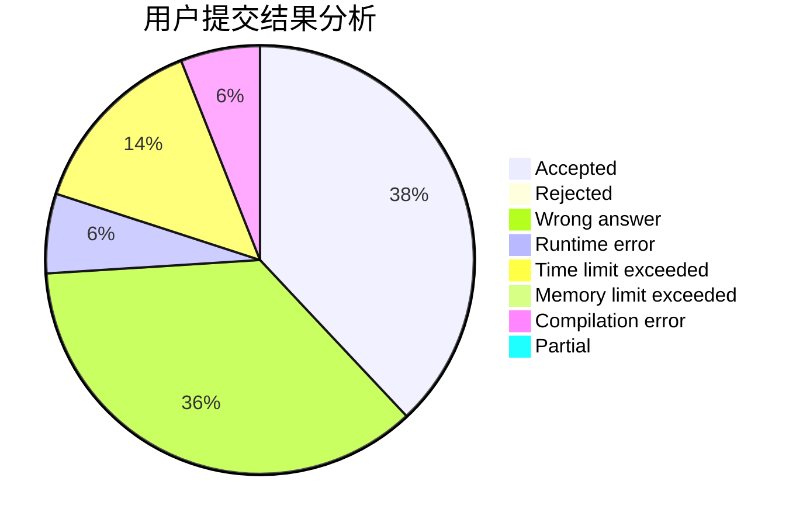
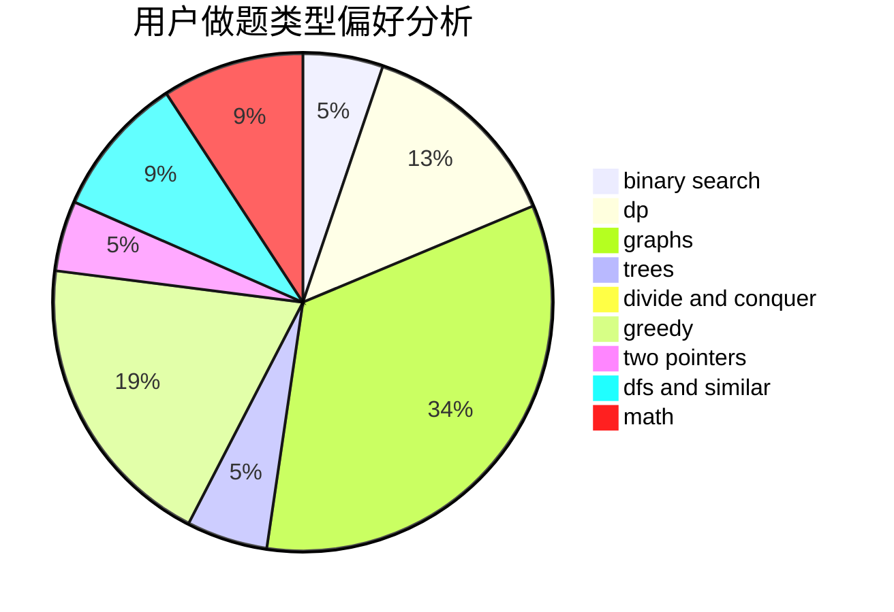

# PushyTao

<!-- tabs:start -->

#### **用户提交结果分析**

#### **用户做题类型偏好分析**

<!-- tabs:end -->
# 推荐题目
[701A](https://codeforces.com/contest/701/problem/A)
[1067B](https://codeforces.com/contest/1067/problem/B)
[911A](https://codeforces.com/contest/911/problem/A)
[1243E](https://codeforces.com/contest/1243/problem/E)
[883M](https://codeforces.com/contest/883/problem/M)
[733D](https://codeforces.com/contest/733/problem/D)
[455B](https://codeforces.com/contest/455/problem/B)
[313C](https://codeforces.com/contest/313/problem/C)
[367C](https://codeforces.com/contest/367/problem/C)
[512C](https://codeforces.com/contest/512/problem/C)
