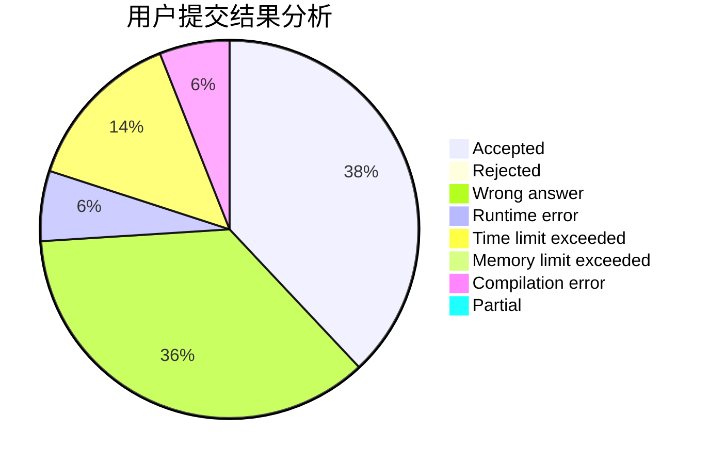
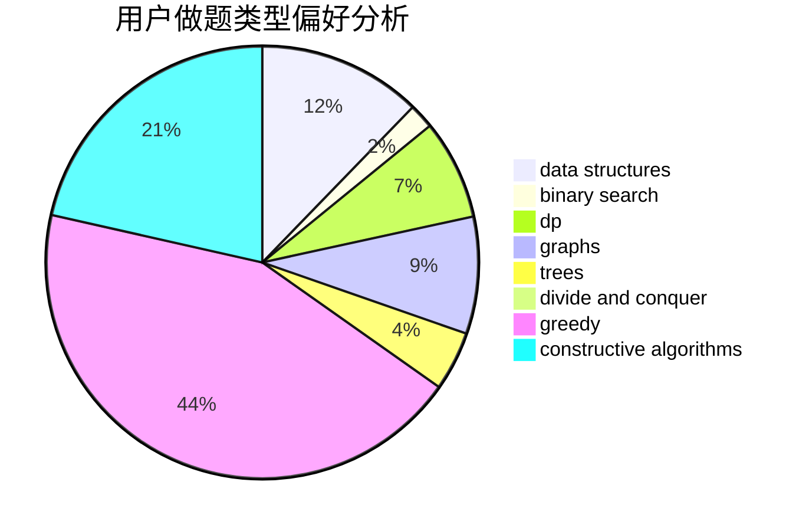

# PushyTao
<!-- tabs:start -->
#### **用户提交结果分析**

#### **用户做题类型偏好分析**

#### **用户错题知识点分析**

<!-- tabs:end -->
# 推荐题目
[Bus](http://codeforces.com/problemset/problem/864/C)		greedy,
                        implementation,
                        math		  
[Chess For Three](http://codeforces.com/problemset/problem/893/A)		implementation		  
[Keyboard Purchase](http://codeforces.com/problemset/problem/1238/E)		bitmasks,
                        dp		  
[Vanya and Fence](http://codeforces.com/problemset/problem/677/A)		implementation		  
[Binary Numbers AND Sum](http://codeforces.com/problemset/problem/1066/E)		data structures,
                        implementation,
                        math		  
[The Winds of Winter](http://codeforces.com/problemset/problem/768/G)		binary search,
                        data structures		  
[DZY Loves Hash](http://codeforces.com/problemset/problem/447/A)		implementation		  
[Average Score](http://codeforces.com/problemset/problem/81/C)		greedy,
                        math,
                        sortings		  
[Optimize!](http://codeforces.com/problemset/problem/338/E)		data structures		  
[Mashmokh and Lights](http://codeforces.com/problemset/problem/415/A)		implementation		  
<!-- tabs:start -->
#### **data structures**
[Bus](http://codeforces.com/problemset/problem/1066/E)		data structures,
                        implementation,
                        math		  
[Chess For Three](http://codeforces.com/problemset/problem/768/G)		binary search,
                        data structures		  
[Keyboard Purchase](http://codeforces.com/problemset/problem/338/E)		data structures		  
[Vanya and Fence](http://codeforces.com/problemset/problem/47/E)		data structures,
                        geometry,
                        sortings		  
[Binary Numbers AND Sum](http://codeforces.com/problemset/problem/1498/F)		bitmasks,
                        data structures,
                        dfs and similar,
                        dp,
                        games,
                        math,
                        trees		  
[The Winds of Winter](http://codeforces.com/problemset/problem/1492/C)		binary search,
                        data structures,
                        dp,
                        greedy,
                        two pointers		  
[DZY Loves Hash](http://codeforces.com/problemset/problem/1490/G)		binary search,
                        data structures,
                        math		  
[Average Score](http://codeforces.com/problemset/problem/1479/D)		binary search,
                        bitmasks,
                        brute force,
                        data structures,
                        probabilities,
                        trees		  
[Optimize!](http://codeforces.com/problemset/problem/1497/A)		brute force,
                        data structures,
                        greedy,
                        sortings		  
[Mashmokh and Lights](http://codeforces.com/problemset/problem/1491/C)		brute force,
                        data structures,
                        dp,
                        greedy,
                        implementation		  
#### **binary search**
[Bus](http://codeforces.com/problemset/problem/768/G)		binary search,
                        data structures		  
[Chess For Three](http://codeforces.com/problemset/problem/1195/B)		binary search,
                        brute force,
                        math		  
[Keyboard Purchase](http://codeforces.com/problemset/problem/1060/C)		binary search,
                        implementation,
                        two pointers		  
[Vanya and Fence](http://codeforces.com/problemset/problem/1138/A)		binary search,
                        greedy,
                        implementation		  
[Binary Numbers AND Sum](http://codeforces.com/problemset/problem/715/B)		binary search,
                        constructive algorithms,
                        graphs,
                        shortest paths		  
[The Winds of Winter](http://codeforces.com/problemset/problem/1492/C)		binary search,
                        data structures,
                        dp,
                        greedy,
                        two pointers		  
[DZY Loves Hash](http://codeforces.com/problemset/problem/1463/D)		binary search,
                        constructive algorithms,
                        greedy,
                        two pointers		  
[Average Score](http://codeforces.com/problemset/problem/1490/G)		binary search,
                        data structures,
                        math		  
[Optimize!](http://codeforces.com/problemset/problem/1479/D)		binary search,
                        bitmasks,
                        brute force,
                        data structures,
                        probabilities,
                        trees		  
[Mashmokh and Lights](http://codeforces.com/problemset/problem/1436/E)		binary search,
                        data structures,
                        two pointers		  
#### **dp**
[Bus](http://codeforces.com/problemset/problem/1238/E)		bitmasks,
                        dp		  
[Chess For Three](http://codeforces.com/problemset/problem/277/D)		dp,
                        probabilities		  
[Keyboard Purchase](https://codeforces.com/contest/434/problem/C)		dp		  
[Vanya and Fence](http://codeforces.com/problemset/problem/296/B)		combinatorics,
                        dp		  
[Binary Numbers AND Sum](http://codeforces.com/problemset/problem/1498/F)		bitmasks,
                        data structures,
                        dfs and similar,
                        dp,
                        games,
                        math,
                        trees		  
[The Winds of Winter](http://codeforces.com/problemset/problem/1487/F)		dp,
                        greedy,
                        shortest paths		  
[DZY Loves Hash](http://codeforces.com/problemset/problem/118/D)		dp		  
[Average Score](http://codeforces.com/problemset/problem/917/A)		dp,
                        greedy,
                        implementation,
                        math		  
[Optimize!](http://codeforces.com/problemset/problem/1492/C)		binary search,
                        data structures,
                        dp,
                        greedy,
                        two pointers		  
[Mashmokh and Lights](https://codeforces.com/contest/1457/problem/C)		brute force,
                        dp,
                        implementation		  
#### **graph**
[Bus](http://codeforces.com/problemset/problem/585/B)		dfs and similar,
                        graphs,
                        shortest paths		  
[Chess For Three](http://codeforces.com/problemset/problem/715/B)		binary search,
                        constructive algorithms,
                        graphs,
                        shortest paths		  
[Keyboard Purchase](http://codeforces.com/problemset/problem/1404/E)		flows,
                        graph matchings,
                        graphs		  
[Vanya and Fence](http://codeforces.com/problemset/problem/388/B)		bitmasks,
                        constructive algorithms,
                        graphs,
                        implementation,
                        math		  
[Binary Numbers AND Sum](http://codeforces.com/problemset/problem/977/E)		dfs and similar,
                        dsu,
                        graphs		  
[The Winds of Winter](http://codeforces.com/problemset/problem/437/C)		graphs,
                        greedy,
                        sortings		  
[DZY Loves Hash](http://codeforces.com/problemset/problem/1487/C)		brute force,
                        constructive algorithms,
                        dfs and similar,
                        graphs,
                        greedy,
                        implementation,
                        math		  
[Average Score](http://codeforces.com/problemset/problem/1437/C)		dp,
                        flows,
                        graph matchings,
                        greedy,
                        math,
                        sortings		  
[Optimize!](http://codeforces.com/problemset/problem/1470/D)		constructive algorithms,
                        dfs and similar,
                        graph matchings,
                        graphs,
                        greedy		  
[Mashmokh and Lights](http://codeforces.com/problemset/problem/1476/C)		dp,
                        graphs,
                        greedy		  
#### **trees**
[Bus](http://codeforces.com/problemset/problem/1498/F)		bitmasks,
                        data structures,
                        dfs and similar,
                        dp,
                        games,
                        math,
                        trees		  
[Chess For Three](http://codeforces.com/problemset/problem/1479/D)		binary search,
                        bitmasks,
                        brute force,
                        data structures,
                        probabilities,
                        trees		  
[Keyboard Purchase](http://codeforces.com/problemset/problem/1511/C)		brute force,
                        data structures,
                        implementation,
                        trees		  
[Vanya and Fence](http://codeforces.com/problemset/problem/1499/F)		combinatorics,
                        dfs and similar,
                        dp,
                        trees		  
[Binary Numbers AND Sum](http://codeforces.com/problemset/problem/1491/E)		brute force,
                        dfs and similar,
                        divide and conquer,
                        number theory,
                        trees		  
[The Winds of Winter](http://codeforces.com/problemset/problem/1466/D)		data structures,
                        greedy,
                        sortings,
                        trees		  
[DZY Loves Hash](http://codeforces.com/problemset/problem/1495/D)		combinatorics,
                        dfs and similar,
                        graphs,
                        math,
                        shortest paths,
                        trees		  
[Average Score](http://codeforces.com/problemset/problem/1303/G)		data structures,
                        divide and conquer,
                        geometry,
                        trees		  
[Optimize!](http://codeforces.com/problemset/problem/1454/E)		combinatorics,
                        dfs and similar,
                        graphs,
                        trees		  
[Mashmokh and Lights](http://codeforces.com/problemset/problem/1494/D)		constructive algorithms,
                        data structures,
                        dfs and similar,
                        divide and conquer,
                        dsu,
                        greedy,
                        sortings,
                        trees		  
#### **divide and conquer**
[Bus](http://codeforces.com/problemset/problem/1461/D)		binary search,
                        brute force,
                        data structures,
                        divide and conquer,
                        implementation,
                        sortings		  
[Chess For Three](http://codeforces.com/problemset/problem/1466/G)		combinatorics,
                        divide and conquer,
                        hashing,
                        math,
                        string suffix structures,
                        strings		  
[Keyboard Purchase](http://codeforces.com/problemset/problem/1490/D)		dfs and similar,
                        divide and conquer,
                        implementation		  
[Vanya and Fence](https://codeforces.com/contest/1483/problem/C)		data structures,
                        divide and conquer,
                        dp		  
[Binary Numbers AND Sum](http://codeforces.com/problemset/problem/1491/E)		brute force,
                        dfs and similar,
                        divide and conquer,
                        number theory,
                        trees		  
[The Winds of Winter](http://codeforces.com/problemset/problem/1303/G)		data structures,
                        divide and conquer,
                        geometry,
                        trees		  
[DZY Loves Hash](http://codeforces.com/problemset/problem/1494/D)		constructive algorithms,
                        data structures,
                        dfs and similar,
                        divide and conquer,
                        dsu,
                        greedy,
                        sortings,
                        trees		  
[Average Score](http://codeforces.com/problemset/problem/1482/E)		data structures,
                        divide and conquer,
                        dp		  
[Optimize!](http://codeforces.com/problemset/problem/566/C)		dfs and similar,
                        divide and conquer,
                        trees		  
[Mashmokh and Lights](http://codeforces.com/problemset/problem/1428/F)		binary search,
                        data structures,
                        divide and conquer,
                        dp,
                        two pointers		  
#### **greedy**
[Bus](http://codeforces.com/problemset/problem/864/C)		greedy,
                        implementation,
                        math		  
[Chess For Three](http://codeforces.com/problemset/problem/81/C)		greedy,
                        math,
                        sortings		  
[Keyboard Purchase](http://codeforces.com/problemset/problem/587/A)		greedy		  
[Vanya and Fence](http://codeforces.com/problemset/problem/1132/A)		greedy,
                        implementation		  
[Binary Numbers AND Sum](http://codeforces.com/problemset/problem/1138/A)		binary search,
                        greedy,
                        implementation		  
[The Winds of Winter](http://codeforces.com/problemset/problem/33/C)		greedy		  
[DZY Loves Hash](http://codeforces.com/problemset/problem/1487/F)		dp,
                        greedy,
                        shortest paths		  
[Average Score](http://codeforces.com/problemset/problem/1332/C)		dfs and similar,
                        dsu,
                        greedy,
                        implementation,
                        strings		  
[Optimize!](http://codeforces.com/problemset/problem/1425/E)		greedy,
                        implementation		  
[Mashmokh and Lights](http://codeforces.com/problemset/problem/437/C)		graphs,
                        greedy,
                        sortings		  
#### **constructive algorithms**
[Bus](http://codeforces.com/problemset/problem/1004/D)		brute force,
                        constructive algorithms,
                        implementation		  
[Chess For Three](https://codeforces.com/contest/879/problem/C)		bitmasks,
                        constructive algorithms		  
[Keyboard Purchase](http://codeforces.com/problemset/problem/1451/E1)		bitmasks,
                        constructive algorithms,
                        interactive,
                        math		  
[Vanya and Fence](http://codeforces.com/problemset/problem/715/B)		binary search,
                        constructive algorithms,
                        graphs,
                        shortest paths		  
[Binary Numbers AND Sum](http://codeforces.com/problemset/problem/388/B)		bitmasks,
                        constructive algorithms,
                        graphs,
                        implementation,
                        math		  
[The Winds of Winter](http://codeforces.com/problemset/problem/1254/B2)		constructive algorithms,
                        greedy,
                        math,
                        number theory,
                        ternary search,
                        two pointers		  
[DZY Loves Hash](http://codeforces.com/problemset/problem/1493/A)		constructive algorithms,
                        greedy		  
[Average Score](http://codeforces.com/problemset/problem/1463/D)		binary search,
                        constructive algorithms,
                        greedy,
                        two pointers		  
[Optimize!](https://codeforces.com/contest/1456/problem/B)		bitmasks,
                        brute force,
                        constructive algorithms		  
[Mashmokh and Lights](http://codeforces.com/problemset/problem/1492/D)		bitmasks,
                        constructive algorithms,
                        greedy,
                        math		  
#### **sortings**
[Bus](http://codeforces.com/problemset/problem/81/C)		greedy,
                        math,
                        sortings		  
[Chess For Three](http://codeforces.com/problemset/problem/47/E)		data structures,
                        geometry,
                        sortings		  
[Keyboard Purchase](http://codeforces.com/problemset/problem/843/A)		dfs and similar,
                        dsu,
                        implementation,
                        math,
                        sortings		  
[Vanya and Fence](http://codeforces.com/problemset/problem/653/A)		brute force,
                        implementation,
                        sortings		  
[Binary Numbers AND Sum](http://codeforces.com/problemset/problem/437/C)		graphs,
                        greedy,
                        sortings		  
[The Winds of Winter](https://codeforces.com/contest/1496/problem/C)		geometry,
                        greedy,
                        math,
                        sortings		  
[DZY Loves Hash](http://codeforces.com/problemset/problem/1495/A)		geometry,
                        greedy,
                        math,
                        sortings		  
[Average Score](http://codeforces.com/problemset/problem/1497/A)		brute force,
                        data structures,
                        greedy,
                        sortings		  
[Optimize!](http://codeforces.com/problemset/problem/1427/A)		math,
                        sortings		  
[Mashmokh and Lights](http://codeforces.com/problemset/problem/1461/D)		binary search,
                        brute force,
                        data structures,
                        divide and conquer,
                        implementation,
                        sortings		  
<!-- tabs:end -->
