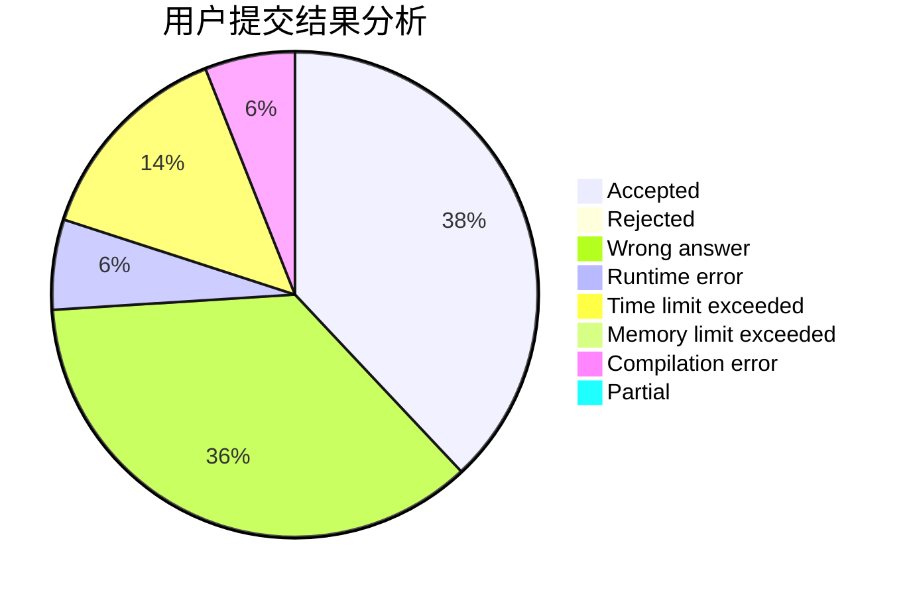
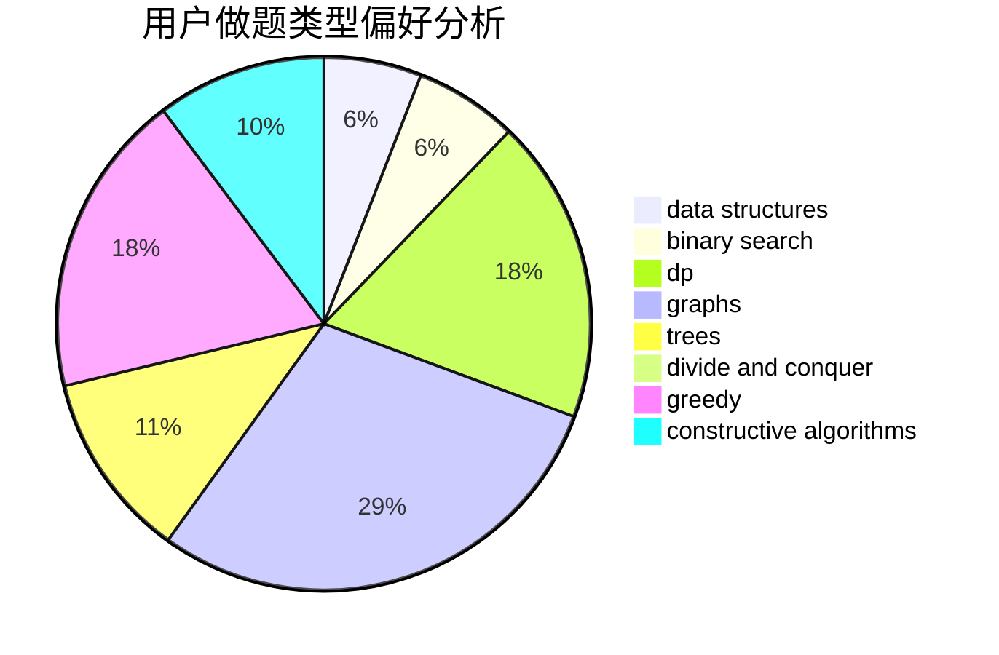

# PushyTao

<!-- tabs:start -->

#### **用户提交结果分析**

#### **用户做题类型偏好分析**

#### **用户错题知识点分析**

<!-- tabs:end -->
# 推荐题目
[701A](https://codeforces.com/contest/701/problem/A)		greedy,
                        implementation		  
[1067B](https://codeforces.com/contest/1067/problem/B)		dfs and similar,
                        graphs,
                        shortest paths		  
[911A](https://codeforces.com/contest/911/problem/A)		implementation		  
[1243E](https://codeforces.com/contest/1243/problem/E)		dsu,graphs,sortings,trees		  
[883M](https://codeforces.com/contest/883/problem/M)		greedy,
                        math		  
[733D](https://codeforces.com/contest/733/problem/D)		data structures,
                        hashing		  
[455B](https://codeforces.com/contest/455/problem/B)		dfs and similar,
                        dp,
                        games,
                        implementation,
                        strings,
                        trees		  
[313C](https://codeforces.com/contest/313/problem/C)		constructive algorithms,
                        greedy,
                        implementation,
                        sortings		  
[367C](https://codeforces.com/contest/367/problem/C)		graphs,
                        greedy,
                        sortings		  
[512C](https://codeforces.com/contest/512/problem/C)		dsu,graphs,sortings,trees		  
