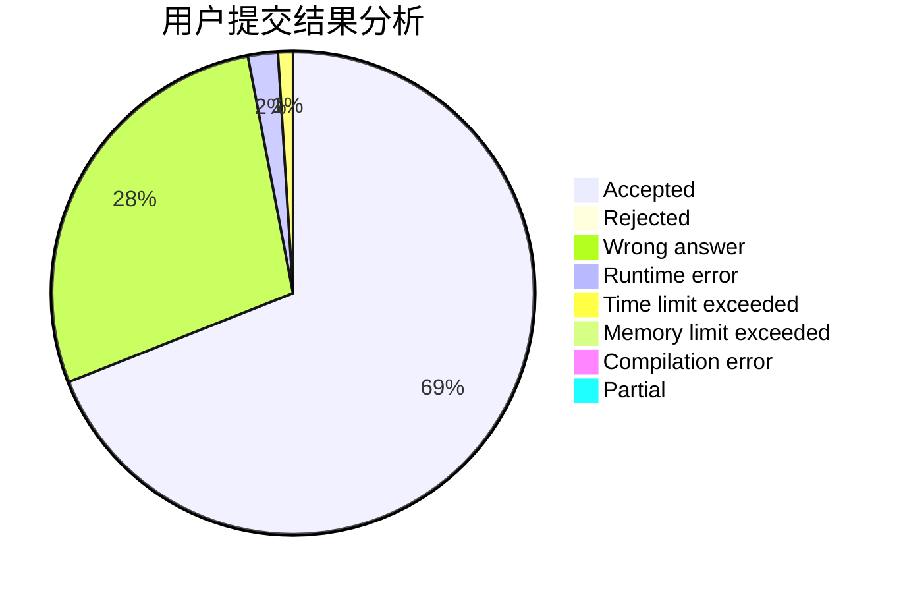
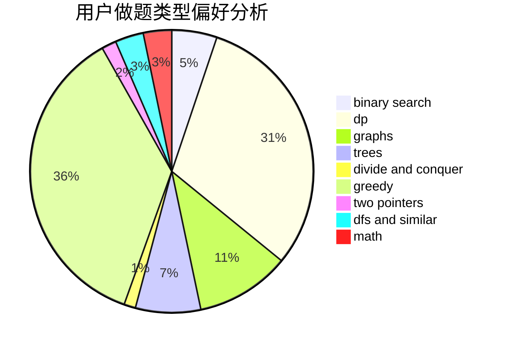

# Q.E.D

<!-- tabs:start -->

#### **用户提交结果分析**

#### **用户做题类型偏好分析**

<!-- tabs:end -->
# 推荐题目
[364D](https://codeforces.com/contest/364/problem/D)
[611H](https://codeforces.com/contest/611/problem/H)
[171A](https://codeforces.com/contest/171/problem/A)
[896A](https://codeforces.com/contest/896/problem/A)
[1102B](https://codeforces.com/contest/1102/problem/B)
[1468N](https://codeforces.com/contest/1468/problem/N)
[989E](https://codeforces.com/contest/989/problem/E)
[914H](https://codeforces.com/contest/914/problem/H)
[1082F](https://codeforces.com/contest/1082/problem/F)
[878E](https://codeforces.com/contest/878/problem/E)
