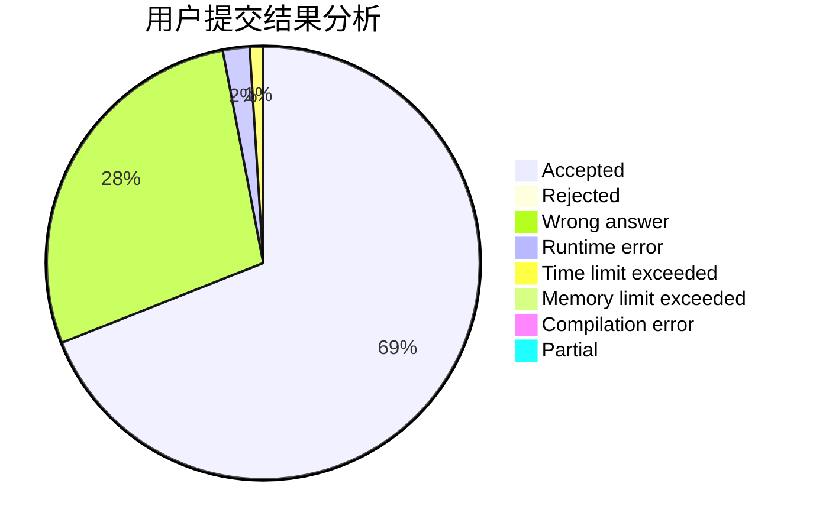
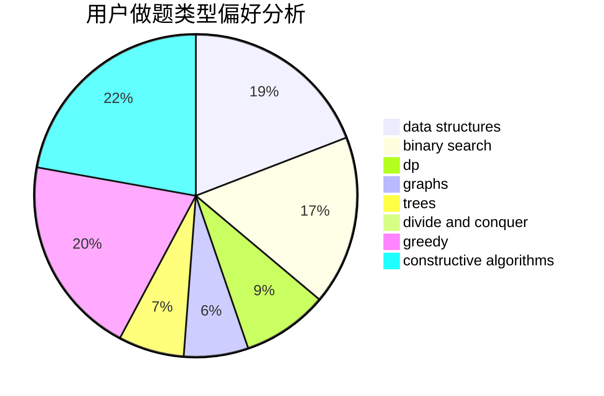

# Q.E.D
<!-- tabs:start -->
#### **用户提交结果分析**

#### **用户做题类型偏好分析**

#### **用户错题知识点分析**

<!-- tabs:end -->
# 推荐题目
[Room Leader](http://codeforces.com/problemset/problem/74/A)		implementation		  
[Rainbow Triples](http://codeforces.com/problemset/problem/1408/H)		binary search,
                        data structures,
                        flows,
                        greedy		  
[Arkady and a Nobody-men](http://codeforces.com/problemset/problem/860/E)		data structures,
                        dfs and similar,
                        trees		  
[Optimize!](http://codeforces.com/problemset/problem/338/E)		data structures		  
[Restoring the Expression](http://codeforces.com/problemset/problem/898/F)		brute force,
                        hashing,
                        math		  
[Chess Championship](http://codeforces.com/problemset/problem/736/E)		constructive algorithms,
                        flows,
                        greedy,
                        math		  
[Hot Days](http://codeforces.com/problemset/problem/215/D)		greedy		  
[Byteland coins](https://codeforces.com/contest/759/problem/E)		combinatorics,
                        dp,
                        math		  
[Aramic script](http://codeforces.com/problemset/problem/975/A)		implementation,
                        strings		  
[Royal Questions](http://codeforces.com/problemset/problem/875/F)		dsu,
                        graphs,
                        greedy		  
<!-- tabs:start -->
#### **data structures**
[Room Leader](http://codeforces.com/problemset/problem/1408/H)		binary search,
                        data structures,
                        flows,
                        greedy		  
[Rainbow Triples](http://codeforces.com/problemset/problem/860/E)		data structures,
                        dfs and similar,
                        trees		  
[Arkady and a Nobody-men](http://codeforces.com/problemset/problem/338/E)		data structures		  
[Optimize!](http://codeforces.com/problemset/problem/660/F)		binary search,
                        data structures,
                        geometry,
                        ternary search		  
[Restoring the Expression](http://codeforces.com/problemset/problem/1220/F)		binary search,
                        data structures		  
[Chess Championship](http://codeforces.com/problemset/problem/103/D)		brute force,
                        data structures,
                        sortings		  
[Hot Days](http://codeforces.com/problemset/problem/1037/F)		combinatorics,
                        data structures,
                        math		  
[Byteland coins](http://codeforces.com/problemset/problem/1093/E)		data structures		  
[Aramic script](http://codeforces.com/problemset/problem/475/D)		brute force,
                        data structures,
                        math		  
[Royal Questions](http://codeforces.com/problemset/problem/232/D)		binary search,
                        data structures,
                        string suffix structures		  
#### **binary search**
[Room Leader](http://codeforces.com/problemset/problem/1408/H)		binary search,
                        data structures,
                        flows,
                        greedy		  
[Rainbow Triples](http://codeforces.com/problemset/problem/1101/F)		binary search,
                        dp		  
[Arkady and a Nobody-men](http://codeforces.com/problemset/problem/660/F)		binary search,
                        data structures,
                        geometry,
                        ternary search		  
[Optimize!](http://codeforces.com/problemset/problem/1220/F)		binary search,
                        data structures		  
[Restoring the Expression](http://codeforces.com/problemset/problem/501/E)		binary search,
                        combinatorics,
                        implementation		  
[Chess Championship](http://codeforces.com/problemset/problem/842/E)		binary search,
                        dfs and similar,
                        divide and conquer,
                        graphs,
                        trees		  
[Hot Days](http://codeforces.com/problemset/problem/232/D)		binary search,
                        data structures,
                        string suffix structures		  
[Byteland coins](http://codeforces.com/problemset/problem/1461/D)		binary search,
                        brute force,
                        data structures,
                        divide and conquer,
                        implementation,
                        sortings		  
[Aramic script](http://codeforces.com/problemset/problem/1492/C)		binary search,
                        data structures,
                        dp,
                        greedy,
                        two pointers		  
[Royal Questions](http://codeforces.com/problemset/problem/1463/D)		binary search,
                        constructive algorithms,
                        greedy,
                        two pointers		  
#### **dp**
[Room Leader](https://codeforces.com/contest/759/problem/E)		combinatorics,
                        dp,
                        math		  
[Rainbow Triples](http://codeforces.com/problemset/problem/1101/F)		binary search,
                        dp		  
[Arkady and a Nobody-men](http://codeforces.com/problemset/problem/464/D)		dp,
                        probabilities		  
[Optimize!](http://codeforces.com/problemset/problem/1407/D)		data structures,
                        dp,
                        graphs		  
[Restoring the Expression](http://codeforces.com/problemset/problem/1278/F)		combinatorics,
                        dp,
                        math,
                        number theory,
                        probabilities		  
[Chess Championship](http://codeforces.com/problemset/problem/1096/D)		dp		  
[Hot Days](http://codeforces.com/problemset/problem/1492/C)		binary search,
                        data structures,
                        dp,
                        greedy,
                        two pointers		  
[Byteland coins](https://codeforces.com/contest/1457/problem/C)		brute force,
                        dp,
                        implementation		  
[Aramic script](http://codeforces.com/problemset/problem/1491/C)		brute force,
                        data structures,
                        dp,
                        greedy,
                        implementation		  
[Royal Questions](http://codeforces.com/problemset/problem/1437/C)		dp,
                        flows,
                        graph matchings,
                        greedy,
                        math,
                        sortings		  
#### **graph**
[Room Leader](http://codeforces.com/problemset/problem/875/F)		dsu,
                        graphs,
                        greedy		  
[Rainbow Triples](http://codeforces.com/problemset/problem/240/E)		dfs and similar,
                        graphs,
                        greedy		  
[Arkady and a Nobody-men](http://codeforces.com/problemset/problem/954/D)		dfs and similar,
                        graphs,
                        shortest paths		  
[Optimize!](http://codeforces.com/problemset/problem/575/B)		dfs and similar,
                        graphs,
                        trees		  
[Restoring the Expression](https://codeforces.com/contest/742/problem/E)		constructive algorithms,
                        dfs and similar,
                        graphs		  
[Chess Championship](http://codeforces.com/problemset/problem/842/E)		binary search,
                        dfs and similar,
                        divide and conquer,
                        graphs,
                        trees		  
[Hot Days](http://codeforces.com/problemset/problem/1407/D)		data structures,
                        dp,
                        graphs		  
[Byteland coins](http://codeforces.com/problemset/problem/1487/C)		brute force,
                        constructive algorithms,
                        dfs and similar,
                        graphs,
                        greedy,
                        implementation,
                        math		  
[Aramic script](http://codeforces.com/problemset/problem/1437/C)		dp,
                        flows,
                        graph matchings,
                        greedy,
                        math,
                        sortings		  
[Royal Questions](http://codeforces.com/problemset/problem/1470/D)		constructive algorithms,
                        dfs and similar,
                        graph matchings,
                        graphs,
                        greedy		  
#### **trees**
[Room Leader](http://codeforces.com/problemset/problem/860/E)		data structures,
                        dfs and similar,
                        trees		  
[Rainbow Triples](http://codeforces.com/problemset/problem/575/B)		dfs and similar,
                        graphs,
                        trees		  
[Arkady and a Nobody-men](http://codeforces.com/problemset/problem/842/E)		binary search,
                        dfs and similar,
                        divide and conquer,
                        graphs,
                        trees		  
[Optimize!](http://codeforces.com/problemset/problem/1479/D)		binary search,
                        bitmasks,
                        brute force,
                        data structures,
                        probabilities,
                        trees		  
[Restoring the Expression](http://codeforces.com/problemset/problem/1511/C)		brute force,
                        data structures,
                        implementation,
                        trees		  
[Chess Championship](http://codeforces.com/problemset/problem/1499/F)		combinatorics,
                        dfs and similar,
                        dp,
                        trees		  
[Hot Days](http://codeforces.com/problemset/problem/1491/E)		brute force,
                        dfs and similar,
                        divide and conquer,
                        number theory,
                        trees		  
[Byteland coins](http://codeforces.com/problemset/problem/1466/D)		data structures,
                        greedy,
                        sortings,
                        trees		  
[Aramic script](http://codeforces.com/problemset/problem/1495/D)		combinatorics,
                        dfs and similar,
                        graphs,
                        math,
                        shortest paths,
                        trees		  
[Royal Questions](http://codeforces.com/problemset/problem/1303/G)		data structures,
                        divide and conquer,
                        geometry,
                        trees		  
#### **divide and conquer**
[Room Leader](http://codeforces.com/problemset/problem/842/E)		binary search,
                        dfs and similar,
                        divide and conquer,
                        graphs,
                        trees		  
[Rainbow Triples](http://codeforces.com/problemset/problem/1461/D)		binary search,
                        brute force,
                        data structures,
                        divide and conquer,
                        implementation,
                        sortings		  
[Arkady and a Nobody-men](http://codeforces.com/problemset/problem/1461/D)		binary search,
                        brute force,
                        data structures,
                        divide and conquer,
                        implementation,
                        sortings		  
[Optimize!](http://codeforces.com/problemset/problem/1466/G)		combinatorics,
                        divide and conquer,
                        hashing,
                        math,
                        string suffix structures,
                        strings		  
[Restoring the Expression](http://codeforces.com/problemset/problem/1490/D)		dfs and similar,
                        divide and conquer,
                        implementation		  
[Chess Championship](https://codeforces.com/contest/1483/problem/C)		data structures,
                        divide and conquer,
                        dp		  
[Hot Days](http://codeforces.com/problemset/problem/1491/E)		brute force,
                        dfs and similar,
                        divide and conquer,
                        number theory,
                        trees		  
[Byteland coins](http://codeforces.com/problemset/problem/1303/G)		data structures,
                        divide and conquer,
                        geometry,
                        trees		  
[Aramic script](http://codeforces.com/problemset/problem/1494/D)		constructive algorithms,
                        data structures,
                        dfs and similar,
                        divide and conquer,
                        dsu,
                        greedy,
                        sortings,
                        trees		  
[Royal Questions](http://codeforces.com/problemset/problem/1482/E)		data structures,
                        divide and conquer,
                        dp		  
#### **greedy**
[Room Leader](http://codeforces.com/problemset/problem/1408/H)		binary search,
                        data structures,
                        flows,
                        greedy		  
[Rainbow Triples](http://codeforces.com/problemset/problem/736/E)		constructive algorithms,
                        flows,
                        greedy,
                        math		  
[Arkady and a Nobody-men](http://codeforces.com/problemset/problem/215/D)		greedy		  
[Optimize!](http://codeforces.com/problemset/problem/875/F)		dsu,
                        graphs,
                        greedy		  
[Restoring the Expression](http://codeforces.com/problemset/problem/1082/C)		greedy,
                        sortings		  
[Chess Championship](http://codeforces.com/problemset/problem/240/E)		dfs and similar,
                        graphs,
                        greedy		  
[Hot Days](http://codeforces.com/problemset/problem/468/A)		constructive algorithms,
                        greedy,
                        math		  
[Byteland coins](https://codeforces.com/contest/1293/problem/D)		brute force,
                        constructive algorithms,
                        geometry,
                        greedy,
                        implementation		  
[Aramic script](http://codeforces.com/problemset/problem/1204/D2)		data structures,
                        greedy,
                        math,
                        strings		  
[Royal Questions](http://codeforces.com/problemset/problem/1492/C)		binary search,
                        data structures,
                        dp,
                        greedy,
                        two pointers		  
#### **constructive algorithms**
[Room Leader](http://codeforces.com/problemset/problem/736/E)		constructive algorithms,
                        flows,
                        greedy,
                        math		  
[Rainbow Triples](https://codeforces.com/contest/742/problem/E)		constructive algorithms,
                        dfs and similar,
                        graphs		  
[Arkady and a Nobody-men](http://codeforces.com/problemset/problem/468/A)		constructive algorithms,
                        greedy,
                        math		  
[Optimize!](https://codeforces.com/contest/1293/problem/D)		brute force,
                        constructive algorithms,
                        geometry,
                        greedy,
                        implementation		  
[Restoring the Expression](http://codeforces.com/problemset/problem/1366/D)		constructive algorithms,
                        math,
                        number theory		  
[Chess Championship](http://codeforces.com/problemset/problem/1493/A)		constructive algorithms,
                        greedy		  
[Hot Days](http://codeforces.com/problemset/problem/1463/D)		binary search,
                        constructive algorithms,
                        greedy,
                        two pointers		  
[Byteland coins](https://codeforces.com/contest/1456/problem/B)		bitmasks,
                        brute force,
                        constructive algorithms		  
[Aramic script](http://codeforces.com/problemset/problem/1492/D)		bitmasks,
                        constructive algorithms,
                        greedy,
                        math		  
[Royal Questions](https://codeforces.com/contest/1504/problem/D)		constructive algorithms,
                        games,
                        interactive		  
#### **sortings**
[Room Leader](http://codeforces.com/problemset/problem/1082/C)		greedy,
                        sortings		  
[Rainbow Triples](http://codeforces.com/problemset/problem/807/A)		implementation,
                        sortings		  
[Arkady and a Nobody-men](http://codeforces.com/problemset/problem/103/D)		brute force,
                        data structures,
                        sortings		  
[Optimize!](http://codeforces.com/problemset/problem/593/B)		geometry,
                        sortings		  
[Restoring the Expression](http://codeforces.com/problemset/problem/1461/D)		binary search,
                        brute force,
                        data structures,
                        divide and conquer,
                        implementation,
                        sortings		  
[Chess Championship](https://codeforces.com/contest/1496/problem/C)		geometry,
                        greedy,
                        math,
                        sortings		  
[Hot Days](http://codeforces.com/problemset/problem/1495/A)		geometry,
                        greedy,
                        math,
                        sortings		  
[Byteland coins](http://codeforces.com/problemset/problem/1497/A)		brute force,
                        data structures,
                        greedy,
                        sortings		  
[Aramic script](http://codeforces.com/problemset/problem/1427/A)		math,
                        sortings		  
[Royal Questions](http://codeforces.com/problemset/problem/1461/D)		binary search,
                        brute force,
                        data structures,
                        divide and conquer,
                        implementation,
                        sortings		  
<!-- tabs:end -->
