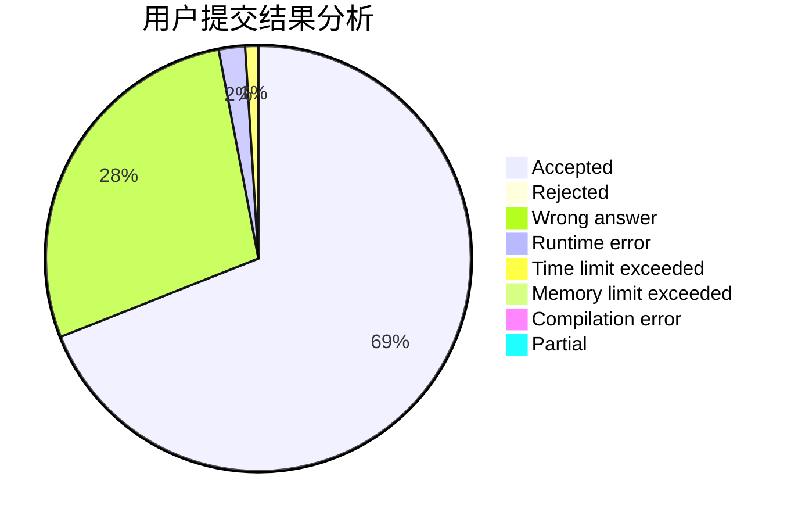
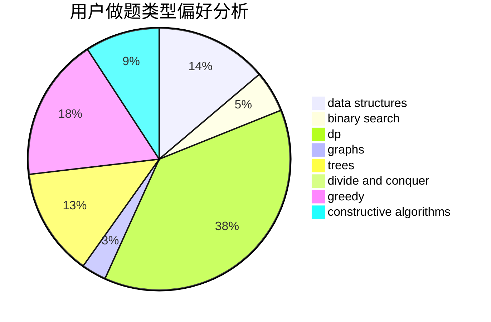

# Q.E.D

<!-- tabs:start -->

#### **用户提交结果分析**

#### **用户做题类型偏好分析**

#### **用户错题知识点分析**

<!-- tabs:end -->
# 推荐题目
[364D](https://codeforces.com/contest/364/problem/D)		brute force,
                        math,
                        probabilities		  
[611H](https://codeforces.com/contest/611/problem/H)		constructive algorithms,
                        flows,
                        graphs		  
[171A](https://codeforces.com/contest/171/problem/A)		*special problem,
                        constructive algorithms		  
[896A](https://codeforces.com/contest/896/problem/A)		binary search,
                        dfs and similar		  
[1102B](https://codeforces.com/contest/1102/problem/B)		greedy,
                        sortings		  
[1468N](https://codeforces.com/contest/1468/problem/N)		greedy,
                        implementation		  
[989E](https://codeforces.com/contest/989/problem/E)		dp,
                        geometry,
                        matrices,
                        probabilities		  
[914H](https://codeforces.com/contest/914/problem/H)		combinatorics,
                        dp,
                        games,
                        trees		  
[1082F](https://codeforces.com/contest/1082/problem/F)		dp,
                        strings,
                        trees		  
[878E](https://codeforces.com/contest/878/problem/E)		combinatorics,
                        dp		  
