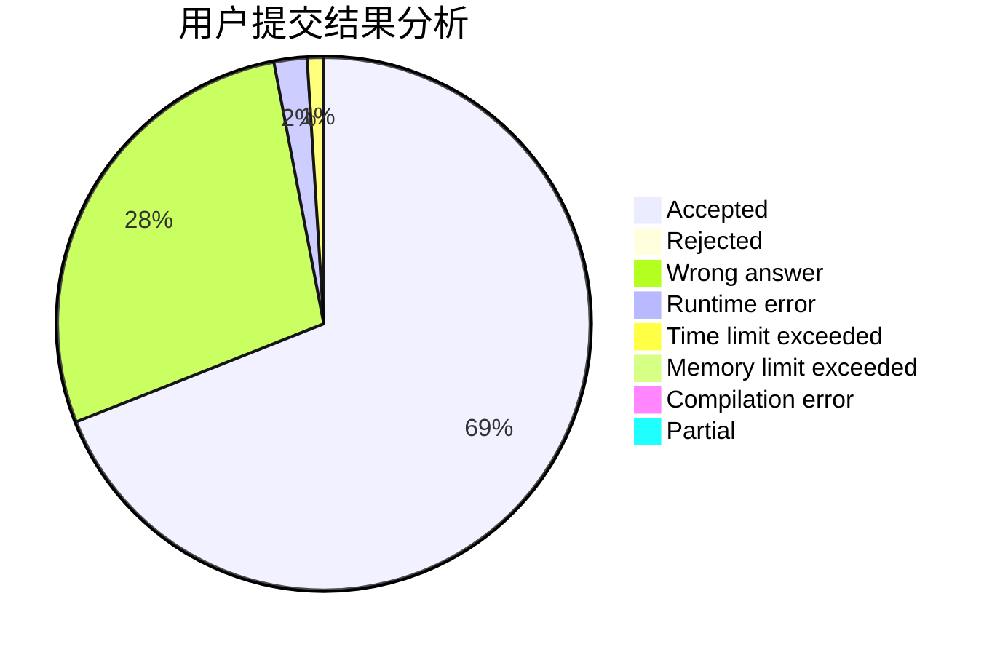
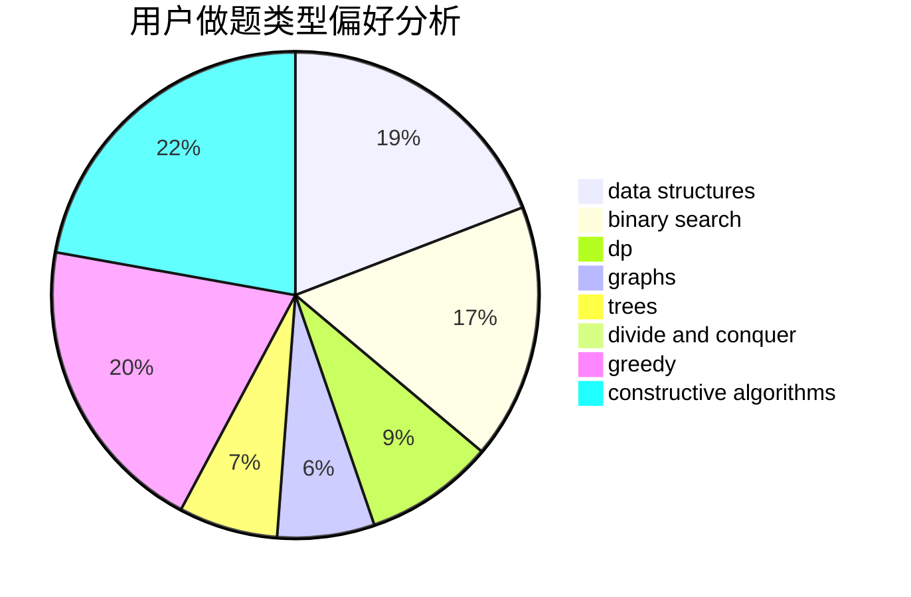

# Q.E.D

<!-- tabs:start -->

#### **用户提交结果分析**

#### **用户做题类型偏好分析**

#### **用户错题知识点分析**

<!-- tabs:end -->
# 推荐题目
[338E](https://codeforces.com/contest/338/problem/E)		data structures		  
[593B](https://codeforces.com/contest/593/problem/B)		geometry,
                        sortings		  
[1512A](https://codeforces.com/contest/1512/problem/A)		brute force,
                        implementation		  
[875F](https://codeforces.com/contest/875/problem/F)		dsu,
                        graphs,
                        greedy		  
[1101F](https://codeforces.com/contest/1101/problem/F)		binary search,
                        dp		  
[1461D](https://codeforces.com/contest/1461/problem/D)		binary search,
                        brute force,
                        data structures,
                        divide and conquer,
                        implementation,
                        sortings		  
[975A](https://codeforces.com/contest/975/problem/A)		implementation,
                        strings		  
[898F](https://codeforces.com/contest/898/problem/F)		brute force,
                        hashing,
                        math		  
[1082C](https://codeforces.com/contest/1082/problem/C)		greedy,
                        sortings		  
[860E](https://codeforces.com/contest/860/problem/E)		data structures,
                        dfs and similar,
                        trees		  
