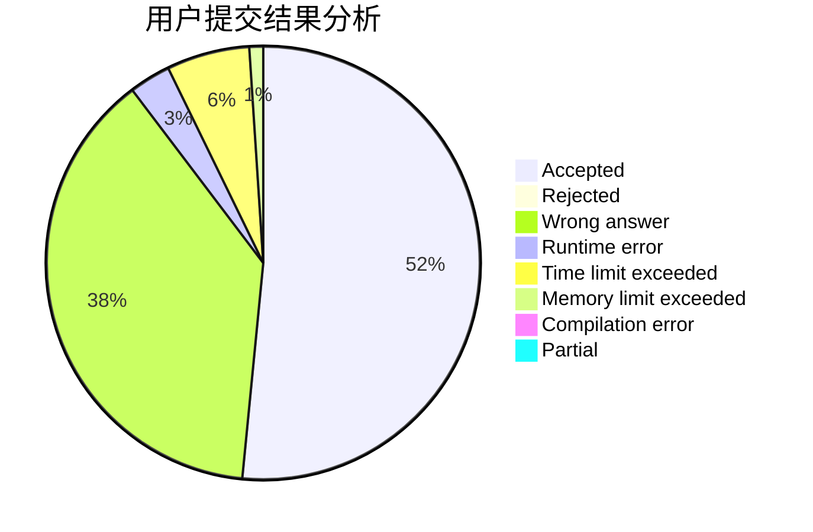
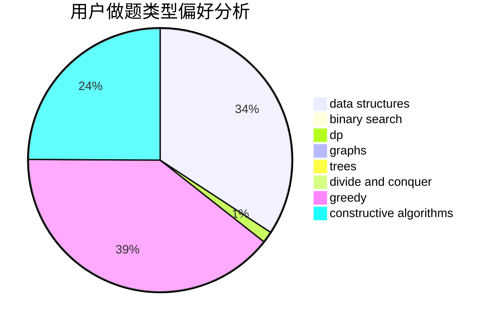
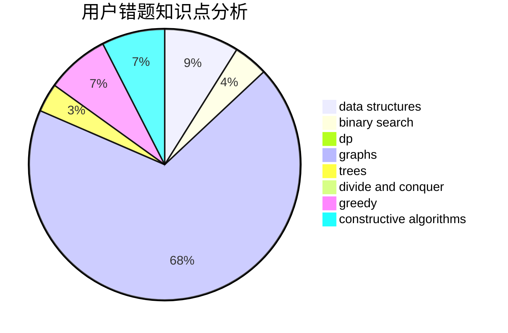

# QAQAutoMaton

<!-- tabs:start -->

#### **用户提交结果分析**

#### **用户做题类型偏好分析**

#### **用户错题知识点分析**

<!-- tabs:end -->
# 推荐题目
[1343D](https://codeforces.com/contest/1343/problem/D)		brute force,
                        data structures,
                        greedy,
                        two pointers		  
[1205E](https://codeforces.com/contest/1205/problem/E)		combinatorics,
                        strings		  
[235D](https://codeforces.com/contest/235/problem/D)		graphs		  
[1023G](https://codeforces.com/contest/1023/problem/G)		data structures,
                        flows,
                        trees		  
[947C](https://codeforces.com/contest/947/problem/C)		dsu,graphs,sortings,trees		  
[745C](https://codeforces.com/contest/745/problem/C)		dsu,graphs,sortings,trees		  
[1347B](https://codeforces.com/contest/1347/problem/B)		dsu,graphs,sortings,trees		  
[1411F](https://codeforces.com/contest/1411/problem/F)		greedy,
                        math		  
[777A](https://codeforces.com/contest/777/problem/A)		constructive algorithms,
                        implementation,
                        math		  
[106C](https://codeforces.com/contest/106/problem/C)		dp		  
