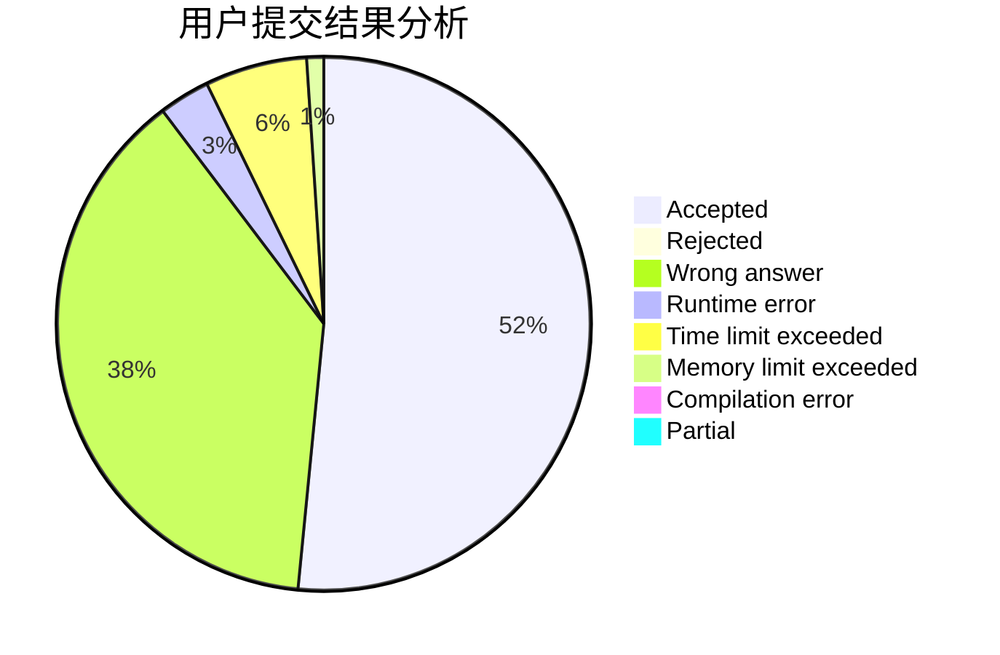
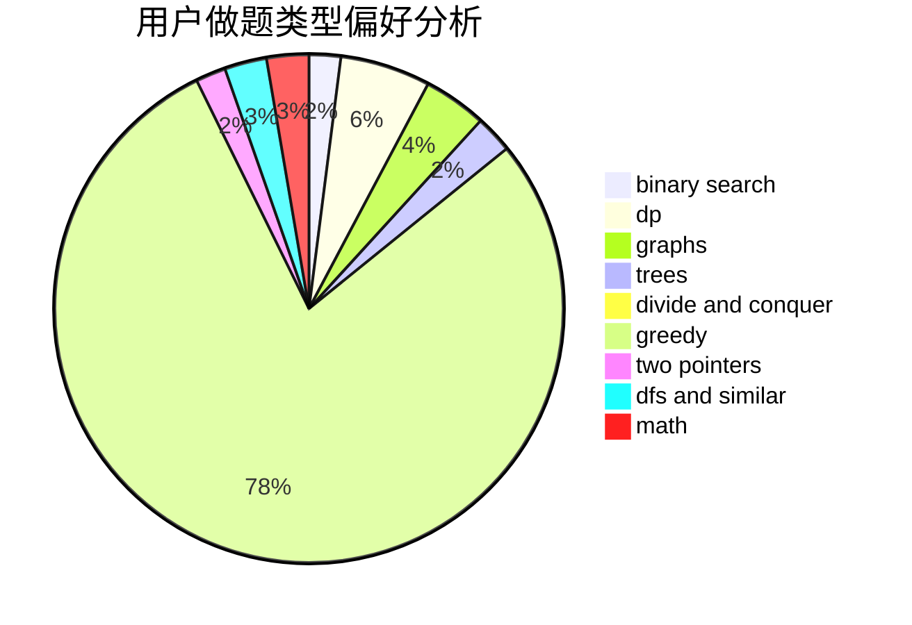

# QAQAutoMaton

<!-- tabs:start -->

#### **用户提交结果分析**

#### **用户做题类型偏好分析**

<!-- tabs:end -->
# 推荐题目
[1343D](https://codeforces.com/contest/1343/problem/D)
[1205E](https://codeforces.com/contest/1205/problem/E)
[235D](https://codeforces.com/contest/235/problem/D)
[1023G](https://codeforces.com/contest/1023/problem/G)
[947C](https://codeforces.com/contest/947/problem/C)
[745C](https://codeforces.com/contest/745/problem/C)
[1347B](https://codeforces.com/contest/1347/problem/B)
[1411F](https://codeforces.com/contest/1411/problem/F)
[777A](https://codeforces.com/contest/777/problem/A)
[106C](https://codeforces.com/contest/106/problem/C)
